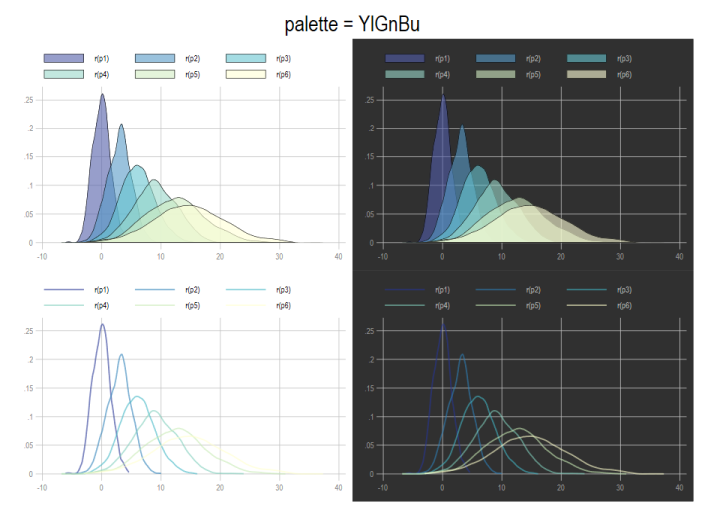
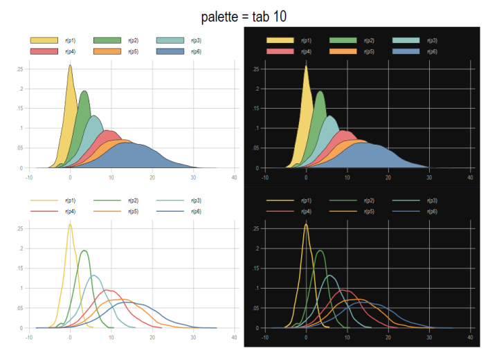

# Commande testpal

Permet de tester une palette sur un graphique témoin

## Installation

**`net install testpal, from("https://mthevenin.github.io/stata_fr/ado/testpal/") replace`**

## Syntaxe

**`testpal nom_palette , [rev] [op(#)] [bf(#)]`**

* **`rev`**: inverse l'ordre des couleurs de la palette
* **`op(#)`**: modifie le pourcentage d'opacité des couleurs. Par défaut 80% (op(80)). # est compris entre 0+ et 100.
* **`bf(#)`**: permet de modifier la clareté des graphiques de la seconde colonne (blanc pour la première). # est une valeur comprise entre 1 (noir) et 14 (presque blanc). 

## Exemples

Collection ***Brewer***, palette ***YlGnBu***:  
```{}
`testpal YlGnBu, rev op(50) bf(5)` 
```


Collection ***tableau***, palette ***10***:

```{}
testpal tab 10 , rev op(100) bf(1)
```




