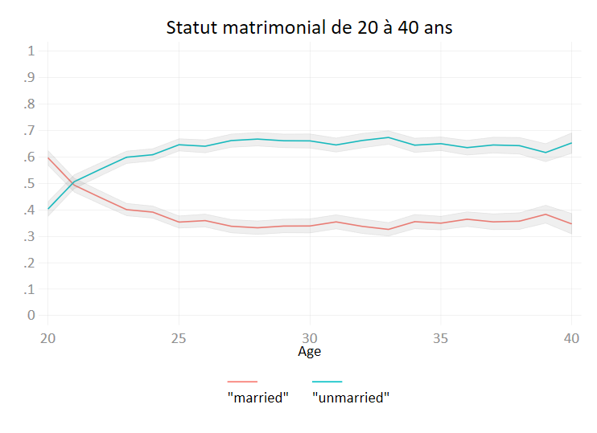
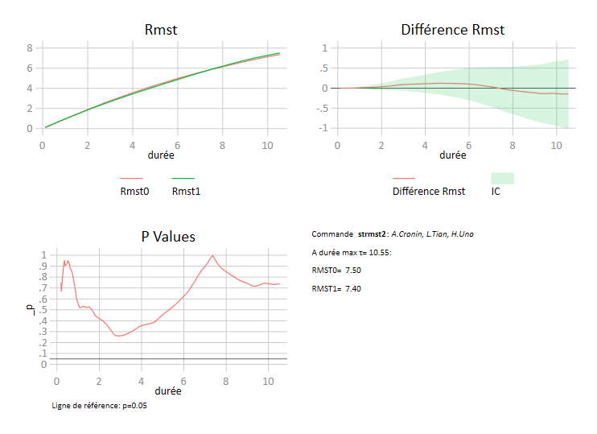

```{r, echo=FALSE, include=FALSE}
require(knitr)
statapath <- "C:\\Program Files (x86)\\Stata15\\StataSE-64"
opts_chunk$set(engine="stata", engine.path=statapath, comment="")
```

<BR><BR>

**Contenu**  

<!--html_preserve-->
<table class="table table-striped table-hover table-bordered">
  <thead class="thead-dark">
    <tr>
      <th>#</th>
      <th>Nom</th>
      <th>Type</th>
      <th>Remarques</th>
    </tr>
  </thead>
<tbody>
   
    <tr>
      <td>1</td>
      <td>ggof</td>
      <td>qualité de l'ajustement</td>
      <td></td>
    </tr>
    <tr>
      <td>2</td>
      <td>tmt3</td>
      <td>test paramètres</td>
      <td></td>
    </tr> 
    <tr>
      <td>3</td>
      <td>qlt</td>
      <td>analyse des durées</td>
      <td></td>
    </tr>   
    <tr>
      <td>4</td>
      <td>competout</td>
      <td>analyse de survie</td>
      <td></td>
    </tr> 
    <tr>
      <td>5</td>
      <td>gpct</td>
      <td>graphique</td>
      <td>maj 2020</td>
    </tr>
     <tr>
      <td>6</td>
      <td>diffrmst</td>
      <td>Analyse des durées</td>
      <td>Ajout 2020</td>
    </tr>
         <tr>
      <td>7</td>
      <td>stphcure</td>
      <td>Analyse des durées</td>
      <td>Ajout fin 2020</td>
    </tr>
     
     
  </tbody>
  </table>
<!--/html_preserve-->

<br>
<br>


- **Installation**:  
Les commandes peuvent être installées directement avec:
```{}
net install stata_commands, replace from("https://raw.githubusercontent.com/mthevenin/stata_commands/master/")
```
- **Désinstallation**:  
```{}
ado uninstall stata_commands
```


<br>

# ggof{.tabset .tabset-fade .tabset-pills}

<span class="badge badge-info">help file</span>

Sous forme de graphiques combinés, la commande présente des éléments de diagnostique de la qualité de l?ajustement après un modèle de type logit, probit, cloglog.  

**Graphiques**: 
Probabilités prédites vs réponse, courbe de Roc, densités des probabilités prédites selon la réponse.  
Le graphique affiche également le résultat du test d'Hosmer et Lemeshow pour 10 groupes.

**Syntaxe**:  
`ggof variable_dependante`  

**Exemple**:  
```{}
qui webuse lbw, clear  
qui logit low age lwt i.race smoke ptl ht ui
    ggof low
```

-------------

-------------

<br>

# tmt3{.tabset .tabset-fade .tabset-pills}

<span class="badge badge-info">help file</span>

Affiche des tests multiples d'hypothèse nulle après un modèle ($b_1=b_2=...=b_p=0$). Utile seulement pour les variables catégorielles avec plus de 2 modalités. 


**Modèles** (vérifiés):  
regress, logit, probit, cloglog, poisson, nbreg, cox, mlogit, ologit, oprobit  

**Syntaxe**: 
`tmt3 variables`  

*Exemple avec logit*
```{}
    qui webuse lbw, clear  
    qui logit low age lwt i.race smoke ptl ht ui
    tmt3 race

Type-III multiple test for categorical covariable(s) after logit

-------------+-----------------------------------
   Variables |       df      Khi2      Prob>chi2
-------------+-----------------------------------
         race|        2    7.00521      0.030   
-------------+-----------------------------------

    
    
```
    
*Exemple avec  mlogit*
```{}
    webuse sysdsn1, clear
    qui mlogit insure age male nonwhite i.site
    tmt3 site


Type-III multiple test for categorical covariable(s) after mlogit

For insure = 2
-------------+-----------------------------------
   Variables |       df      Khi2      Prob>chi2
-------------+-----------------------------------
         site|        2    10.7754      0.005   
-------------+-----------------------------------

For insure = 3
-------------+-----------------------------------
   Variables |       df      Khi2      Prob>chi2
-------------+-----------------------------------
         site|        2    6.80668      0.033   
        
```
    
*Exemple avec regress*
```{}
    webuse auto, clear
    qui gen gweight=weight
    qui recode gweight min/2239=1 2240/3189=2 3190/3599=3 3600/max=4
    qui regress mpg ib2.gweight ib2.rep78 i.foreign
    tmt3 gweight rep78
    
Type-III multiple test for categorical covariable(s) after regress

-------------+--------------------------
   Variables |   df      F      Prob>F
-------------+--------------------------
      gweight| (3,60)    31.5   0.000
        rep78| (4,60)    2.65   0.042
-------------+--------------------------
    
```


<br>

# qlt{.tabset .tabset-fade .tabset-pills}

Calcul des durées pour plusieurs quantiles de la fonction de survie estimée à partir de la méthode actuarielle (commande `ltable`).
La commande `ltable` ne permettant pas de récupérer directement la fonction d survie estimées, il convient d'utiliser l'option `saving(nom_base)`.  

**Estimations des durées  avec Stata et Sas**:     
Rappel: Comme la méthode actuarielle est une méthode dite continue, elle nécessite d'avoir des bornes ouvertes ou fermées sur chaque intervalle.  La définition des bornes diffère entre les deux logiciels, ce qui génère des résultats différents au niveau des estimations de la survie reportées sur chaque intervalle, et donc au final sur les durées estimées pour différents sur les quantiles(calcul par interpolation linéaire) .    

**Stata** :   $t(i) \leq t < t(i+1)$         
**Sas**   :   $t(i) < t \leq t(i+1)$       


La commande `qlt` permet de récupérer des tables de survie identiques entre les deux logiciels et donc d'afficher, par exemple, la même durée médiane.

Syntaxe:  
`qlt [if/in] [, sas]`  

**Exemple**:  
```{}
webuse rat, clear
qui ltable t died, saving(lt, replace) interval(10) by(group)
qui use lt, clear

qlt if group==1

Duree pour differents quantiles de la fonction de survie
Definition des bornes Stata-ltable
S(t)=0.90: t=  158.000
S(t)=0.75: t=  183.750
S(t)=0.50: t=  207.159
S(t)=0.25: t=  228.663
S(t)=0.10: t=  256.103

qlt if group==1, sas

Duree pour differents quantiles de la fonction de survie
Definition des bornes Sas-lifetest
S(t)=0.90: t=  178.000
S(t)=0.75: t=  193.750
S(t)=0.50: t=  217.159
S(t)=0.25: t=  238.663
S(t)=0.10: t=  292.205

 list

     +---------------------------------------------------------------+
     | group    t0    t1   survival   sesurv~l   lsurvi~l   usurvi~l |
     |---------------------------------------------------------------|
  1. |     1   140   150          1          .          .          . |
  2. |     1   160   170   .9473684   1.000122   .6811868   .9924147 |
  3. |     1   180   190   .8947368   .7074713   .6407943   .9725854 |
  4. |     1   190   200   .7894737    .501165   .5319127   .9152861 |
  5. |     1   200   210   .6842105   .4107024   .4279406   .8439419 |
     |---------------------------------------------------------------|
  6. |     1   210   220   .5789474   .3579703   .3320811   .7626399 |
  7. |     1   220   230   .4686717   .3250582   .2385695   .6698043 |
  8. |     1   230   240   .3515038   .3059934   .1488843   .5632942 |
  9. |     1   240   250   .2343358    .296977   .0745044   .4445302 |
 10. |     1   260   270   .1673827   .3064088   .0384353   .3751437 |
     |---------------------------------------------------------------|
 11. |     1   300   310   .0836914   .3605598   .0065463   .2941596 |
 12. |     1   310     .          0   .3605598          .          . |
     +---------------------------------------------------------------+

 
use lt, clear
qlt if group==2
   
Duree pour differents quantiles de la fonction de survie
Definition des bornes Stata-ltable
S(t)=0.90: t=  151.000
S(t)=0.75: t=  200.884
S(t)=0.50: t=  222.018
S(t)=0.25: t=  270.688
S(t)=0.10: t=  290.825

qlt if group==2, sas

Duree pour differents quantiles de la fonction de survie
Definition des bornes Sas-lifetest
S(t)=0.90: t=  163.000
S(t)=0.75: t=  230.295
S(t)=0.50: t=  237.339
S(t)=0.25: t=  285.344
S(t)=0.10: t=  320.550

. 
.   list

     +---------------------------------------------------------------+
     | group    t0    t1   survival   sesurv~l   lsurvi~l   usurvi~l |
     |---------------------------------------------------------------|
  1. |     2   140   150          1          .          .          . |
  2. |     2   150   160    .952381   1.000099   .7072068   .9931521 |
  3. |     2   160   170   .9047619   .7074019   .6700459   .9752942 |
  4. |     2   190   200   .8571429    .577922    .619718   .9515517 |
  5. |     2   200   210   .8095238   .5009308   .5689051   .9238889 |
     |---------------------------------------------------------------|
  6. |     2   230   240   .7604617   .4489701   .5167726   .8926294 |
  7. |     2   240   250   .4055796   .3003117   .1967718   .6059566 |
  8. |     2   260   270   .3548822   .2916758   .1596231   .5571687 |
  9. |     2   280   290   .3041847    .285085   .1248152    .506286 |
 10. |     2   290   300   .2027898   .2791921   .0634287   .3972666 |
     |---------------------------------------------------------------|
 11. |     2   320   330   .1013949    .292591   .0172292   .2753105 |
 12. |     2   340   350   .0506974   .3266003   .0034972   .2076033 |
 13. |     2   350     .   .0506974   .3266003   .0034972   .2076033 |
     +---------------------------------------------------------------+

```	  

<br>


# competout{.tabset .tabset-fade .tabset-pills}

<span class="badge badge-info">help file</span>

**Maj 2017***:
Voir également la commande stcomlist(***```ssc install stcomlist```***), très proche si l'on excepte la question du test de Gray.***  

Pour la prise en compte des risques concurrents en analyse des durées, **competout** affiche les estimateurs  des  incidences cumulées sous forme de tableau, et le graphique associé. En option, plusieurs tests peuvent être exécutés. **competout** utilise des commandes existantes qui seront automatiquement installées si besoin.     
Pour le test de Gray, il est exécuté par **R**. Cela nécessite donc  une installation particulière d'écrite dans le fichier d'aide. Aucune connaissance du langage R n'est cependant requise (le fichier **competout_gray_test.do** doit se trouver dans le même répertoire que **competout.ado**).

**Syntaxe**:  
```[bysort variable: ] competout variable_duree variable_evenement [if/in], event(#) [group(variable) test(s/r/sr) exc(nom_fichier)]``` 

**Exemple**: 
```{}
    qui use http://www.stata-press.com/data/cggm3/bc_compete, clear
    competout time status, event(1) group(drug) test(sr)

Cumulative incidence for drug=0

----------------------------------------------------------
analysis  |
time when |
record    |
ends      |         IC          SE      95% LB      95% UB
----------+-----------------------------------------------
        3 |     0.0968      0.0188      0.0640      0.1375
        6 |     0.1935      0.0251      0.1471      0.2449
        9 |     0.2540      0.0276      0.2017      0.3095
       12 |     0.3145      0.0295      0.2577      0.3728
       15 |     0.3185      0.0296      0.2615      0.3769
       18 |     0.3266      0.0298      0.2691      0.3853
       21 |     0.3347      0.0300      0.2767      0.3936
       27 |     0.3387      0.0301      0.2805      0.3977
       30 |     0.3427      0.0301      0.2843      0.4019
       36 |     0.3468      0.0302      0.2881      0.4060
       39 |     0.3508      0.0303      0.2919      0.4102
       45 |     0.3548      0.0304      0.2957      0.4143
       48 |     0.3629      0.0305      0.3034      0.4226
----------------------------------------------------------

Cumulative incidence for drug=1

----------------------------------------------------------
analysis  |
time when |
record    |
ends      |         IC          SE      95% LB      95% UB
----------+-----------------------------------------------
        3 |     0.0800      0.0205      0.0459      0.1262
        6 |     0.1429      0.0265      0.0959      0.1989
        9 |     0.2114      0.0309      0.1544      0.2746
       12 |     0.2400      0.0323      0.1797      0.3053
       15 |     0.2457      0.0325      0.1848      0.3114
       36 |     0.2514      0.0328      0.1899      0.3175
       60 |     0.2571      0.0330      0.1950      0.3236
----------------------------------------------------------

log-rank test (Cause specific hazards)

 Main event failure:  status == 1
   Chi2(1) =  4.0664
 Prob>Chi2 =  0.0437


Pepe and Mori test comparing the cumulative incidence of two groups of drug

     Main event failure:  status == 1
Chi2(1) = 4.6845  -  p =  0.03044

Competing event failure:  status == 2
Chi2(1) = 5.6476  -  p =  0.01748


Gray's test

using Rsource (Newson) & cmprsk (Gray)

Line 1 - Test for main event failure:  status == 1
Line 2 - Test for competing event(s) failure:  status == 2

rsource, terminator(END_OF_R)
Assumed R program path: "C:\Program Files\R\R-3.4.3\bin\R.exe"
Beginning of R output
      Chi2 df     Pr>Chi2
1 4.908811  1 0.026720033
2 8.615262  1 0.003333579
End of R output
    
    
```


<br>

# gpct{.tabset .tabset-fade .tabset-pills}
<span class="badge badge-info">help file</span>


***Mise à jour:***   

- Calcul et report des intervalles de confiances (méthode clopper-wilson) avec l'option `ci`.
- Prise en charge automatique des labels des modalités de la variable.
- On peut conserver les % sous formes de variable (option `keep`).
- Le graphique peut-être customisé avec les options graphiques supportées par la commande `line`, à l'exeption de l'option **legend** qui est utilisée par le programme.  

**A faire**: prise en charge des pondérations.
  

**gpct** permet de tracer sous forme de courbes des pourcentages issus d'un tableau croisé de type `tab X Y, nof r`.     
  

**Syntaxe**:  
```gpct variable_continue variable_catégorielle [if/in] [, ci gops(string) mts keep]```      
<br>
Voir le fichier d'aide pour les options


**Exemple**: 
```{}
    use  http://www.stata-press.com/data/r15/nlswork.dta, clear
    label define msp 0 "married" 1 "unmarried", modify
    label value msp msp

    gpct age msp if age>=20 & age<=40, ci gops(title("Statut matrimonial de 20 à 40 ans") ylabel(0(0.1)1)) mts

```


  
<br>

# diffrmst{.tabset .tabset-fade .tabset-pills}

La comparaison des RMST (Restricted Mean of Survival Time) présente plusieurs avantages par rapport au test du log-rang, et à ces multiples versions::  

- N'est pas sensible au distribution des censures à droite.
- N'est pas sensible à l'hypothèse de proportionalité des risques.
- Permet une lecture en terme de différence des durées moyennes de séjour (survie).
- On peut choisir la borne maximal à la durée pour les calcul des rmst. C'est justement l'objet de cette commande que d'offrir des résultats des comparaisons pour toutes les durées où un évènement a été observé.

Source: https://journals.sagepub.com/doi/pdf/10.1177/1536867X1601600310

**Syntaxe**:  
```gpct variable, [ng]```   
<br> 

- L'option `ng` permet de ne pas générer le graphique
- La commande `strmst2` est installée automatiquement avec `diffrmst`
- La variable ne peut comporter que deux modalités de comparaison (c'est la contrainte imposée par `strmst2`).

```{}
* la base pbc est téléchargeable avec la commande strmst2
use pbc, clear
stset time, f(status)
diffrmst treatment

* extrait du tableau

  +-------------------------------------------------------------------------------+
  |    _time     _rmst1     _rmst0       _diff          _l          _u         _p |
  |-------------------------------------------------------------------------------|
  | .1122519   .1122519   .1122519           0           0           0          . |
  | .1396304   .1394571   .1396304   -.0001733   -.0001733   -.0001733          . |
  | .1943874   .1938676   .1940318   -.0001643   -.0011864    .0008579   .7527578 |
  | .2108145   .2100867   .2103523   -.0002655   -.0014908    .0009597    .671001 |
  | .3011636   .2992921    .299528   -.0002358    -.003352    .0028803   .8820767 |
  |-------------------------------------------------------------------------------|
  | .3559206   .3533561   .3532183    .0001377   -.0043421    .0046176   .9519514 |
  | .3586585   .3560593   .3558851    .0001742   -.0044227    .0047711   .9407999 |
  | .3832991    .380232   .3798857    .0003463   -.0053301    .0060228   .9048129 |
  | .4900753    .484305   .4838885    .0004165   -.0083805    .0092136   .9260591 |
  | .5092403   .5028635   .5025557    .0003079   -.0090761    .0096918    .948731 |
  |-------------------------------------------------------------------------------|
  | .5229295   .5161195   .5158004    .0003191   -.0097163    .0103546   .9503055 |
  | .5420945    .534678   .5342187    .0004593   -.0102124     .011131   .9327726 |
  | .5667351   .5583829   .5578993    .0004836   -.0110561    .0120234   .9345359 |
  | .5913758   .5820879   .5814199    .0006679   -.0117686    .0131044   .9161667 |
  | .6105407   .6005251   .5995893    .0009357   -.0122029    .0140744   .8889861 |
  |-------------------------------------------------------------------------------|
  | .7227926   .7078037   .7060099    .0017938   -.0157935    .0193811   .8415548 |
  | .8323066   .8124658   .8084127    .0040532   -.0185099    .0266163    .724773 |
  | .8788501   .8569473   .8516316    .0053157   -.0193574    .0299888   .6728329 |
  | .8925394   .8700301   .8642542    .0057759   -.0195332     .031085   .6546639 |
  | .9144422   .8909625    .884308    .0066545   -.0196653    .0329743   .6202179 |
  |-------------------------------------------------------------------------------|
  | .9527721   .9273517   .9194023    .0079494   -.0204813      .03638   .5836803 |
  | 1.062286   1.030628   1.019672    .0109559   -.0229056    .0448175   .5259846 |
  |  1.09514   1.061402   1.049752    .0116499   -.0238792    .0471791   .5204387 |
  | 1.259411   1.214237   1.200156    .0140804    -.030021    .0581818   .5314698 |
  | 1.409993   1.354335   1.337049    .0172861   -.0354319    .0700041   .5204401 |
  |-------------------------------------------------------------------------------|
  .                                                                               .
  .                                                                               .
  .                                                                               .
  .                                                                               .
  |-------------------------------------------------------------------------------|
  | 9.368925   6.855622   6.992892     -.13727   -.8761555    .6016155   .7157671 |
  | 9.385352   6.863472   7.001159   -.1376871   -.8783254    .6029512   .7155864 |
  | 9.431896   6.885712   7.023517   -.1378042   -.8833281    .6077197   .7171399 |
  | 9.467488    6.90272   7.039799   -.1370796   -.8862833     .612124   .7198877 |
  | 9.785079   7.054479   7.185092    -.130614   -.9137435    .6525154   .7437495 |
  |-------------------------------------------------------------------------------|
  | 9.793292   7.058185    7.18885   -.1306649   -.9148641    .6535343   .7439907 |
  | 9.804244   7.063128    7.19386   -.1307327   -.9161143     .654649   .7442347 |
  | 9.812457   7.066834   7.197618   -.1307835   -.9170547    .6554878   .7444181 |
  | 9.886379   7.098233   7.231436   -.1332034   -.9273038    .6608971    .742332 |
  | 10.05339   7.169169    7.30784   -.1386705   -.9508823    .6735412   .7379054 |
  |-------------------------------------------------------------------------------|
  | 10.14921   7.209871   7.351678   -.1418074   -.9646641    .6810493   .7355356 |
  | 10.29979    7.27383   7.420568   -.1467368   -.9866738    .6932002    .732046 |
  | 10.45859   7.341279   7.488371   -.1470919   -1.005198    .7110141   .7368962 |
  |  10.4668   7.344768   7.491878   -.1471103   -1.006163    .7119419   .7371436 |
  | 10.51061   7.363374   7.510582   -.1472083   -1.011328    .7169117   .7384609 |
  |-------------------------------------------------------------------------------|
  | 10.54073   7.376166   7.522453   -.1462864   -1.013793    .7212203   .7410177 |
  +-------------------------------------------------------------------------------+


```




