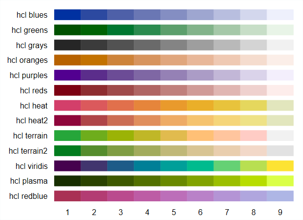
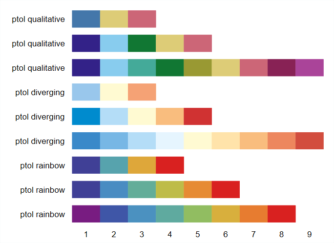

**version 0**  
**[X]: A faire**

# Objectifs

**[A faire]**   


# Colorpalette

[pourquoi colorpalette]

## Sources et installation

Sources:
http://repec.sowi.unibe.ch/stata/palettes/index.html
https://www.stata-journal.com/article.html?article=gr0075
https://boris.unibe.ch/116571/1/Jann-2018-palettes.pdf


**Installation via ssc**  

* `ssc install palettes, replace`
* `ssc install colrspace, replace`


**Installation de grstyle pour charger et utiliser une palette**
* `ssc install grstyle, replace`

**Autres sources**

* Librairie particulièrement complète de couleurs: https://www.w3schools.com/colors/default.asp
* Colorbrewers: https://colorbrewer2.org/#type=sequential&scheme=BuGn&n=3

## Syntaxe et exemples

Visualiser une palette
```{}
colorpalette nom_palette [, options] 
```

La palette par défaut de Stata est la palette s2 (15 couleurs) utilisée par le thème par défaut **s2color**:

```{}
colorpalette s2
```


<div style="border: 1px solid black; width:519px; heigth:377px ">

</div>
<br>


* Lorsqu'on fait  un graphique, les couleurs utilisées pour chaque objet (courbes par exemples) suivent l'ordre d'affichage de la palette: (1) "navy", (2) "maroon", (3) "forest green".......
* On peut forcer la commande à afficher le code **RGB**: 

```{}
colorpalette s2, force
```

<div style="border: 1px solid black; width:519px; heigth:377px">

</div>
<br>

* On peut sélectionner une partie de la palette (très utile au final - voir plus loin)

```{}
colorpalette nom_palette, select(numlist)
```

Exemple
```{}
colorpalette s2, select(1 6 14)
```

<div style="border: 1px solid black; width:519px; heigth:377px">

</div>
<br>

* On peut réduire la taille de la palette [très utile]
```{}
colorpalette nom_palette, n(#)
```


* On veut donner un aspect plus "pastel" à la palette:  option `intensity`
  * La commande `colorpalette` permet également d'utiliser toutes les options graphiques `tw`. En modifiant les couleurs, le code couleur a plus d'arguments et empiète sur le numéro de la couleur juste à sa droite. J'utilise l'option `scale(#)' pour réduire la taille de tous les éléments présent dans le graphique (colorpalette génère des graphs), ici avec une échelle d'affichage de 90%.
  * L'option `intensity(#)` permet de baisser (vers le pastel) ou d'augmenter l'intensité des couleurs


```{}
colorpalette s2, intensity(0.50) force  gropts(scale(0.9))
```


<div style="border: 1px solid black; width:519px; heigth:377px">

</div>
<br>

* On peut visualiser l'effet au niveau des couleurs du changement d'opacité (transparence) avec l'option `opacity(#)` [# de 0+ à 100-]

```{}
colorpalette s2, opacity(50) force  gropts(scale(0.9))
```


<div style="border: 1px solid black; width:519px; heigth:377px">


</div>
<br>

* Toutes les options disponibles (derniere version dans dépôt Stata)


```{}
    Main
      n(#)                size of the palette (number of colors)
      select(numlist)     select (and order) the colors
      order(numlist)      order the colors
      reverse             arrange palette in reverse order
      opacity(numlist)    set opacity, in percent
      intensity(numlist)  set color intensity multipliers
      ipolate(spec)       interpolate the colors
      intensify(numlist)  modify intensity
      saturate(spec)      modify saturation (colorfulness)
      luminate(spec)      modify luminance (brightness)
      gscale[(spec)]      convert to grayscale
      cblind[(spec)]      simulate color vision deficiency
      other               palette-specific options

    Technical
      forcergb            enforce translation to RGB
      noexpand            omit automatic interpolation/recycling
      class(class)        set palette class
```


## Utilisation des macros générées par colorpalette

* Colorpalette enregistre les noms ou codes des couleurs sous forme de macro (`return list`)
* Ces valeurs peuvent donc être utilisée automatiser la sélection des couleurs


```{}
colorpalette s2,  nograph
return list

. return list

scalars:
                  r(n) =  15

macros:
              r(ptype) : "color"
              r(pname) : "s2"
             r(pclass) : "qualitative"
                  r(p) : ""26 71 111" "144 53 59" "85 117 47" "227 126 0" "110 142 132" "193 5 52" "147 141 210" .."
            r(p15info) : "bluishgray"
                r(p15) : "217 230 235"
            r(p14info) : "gold"
                r(p14) : "255 210 0"
            r(p13info) : "erose"
                r(p13) : "191 161 156"
            r(p12info) : "brown"
                r(p12) : "156 136 71"
            r(p11info) : "emerald"
                r(p11) : "45 109 102"
            r(p10info) : "emidblue"
                r(p10) : "123 146 168"
             r(p9info) : "sienna"
                 r(p9) : "160 82 45"
             r(p8info) : "khaki"
                 r(p8) : "202 194 126"
             r(p7info) : "lavender"
                 r(p7) : "147 141 210"
             r(p6info) : "cranberry"
                 r(p6) : "193 5 52"
             r(p5info) : "teal"
                 r(p5) : "110 142 132"
             r(p4info) : "dkorange"
                 r(p4) : "227 126 0"
             r(p3info) : "forest_green"
                 r(p3) : "85 117 47"
             r(p2info) : "maroon"
                 r(p2) : "144 53 59"
             r(p1info) : "navy"
                 r(p1) : "26 71 111"
```

* la macro **r(p)** contient donc tous les codes couleurs de la palette *s2* 

```{}
di r(p)
"26 71 111" "144 53 59" "85 117 47" "227 126 0" "110 142 132" "193 5 52" "147 141 210" "202 194 126" "160 82 45" "123 146 168" "45 109 102" "156 136 71" "191 161 156" "255 210 0" "217 230 235"
```

* On pourra donc utiliser cette macro  pour indiquer les couleurs qui seront utilisées dans le graphique

**Exemple**

```{}
sysuse uslifeexp.dta
tw line le le_male le_female year
```


<div style="border: 1px solid black; width:519px; heigth:377px">

</div>
<br>


Les couleurs des trois courbes sont bien les trois premières couleurs de la palette `s2`.  
<br>
Si on souhaite utiliser les couleurs (5,6,14) au lieu des couleurs (1,2,3) de la palette complète + une intensité de 1.2:

```{}
colorpalette s2, select(5 6 14) intensity(1.2) nograph
tw line le le_male le_female year, lc(`r(p)')
```
Rappel: `lc()` est l'expression tronquée de `lcolor()` [line color]


<div style="border: 1px solid black; width:519px; heigth:377px">

</div
<br>

## Utilisation d'une palette de couleurs avec grstyle

* Les options et la récupération des couleurs sélectionnées sont également intégrées à la commande `grstyle` de Ben Jann [`grstyle set color [options]`]
* En sélectionnant cette fois-ci les couleurs (1,6,4) de la palette *s2* et en customizant légèrement le graphique:

```{}
grstyle init
grstyle set legend, nobox stack
grstyle set plain, horizontal grid compact
grstyle set mesh,  horizontal
grstyle set color s2, select(1 6 4)

tw line le le_male le_female year, legend(cols(3))
```


<div style="border: 1px solid black; width:519px; heigth:377px">

</div>
<br>


## Cas d'un graphique à plusieurs composantes

**Avec colorpalette**  

* Pour un graphique à plusieurs composantes [`tw (objet1) (objet2)...`] ou [`tw objet1 || (objet2 ||...`] , on ne peut pas utiliser d'un bloc tous les codes couleurs avec `r(p)`
* On doir inséré la macro de chaque composantes dans ses options `r(p1)`, `r(p2)`.... La modification des couleurs est néanmoins automatisée avec `colorpalette`

Exemple
```{}
colorpalette s2, select(6 14) opacity(50) nograph

local opts mlc(black) mlw(vthin)

tw (scatter price mpg if foreign==0, mc(`r(p1)') `opts')  ///
   (scatter price mpg if foreign==1, mc(`r(p2)') `opts'), ///
   legend(order(1 "Domestic" 2 "Foreign"))
```


<div style="border: 1px solid black; width:519px; heigth:377px">

</div>
<br>


**Avec grstyle**  

* Avec `grstyle` la procédure est simplifiée au niveau du graphique, l'option pour la couleur de remplissage des marqueurs est chargée avec `grstyle set color s2, select(6 14) opacity(50)`

```{}
grstyle init
grstyle set legend, nobox stack
grstyle set plain, horizontal grid compact
grstyle set mesh,  horizontal
grstyle set color s2, select(6 14) opacity(50)

local opts mlc(black) mlw(vthin)

tw (scatter price mpg if foreign==0, `opts')  ///
   (scatter price mpg if foreign==1, `opts'), ///
    legend(order(1 "Domestic" 2 "Foreign"))
```
**Remarque**: `grstyle` permet également de paramétrer la couleur et l'épaisseur des contours des marqueurs


## La palette de couleur de ggplot2

* Avec `colorpalette`, le nom de la palette utilisée par le standard **ggplot2**  est **hue** (15 couleurs par défaut)

```{}
colorpalette hue
```

<div style="border: 1px solid black">

</div>
<br>

* La sélection automatique des couleurs sur une palette à 15 éléments ne donne pas un résultat pertinent niveau visualisation

```{}
sysuse uslifeexp.dta
*set scheme s2color
colorpalette hue, nograph
tw line le le_male le_female year, lc(`r(p)')
```


<div style="border: 1px solid black; width:519px; heigth:377px">

</div>
<br>


* Il convient donc:
  * de sélectionner des couleurs adaptées pour éviter les effets de dégradé qui ne sont pas les bienvenus dans certains graphiques. On peut donc:
    * utiliser l'option `select(#)` pour générer une palette pertinente au niveau des couleurs et de l'ordre d'utilisation
    * Utiliser l'option `n(#)` [# taille de la palette]:

<div style="border: 1px solid black">

</div>
<br>


* Comme le graphique précédent est composé de trois courbes, on utilise l'option `n(3)` à `colorpalette` : 
```{}
sysuse uslifeexp.dta
*set scheme s2color
colorpalette hue, n(3) nograph
tw line le le_male le_female year, lc(`r(p)')
```


<div style="border: 1px solid black; width:519px; heigth:377px">

</div>
<br>


Avec `grstyle`` 
```{}
grstyle init
grstyle set legend, nobox stack
grstyle set plain, horizontal grid compact
grstyle set mesh,  horizontal
grstyle set color hue, n(3)
tw line le le_male le_female year, legend(cols(3))
```


<div style="border: 1px solid black; width:519px; heigth:377px">

</div>
<br>


**Rappels sur les courbes**: attention au nombre de courbes affichées dans un même graphique, cela peut devenir illisible (*effet spaghetti*)

# Exemples de palette

**[A voir: mettre quelques exemples de graphiques]**


* Se reporter à l'aide de `colorpalette`, il est possible de visualiser directement un nombre impressionnant de palettes de couleurs
* Trois type de palettes:
  * Les palettes *qualitatives*: on mixe plusieurs types de couleurs (bleu, rouge, jaune, vert...)
  * Les palettes *divergentes*:  on va d'une couleurs à une autre (du bleu au rouge) en altérant l'intensité avec une couleur de transition généralement proche du blanc. Ces palettes peuvent être rendues qualitative en réduisant la taille de la palette
  * Les palettes *séquentielles*: on baisse (ou augmente) l'intensité d'une seule couleur (bleu vif vers le blanc ou l'inverse)
  
  
## Palette Stata

Palettes de types qualitatives

<div style="border: 1px solid black; width:519px; heigth:377px">

</div>


## Palettes thèmes externe Stata

Palettes de types qualitatives

<div style="border: 1px solid black; width:519px; heigth:377px">

</div>


## HCL

```{}
`coloraplette hcl, nom_sous_palette [options]`
```


### Qualitatives

<div style="border: 1px solid black; width:519px; heigth:377px">

</div>
<br>


* La palettes **hcl intense** est identique à la palette **hue** de la section précédente, ici avec 9 couleurs `n(9)`
* Si on veut afficher et utiliser la palette **hcl qualitative** avec les valeurs RGB:

```{}
coloraplette hcl, qualitative force
```

<div style="border: 1px solid black; width:519px; heigth:377px">

</div>

### Séquentielles

<div style="border: 1px solid black; width:519px; heigth:377px">

</div>
<br>

La palette **VIRIDIS** est très populaire en dataviz, et peut-être utilisée comme une palette qualitative avec un nombre limité de couleurs

<div style="border: 1px solid black; width:519px; heigth:377px">

</div>
<br>


<div style="border: 1px solid black; width:519px; heigth:377px">

</div>


### Divergentes

<div style="border: 1px solid black; width:519px; heigth:377px">

</div>


## HSV

Proche de la précédentes avec, me semble t-il, des intensités plus élevées

```{}
coloraplette hsv, nom_sous_palette [options]
```


### Qualitatives

<div style="border: 1px solid black; width:519px; heigth:377px">

</div>


### Séquentielles

<div style="border: 1px solid black; width:519px; heigth:377px">

</div>


### Divergentes

<div style="border: 1px solid black; width:519px; heigth:377px">

</div>

## Colorbrewer

https://colorbrewer2.org/#type=sequential&scheme=BuGn&n=3

```{}
`coloraplette nom_palette [,options]`
```

### Qualitatives

<div style="border: 1px solid black; width:519px; heigth:377px">

</div>

### Séquentielles


<div style="border: 1px solid black; width:519px; heigth:377px">

</div>
<br>

<div style="border: 1px solid black; width:519px; heigth:377px">

</div>

### Divergentes

<div style="border: 1px solid black; width:519px; heigth:377px">

</div>

## Viridis

* Voir plus haut les palettes **hcl**
* Les palettes **viridis** sont régulièrement utilisées avec Python
* Elles sont plutôt de type séquentielles ou divergentes
* On peut les rendre qualitative en réduisant la taille de la palette `n(#)`

```{}
coloraplette nom_palette [,options]
```

<div style="border: 1px solid black; width:519px; heigth:377px">

</div>
<br>

<div style="border: 1px solid black; width:519px; heigth:377px">

</div>

## Matplotlib

Palettes des objets graphiques de la librairie `matplotlib` de Python

```{}
coloraplette matplotlib, nom_sous_palette [options]
```

<div style="border: 1px solid black; width:519px; heigth:377px">

</div>
<br>

<div style="border: 1px solid black; width:519px; heigth:377px">

</div>

## Ptol

3 types de palette: qualitative, divergente et de type arc en ciel

```{}
coloraplette ptol, nom_sous_palette [options]
```


<div style="border: 1px solid black; width:519px; heigth:377px">

</div>

La première palette (3 couleurs): `colorpalette ptol, qualitative n(3)`

## D3

```{}
coloraplette d3, nom_sous_palette [options]
```

* La première palette à 10 couleurs est qualitative
* La seconde palette à 20 couleurs est composée de 10 paires qualitatives, avec un élément plus foncé et un élément claire
* Les troisièmes et quatrième palettes ont 20 couleurs à 5 ensembles qualitatifs (bleu,orange vert, mauve, gris) avec des éléments allant du du plus foncé au plus claire

<div style="border: 1px solid black; width:519px; heigth:377px">

</div>
<br>

## Spmap

Comme son nom l'indique, il s'agit d'un ensemble de palettes prévues pour générer des cartes.  
Ces palettes (et d'autres) sont intégrées dans la commande Stata du même nom (`ssc install spmap`[M.Pisatti] - `help spmap`)

```{}
coloraplette spmap, nom_sous_palette [options]
```

<div style="border: 1px solid black; width:519px; heigth:377px">

</div>
<br>

Exemples (palettes *reds* et *rainbow*)

```{}
* help spmap
use "Italy-RegionsData.dta", clear
spmap relig1 using "Italy-RegionsCoordinates.dta", id(id)            ///
clnumber(20) fcolor(Reds2) ocolor(none ..)                           ///
title("Pct. Catholics without reservations", size(*0.8))             ///
subtitle("Italy, 1994-98" " ", size(*0.8))                           ///
legstyle(3) legend(ring(1) position(3))  name(g1, replace) nodraw

spmap relig1 using "Italy-RegionsCoordinates.dta", id(id)           ///
clnumber(20) fcolor(Rainbow) ocolor(none ..)                        ///
title("Pct. Catholics without reservations", size(*0.8))            ///
subtitle("Italy, 1994-98" " ", size(*0.8))                          ///
legstyle(3) legend(ring(1) position(3))  name(g2, replace) nodraw

graph combine g1 g2, ysize(9) xsize(20)  plotr(color(white))  graphr(color(white))
```


<div style="border: 1px solid black; width:519px; heigth:377px">

</div>

**Remarques**:   

* La commande `spmap` ne fonctionne pas avec `grstyle set color`
* Elle intègre au total 45 palettes


<br><br>
Autres palettes contenues dans `colorpalette`: **lin**, **webcolors**, **sfso**


# Exemples de graphiques

## Palettes qualitatives

**Pyramide des âges et évolution de l'espérance de vie**  
<br>
Le programme pour la pyramide des âges est donné dans l'aide de `help tw bar`

Programme 

* Le seul élément modifié est `grstyle set color NOM_PALETTE [OPTIONS]`
* La pyramide est définie et exécutée par la fonction `pyramide`


### S2

<div style="border: 1px solid black">

</div>

### HUE
<div style="border: 1px solid black">

</div>

### COLORBREWER - DARK2

* Pallete de `colorbrewer`
* L'intensité pour les courbes a été augmenté de 20%

<div style="border: 1px solid black">

</div>

### VIRIDIS

<div style="border: 1px solid black">
 
</div>

## Palettes séquentielles et divergentes

### Barres

**Répartition d'une variable ordinale**

```{}
use nhanes2f, clear

tab health race, nof col

/*
1=poor,... |
         , |
5=excellen |    1=white, 2=black, 3=other
         t |     White      Black      Other |     Total
-----------+---------------------------------+----------
      poor |      6.37      13.26       4.50 |      7.05 
      fair |     15.50      22.28      12.50 |     16.16 
   average |     27.65      32.97      39.00 |     28.43 
      good |     25.96      18.05      23.00 |     25.07 
 excellent |     24.52      13.44      21.00 |     23.29 
-----------+---------------------------------+----------
     Total |    100.00     100.00     100.00 |    100.00 
*/

grstyle init
grstyle set legend, nobox stack
grstyle set plain, horizontal grid compact
grstyle set mesh,  horizontal
grstyle set color NOM_PALETTE [, OPTIONS]  

catplot health race, ///
percent(race) asyvars legend(pos(3) cols(1)) nodraw name(g1, replace)
catplot health race, ///
percent(race) asyvars stack legend(pos(3) cols(1)) nodraw name(g2,replace)

grc1leg g1 g2, ysize(9) xsize(20) legendfrom(g1) pos(3)  plotr(color(white))  graphr(color(white))
```


#### HCL - BLUES

* La taille de la palette a été fixée à 6 couleurs (la variable *health* a 5 modalité) pour éviter un bleu trop proche du blanc
* Si une modalité est très proche du blanc, il convient de modifié la couleur du background (avec `grstyle`: `grstyle set imesh,  horizontal` )

<div style="border: 1px solid black">
 
</div>

#### VIRIDIS

<div style="border: 1px solid black">
 
</div>

#### MATPLOTLIB -

**Les 4 saisons de matplotlib**

<div style="border: 1px solid black">
 
</div>


### Bulles - Matplotlib


* Données issues du site https://www.gapminder.org/data/
* Utilisation des palettes matplotlib "4 saisons":
  * **Winter**: Afrique
  * **Spring**: Asie (+ Océanie)
  * **Summer**: Amériques
  * **Autumn**: Europe
* [**gapminder project**]  graphique animé: https://www.gapminder.org/tools/#$chart-type=bubbles
* [**Demetris Christodoulou**] graphique généré par Stata [avec bien plus d'options]: https://graphworkflow.com/2019/09/23/tribute-to-hans-rosling/


* **Avec une opacité de 80%**. Comme le graphique est combiné, on ne distingue pas très bien les bulles superposées

<div style="border: 1px solid black">
 
</div>

### Densité - Matplotlib

* Même données et mêmes palettes que pour les bulles
* Les densités ont été estimées [commande `kdensity`] avec comme niveau d'observation les pays:
  * Asie (+Océanie): N=29
  * Africa: N=49
  * Americas: N=24
  * Europe: N=30

<br>

* **Avec 80% d'opacité** 

<div style="border: 1px solid black">
 
</div>
<br>

<div style="border: 1px solid black">
* **Avec 50% d'opacité** 

 
</div>
<br>


* **Avec 80% d'opacité sans contour**

<div style="border: 1px solid black">
 
</div>
<br>

* **Avec 80% d'opacité et contour**

<div style="border: 1px solid black">

</div>
<br>

* **Avec 50% d'opacité et contour**

<div style="border: 1px solid black">

</div>
<br>
**Elements de programme pour le graphique à bulle [année 1957]**

```{}
use gm2, clear
* Asie et Océanie fusionnée
gen af_lf=lifeexp if continent=="Africa"
gen am_lf=lifeexp if continent=="Americas"
gen as_lf=lifeexp if continent=="Asia" | continent=="Oceania"
gen eu_lf=lifeexp if continent=="Europe"
gen lg = log(gdppercap)


*1957

* Les couleurs n'ont pas été introduites automatiquement car issues de palettes différentes
* L'utilisation d'une palette qualitative le permettrait

grstyle init //s0, replace
grstyle set legend, nobox stack
grstyle set plain, horizontal grid compact
grstyle set mesh,  horizontal

local leg  "order(1 "Asia" 2 "Americas" 3 "Africa" 4 "Europe")"
local mlc  "mlc(black black black black)"
local mlw  "mlw(vthin vthin vthin vthin)"
local mc   "mc("255 109 146%90" "91 173 102%90" "0 109 200%90" "255 109 0%90")"


tw scatter as_lf am_lf af_lf eu_lf lg [w=pop] if year==1957, ///
`mlc' `mlw' `mc' ///
ylabel(20(10)90) xlabel(5(1)12) ytitle("Espérance de vie") ///
xtitle("")  ///
legend(pos(3) col(1)`leg') name(g31, replace)  ysize(10) xsize(20)
```

<br>
**Elements de programme pour le graphique avec les densités [4 continents en 1957 et 2007]**

```{}

* Exemple: calcul des densités pour l'Asie
local l 1957 1967 1977 1987 1997 2007
foreach i of local l {
kdensity lifeexp if continent=="Asia" & year==`i', gen(as_x`i' as_d`i') nograph bwidth(3)
}
*[Non reporté: Calcul des densités pour les autres continents]


* Les couleurs n'ont pas été introduites automatiquement car issues de palettes différentes

grstyle init
grstyle set legend, nobox stack
grstyle set plain, horizontal grid compact
grstyle set mesh,  horizontal

local leg "order(1 "Europe" 2 "Americas" 3 "Africa" 4 "Asia")"
local lc "lc(black) lw(vthin)"
local fcas fcolor("255 0 255%80")
local fcam fcolor("0 128 102%80")
local fcaf fcolor("0 0 255%80")
local fceu fcolor("255 0 0%80")


tw (area eu_d1957 eu_x1957, `lc' `fceu')         ///
   (area am_d1957 am_x1957, `lc' `fcam')         ///
   (area af_d1957 af_x1957, `lc' `fcaf')         ///
   (area as_d1957 as_x1957,`lc'  `fcas') ,       ///
legend(pos(2) col(1) `leg')                      ///
ylab(0(0.05)0.1) xlab(20(10)90)                  ///
xtitle("") ytitle("Density")

```

<br>
**Elements de programme pour le graphique avec les densités [Asie de 1957 à 2007 avec 80% d'opcité et contour]**

```{}

local l 1957 1967 1977 1987 1997 2007
foreach i of local l {
kdensity lifeexp if continent=="Asia" & year==`i', gen(as_x`i' as_d`i') nograph bwidth(3)
}

local l1 lc(black) lw(vthin)

local l 1957 1967 1977 1987 1997 2007
foreach i of local l {
local x `x'  area as_d`i' as_x`i', `l1' ||
}

local i = 1
levelsof year, local(l)
foreach val of local l {
local leg `"`leg' label(`i' `""`val'""')"'
local ++i
}

grstyle init s1, replace
grstyle set legend, nobox stack
grstyle set plain, horizontal grid compact
grstyle set mesh,  horizontal
grstyle set color matplotlib, spring opacity(80) n(6) reverse


tw `x', ///
legend(`leg' pos(2) col(1)) title("ASIA") ///
xtitle("") ytitle("density")             ///
ylab(0(0.05)0.1) xlab(20(10)90) 
```


