<style>
body {font-family: Consolas;
     font-size: 12pt}

hide {
      background-color: #d6d6d6;
      color: #d6d6d6;}
hide:hover {
      background-color: white;
      color: black;}
</style>


<br><br>

<div class="alert alert-info">
**Nouvelle version de la formation**  
Une nouvelle version de la formation est en préparation (septembre-octobre 2022). Le document sera sensiblement modifié.
La première partie est accessible (format pdf) à cette adresse: https://github.com/mthevenin/stata_fr/blob/master/v2_2022_chap12.pdf
</div>

<div class="alert alert-info">
**Compléments**  

* **Courbes de Ridge**: Juin 2022 => fonction programmée par **Asjad Naqvi** (https://asjadnaqvi.github.io/)  
* **Lollipop**:         https://mthevenin.github.io/stata_fr/lollipop.html
* **Effet spaghetti**:  https://mthevenin.github.io/stata_fr/spaghetti.html
* **Lignes parallèles**: https://mthevenin.github.io/stata_fr/parallel.html
* **Forest Plot (régression)**: https://mthevenin.github.io/stata_fr/forest_plot.html

Ces éléments seront intégrés à la nouvelle version de la formation.
</div>

<br>

* Pour alléger le document des programmes ont été collapsés. Cliquer sur <font color="#178ACC">Programme</font> pour les faire apparaitre

<details>
  <summary><B><font color="#178ACC">PROGRAMME</B></font></summary>
```{}
PROGRAMME STATA
```
</details>

<br>

* **Les programmes des tp de la formation du 15 septembre 2020**:
  * https://mthevenin.github.io/tp_statagraph/

<br>

* La taille des graphiques a été réduite: clic droit + "view image"  pour les visualiser en taille réelle


# Introduction à la sémiologie graphique 

Présentation réalisée par **Bénédicte Garnier** (Ined-Sms):

https://github.com/mthevenin/stata_fr/blob/master/semio_bene/2020.09.14.BGIntro_ppt.pdf

Cette présentation sera intégrée correctement au site ultérieurement (mais rapidement)

<br>

# Générer et modifier des graphiques

##  Les graphiques Stata

* Graphiques de type statiques et non intéractifs
* Graphiques de type **one way** (y)) ou **two way** (x,y)
* Une syntaxe de base plutôt simple
* Des graphiques critiqués pour leur aspect rustre par défaut, loin des standards actuels
  * Mauvaise communication officielle :  https://www.stata.com/stata-news/news33-4/spotlight/
  
  * Alors que...:  
  

Source: https://graphworkflow.files.wordpress.com


<br> 
**Améliorations récentes**:   

* Depuis Stata 15, l'opacité/transparence des couleurs peut être modifiée.
* Des commandes externes qui permettent de démultiplier les possibilités en termes de couleurs et de styles, en particulier les deux commandes de **Ben Jann**: *colorpalette* et *grstyle*
* Depuis la version 16 on peut utiliser intéractivement **Python** sous Stata, ce qui ouvre de nombreuses possibilités au niveau de la visualisation des données avec  les graphiques intéractifs et dynamiques


##  Générer et éditer un graphique

### Par les boites de dialogue

**Générer un graphique**:  

* Ouverture d'une boite directement dans la fenêtre *command* avec la commande *db*: `db command`
* Préférer *submit* à *OK* pour laisser la fenêtre ouverte
  
```{r ,eval=F, echo=T}
db tw
db histogram
```

**Editer un graphique**:  

* On peut éditer manuellement le graphique après sa création dans la boîte d'édition du graphique, ou en le chargeant après sauvegarde
* On peut enregistrer les modifications avec *record* - *play* pour une édition ultérieure. Un fichier au format *.grec* est enregistrée. Il peut être édité
* Quelques améliorations de l'interface d'édition avec stata 16
 
exemple:    
```{r ,eval=F, echo=T}
sysuse auto, clear
* sauvegarde en mémoire
tw scatter price mpg, name(g1, replace)
graph display g1 [, scheme() play()....]
* sauvegarde en dur
tw scatter price mpg, save(g1, replace)
graph display g1 [, scheme() play()....]
``` 
    

### Syntaxe


#### Un seul bloc d'objets graphiques

```{r ,eval=F, echo=T}
[tw/graph] type_graph Y1 Y2 Y3.... [X] [Z] [, option1(Y1 Y2 Y3... X Z)....options_generales] 
```

**Important**: si plusieurs éléments graphiques, le paramètrage des options suit l'ordre Y1,Y2,Y3.....
<BR>
**Remarque 1**: Y - X  peuvent-être des variables mais également des coordonnées (graphique type **scatteri** - **pci** -  **pcarrowi**)
**Remarque 2**: on peut genérer des graphiques sur des fonctions: **`tw function Y=f(X)`**


**Exemple**   

Graphique obtenu dans l’aide de la commande  **`tw line`** : espérance de vie aux Etats-Unis de 1900 à 2000

[graph gauche]**
```{r ,eval=F, echo=T}
sysuse uslifeexp.dta , clear
tw line le year, title("Espérance de vie") 
```

* Options:
  * Option générale: *`title()`* titre du graphique avec aspect par défaut

**Exemple [graph droite]**
```{r ,eval=F, echo=T}
tw line  le le_male le_female year,                                        ///
   lc(*.3)                                                                 /// 
   title("Espérance de vie")                                               ///
   legend(order(1 "Ensemble" 2 "Hommes" 3 "Femmes") pos(4) col(1) ring(0)) ///
```

* Options:
  * Options des courbes: intensité de la couleur réduite pour la variable *le* **`lc(*.2)`** et augmentée pour *le_male* et *le_female* **`lc(1.3)`** 
  * Options générales:
    * Titre: positionné à 11 heures **`pos(11)`**
    * Modification de la légende:
      * Labels: **`order(1 "Ensemble" 2 "Hommes" 3 "femmes")`**
      * A l'intérieur du graphique **`ring(0)`**
      * Positionnée à 4 heures **`pos(4)`**
      * Affichée en une seule colonne **`col(1`)`**
* **Remarque**: la courbe pour l'ensemble de la population a éte mise en arrière plan (première position des Y dans la commande)


*Graphique 1*    
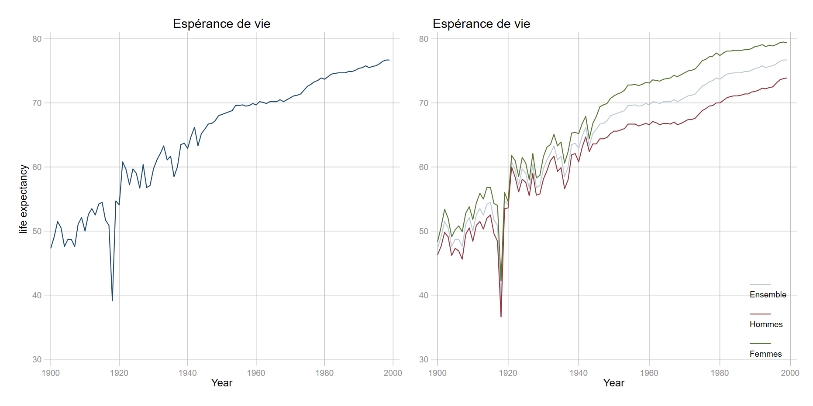{ width=75% }


#### Plusieurs objets graphiques

* Chaque objet est séparé par **()** ou **||**
* Il contient ses options

```{r ,eval=F, echo=T}
[tw/graph] (type_graph1 Y1 [X1] [Y2] [X2] [Z] [in if]  [weight] [, options(1)])   ///
           (type_graph2 Y2 [X1] [Y2] [X2] [Z] [in if]  [weight] [, options(2)])   ///
          [(type_graph3...)] ...                                                  ///
          [(type_graph4...)] ...                                                  ///
          [, options_generales]   
```

ou

```{r ,eval=F, echo=T}
[tw/graph]  type_graph1 Y1 [X1] [Y2] [X2] [Z] [in if]  [weight] [, options(1)])   ///
        ||  type_graph2 Y2 [X2] [Y2] [X2] [Z] [in if]  [weight] [, options(1)])   ///
        || [type_graph3...] ...                                                   ///
        || [type_graph4...] ...                                                   ///
        || [, options_generales]   
```


**Exemple**
```{r ,eval=F, echo=T}
sysuse auto, clear

* sans option
tw scatter price mpg if foreign==0                                                              ///
|| scatter price mpg if foreign==1                                                              ///  
||, legend(order(1 "Domestic" 2 "Foreign"))  

* avec options
tw scatter price mpg if foreign==0 , msiz(vlarge) mc("84 2 163%60") mlc(black) mlw(vthin)      ///
|| scatter price mpg if foreign==1 , msiz(vlarge) mc("244 136 73%60") mlc(black) mlw(vthin)    ///
, legend(order(1 "Domestic" 2 "Foreign") region(lcolor(%0)))  ///
  graphr(color(white)) plotr(color(white))  name(g2,replace) 
```


*Graphique 2*    
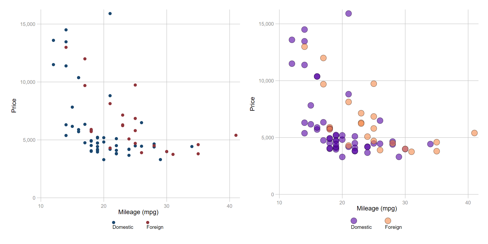{ width=75% }


* **Options sur les /bulles**:
  * Modification de la couleur de remplissage de la bulle avec l'option **`mc()`** [**`mcolor`**: marker-color]. L'opacité à été réduite à 60% pour laisser apparaitre les bulles superposées en arrière plan:  **`84 2 163%60`** et **`244 136 73%60`** 
  * Modification du contour des bulles avec **`mlc(black)`** (marker-line-color) et **`mlw(vthin)`** (marker-line-width)
  * Augmentation de la taille des bulles avec **`msiz(large)`** (marker-size)
* **Option générale**:
  * Ajout d'une légende et suppression du contour: **`legend(order(1 "Domestic" 2 "Foreign") region(lcolor(%0)))`**


**Cas particuliers**: pour les graphiques de type oneway [graph bar, graph box, pie...], les options des objets sont renseignées dans les options générales avec possibilité de paramétrer les options de chaque objet en suivant une syntaxe du type **`objet(#, option objet #)`**   

```{r ,eval=F, echo=T}
  graph bar  y1 y2, ///
  bar(1, options)   ///
  bar(2, options) title("title")  
```


**Préférer un graphique avec un seul bloc d'objets ??**  
Plutôt que de multiplier le nombre d'objets et d'options, on peut créer une variable pour chaque modalité et générer un graphique à un seul bloc


```{r ,eval=F, echo=T}
sysuse auto,
separate price, by(foreign)

tw scatter price0 price1 mpg                                              ///
 , msiz(large large) mc(red%50 blue%50) mlc(black black) mlw(vthin vthin) ///
   legend(order(1 "Domestic" 2 "Foreign") region(lcolor(%0)))             
```


## [Quelques] Options graphiques

Il s'agit d'un tour d'horizon forcément imcomplet des options graphiques. On va regarder principalement les options liées aux couleurs, tailles, positions; et quelques paramètres de bases pour les axes, légendes, titres, et les graphiques combinés  

Un très bon pense bête: https://geocenter.github.io/StataTraining/pdf/StataCheatSheet_visualization15_Syntax_2016_June-REV.pdf

### Options d'un objet graphique

**COULEURS ET TAILLES/EPAISSEURS**

#### Couleurs  

* 3 Eléments dans les options couleurs
    * **Un nom ou un code numérique**: la couleur *navy* (première couleur de la palette Stata **s2**) à pour code RGB [Red-Green-Blue] **`"26 71 11"`**  
    
    * **Modification de l'intensité (saturation)**: par défaut la couleur d'une palette a une saturation de 1, on tire vers le blanc en la réduisant, vers le noir en l'augmentant
      * Valeur minimale 0 (blanc ou quasi blanc), pas de valeur maximale.
      * Après le nom ou le code couleur, l'intensité est modifiée par **`*#`**
      * Exemples:
        * **`option_couleur(*.5)`**  réduit l'intensité de 50% de la couleur utilisée par défaut
        * **`option_couleur(*1.2)`** augmente l'intensité de 20% de la couleur utilisée par défaut  
<br>
    * **Jouer sur la transparence** (depuis Stata 15): par défaut le niveau d'opacité est de 100% [transparence = 0%]
      * Valeur minimale 0, valeur maximale 100
      * Après le nom ou le code de la couleur, l'opacité est réduite par **`%#`** avec # compris entre 0 et 100-] 
      * Une transparence totale **option(`%0`)** permet de cacher des éléments d'un graphique
    * On peut **combiner les deux modifications**:
      * Baisser l'intensité et réduire l'opacité n'a aucun intérêt (voir graphique sur les barres plus bas)
      * Augmenter l'intensité et baisser l'opacité modifiera le rendu de la couleur dans le graphique **`optionc([couleur]*1.5%50)`**: ici intensité multiplié par 1.5 avec 50% de transparence   
<br>
<br>

**Exemples de syntaxes**  

*Objets graphiques*
```{r ,eval=F, echo=T}
tw scatter Y X,  mc(blue%30) mlc(black)
tw line    Y X,  lc(blue*1.2) 
graph box Y1 Y2, box(1,fc(red%50)) box(2,fc(blue%50))
```


*Options*
```{r ,eval=F, echo=T}
title("MON TITRE", c(red) box fc(blue) lc(black)   )  ///
legend(region(fc(blue*.2) lc(black)))
```


**EXEMPLES**  
<br> 
**Nuage de points: contrôle des effets de superposition**   
*Graphique 3*    
{ width=75% }


**Barres**  
*Graphique 4*    
{ width=75% }


*Graphique 5*   
{ width=75% }

#### Taille - Epaisseurs


##### Tailles/épaisseurs prédéfinies

* Les tailles et épaisseurs prédéfinies ont un nom (small, large...)
* Selon l'élément (symbole, courbe, texte), les noms et la liste changent

**Types marker**   
*Graphique 6*  
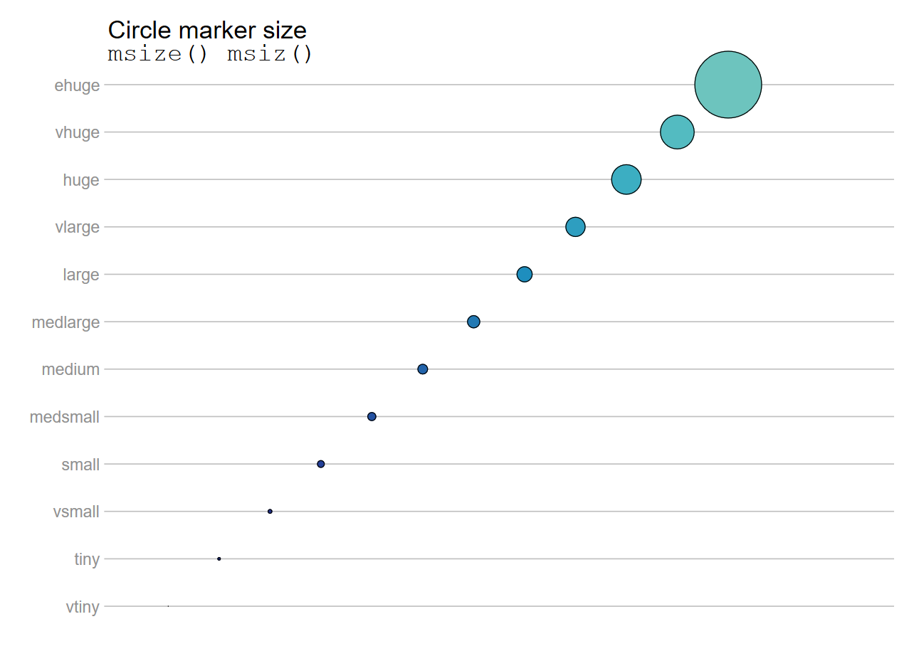{ width=75% }

*Graphique 7*   

Il est fortement conseillé de n'utiliser que les bulles 

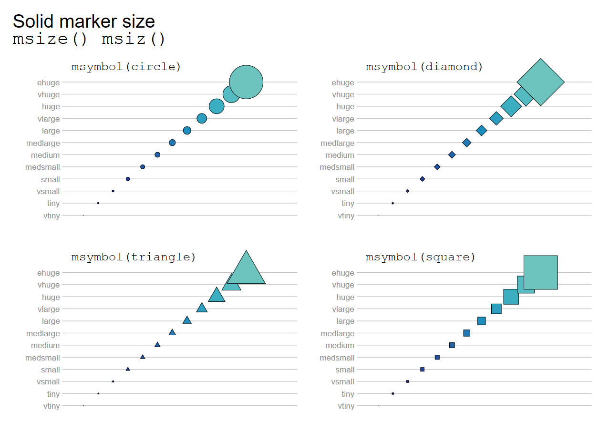{ width=50% }


*Graphique 8*   
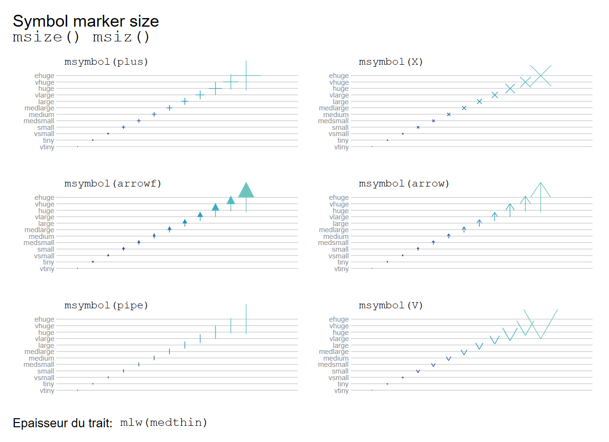{ width=50% }

*Graphique 9*   
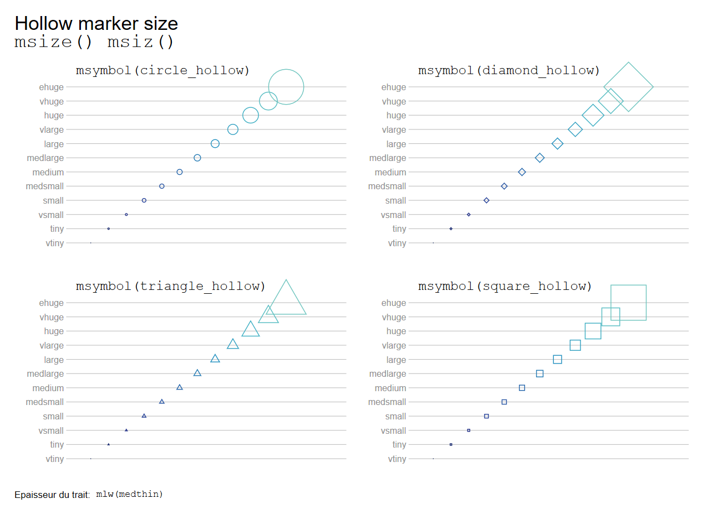{ width=50% }

**Types line**     
*Graphique 10*   
{ width=75% }


*Graphique 11*  
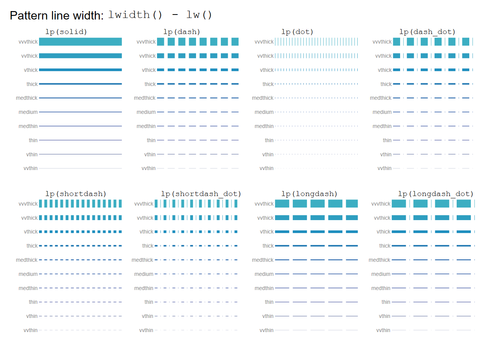{ width=75% }

*Graphique 12*  
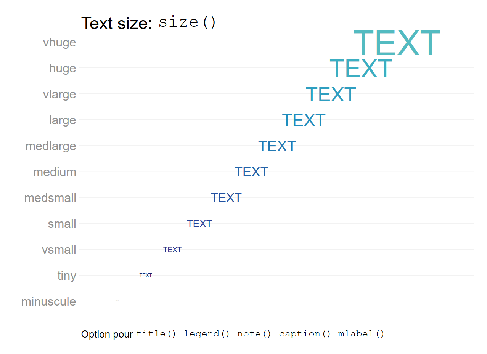{ width=75% }


##### Tailles paramétrées

* Les tailles et épaisseurs peuvent être paramétrées manuellement: 
  * par unité de mesure: **#pt** (printer point) **#in** (pouce) **#cm** (centimètre )  
  * par un coefficient multiplicateur d'une taille de référence: **`option(#rs)`**  ou **`option(*#)`**. 
  * visiblement `#rs` peut-être réduit à `#`
  * La taille et l'épaisseur semblent semblent pour `*#` 

*Graphique 13*  
{ width=75% }


**Exercices**  
<br>
Avec la base *auto* [*`sysuse auto.dta`*]
<br>
* **Graphique(s) I**  

  * Reproduire l’un et/ou l’autre de ces graphiques avec les variable mpg (continue) et foreign (discrete)
  •	Les histogrammes sont générés avec la fonction **`tw histogram`** (à préférer à la commande one-way **`histogram`**)
  * Les densités sont estimées avec la fonction **`kdensity`** [**`help kdensity`**]


*Graphique 14*  

<details>
<summary><B><font color="#178ACC">PROGRAMME</B></font></summary>
```{r,eval=F, echo=T}
sysuse auto, clear

qui separate mpg, by(foreign)

kdensity mpg0 , g(x1 d1) nograph k(gauss)
kdensity mpg1 , g(x0 d0) nograph k(gauss)
 
tw histogram mpg0  , bin(10)  density fcolor("34 94 168%70")   lc(black) lw(vvthin)   ///
|| histogram mpg1  , bin(10)  density fcolor("139 209 187%70") lc(black) lw(vvthin)   ///
legend(order(1 "Domestic" 2 "Foreign") region(lcolor(%0))) xlabel(10(10)50)

tw area d1 d0 x0, fc("34 94 168%70" "139 209 187%70") lc(black black) lw(vthin vthin) ///
legend(order(1 "Domestic" 2 "Foreign")  region(lcolor(%0))) xlabel(10(10)50)         
```
</details>   

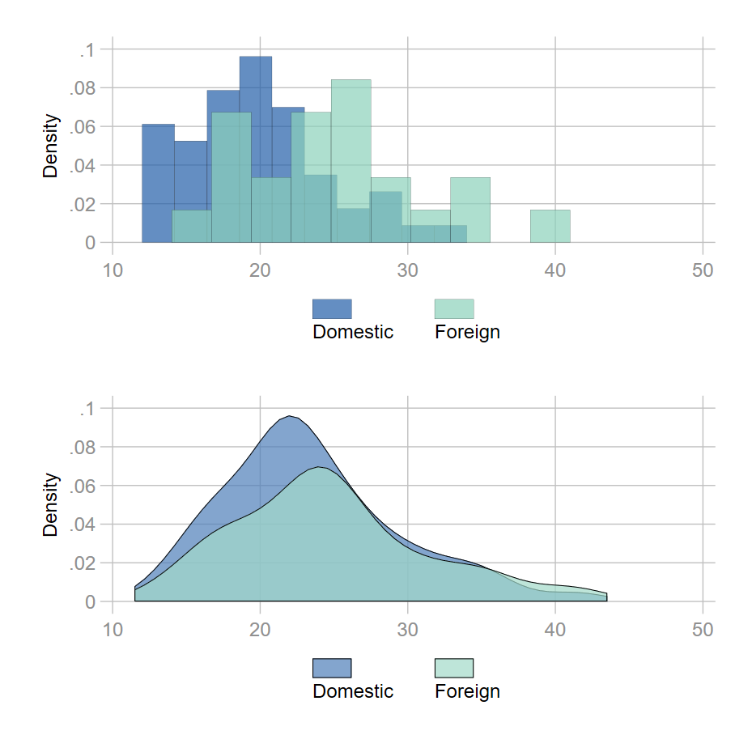{ width=75% }

* * **Graphique(s) II**  

Reproduire le graphique suivant:  

  * nuage de points des variables price et mpg pour les deux modalités de la variable foreign, avec report des OLS 
  * La droite de l'OLS est générée avec un graphique de type **`lfitci`**:
    * Couleur de la droite: option **`clcolor()`**
    * Couleur de l'intervalle de confiance: option  **`fcolor()`** 
    * Couleur du contour de l'intervalle de confiance: option  **`alcolor()`** 
  * Légende facultative (voir section suivante)  


*Graphique 15*  

<details>
<summary><B><font color="#178ACC">PROGRAMME</B></font></summary>
```{r,eval=F, echo=T}
tw  lfitci  price mpg  if !foreign, clcolor("34 94 168*1.2")    fcolor("34 94 168%25")  alcolor(%0)        ///
 || lfitci  price mpg  if foreign,  clcolor("139 209 187*1.2")  fcolor("139 209 187%25") alcolor(%0)       ///
 || scatter price mpg  if !foreign, msize(medlarge)   mlc(black) mlw(vthin) mc("34 94 168*.5") jitter(2)   ///
 || scatter price mpg  if foreign,  msize(medlarge)   mlc(black) mlw(vthin) mc("139 209 187*.5") jitter(2) ///
 || , legend(order(5 "Domestic" 6 "Foreign") pos(1) region(lc(%0)))                                        ///                                            
     ytitle("price") xtitle("mpg")         
```  
</details>

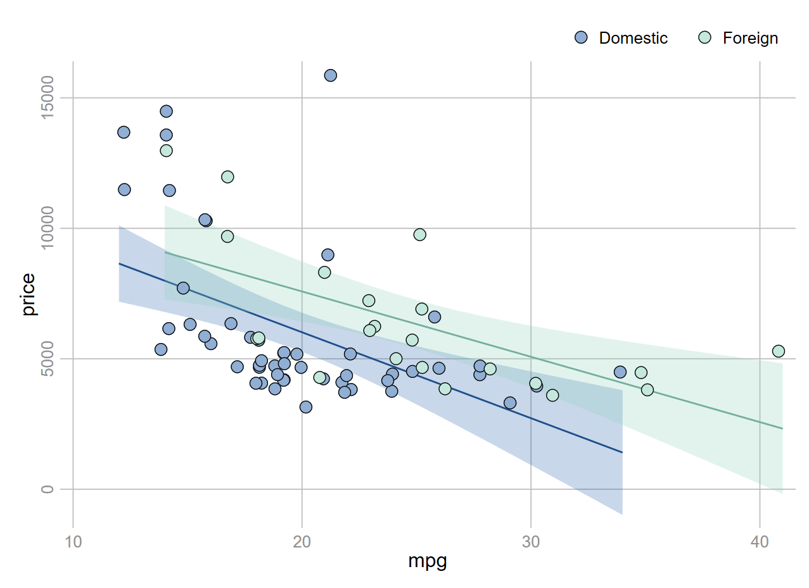{ width=75% }

### Habillage : Axes - Légendes - Titres

#### Axes

4 sous ensembles d'options: *titre*, *label*, *échelles* et *choix* pour les axes multiples (non traité)  

**Titres**    

* **xtitle()**  **ytitle()**:  **`xtitle(["titres"] [, options]`**
  * Si seulement des option(s) en conservant le titre par défaut (label de la variable): **`xtitle(, options)`**
  * Principales options: taille **`size()`**, couleur **`color()`** 
  * Titres sur plusieurs lignes: **`xtitle("ligne1" ligne2"....[, options]`**

**Labels**  

* **xlabel()**  **ylabel()**: **`xlabel([coordonnées] [,options])`**
  * Si seulement des option(s) en conservant les coordonnées par défaut: **`xlabel(, options)`**
* Modification du label:
  * Avec **min(delta)max**: **`xlabel(#1([#2]#3))`**. Exemple **`xlabel(0(5)10)`**
  *	Manuel: xlabel( #1 #2 "label2"…)  ou   xlabel( #1 "label1" #2 "label2"...). Exemple: xlabel(0 5 10) ou  xlabel(0 "Zero" 5 "Cinq" 10 "Dix")
  * On peut mixer l’approche manuelle et l’approche avec le delta: xlabel( 0 .5 1(1)10)
  
* Principales options:
  * taille **`labsize()`** [**`labs`**] , couleur **`labcolor()`** [**`labc`**]
  * Alterner les positions pour éviter les chevauchements: **`alternate`** [**`alt`**]
  * Modifier l'angle: **`angle(#)`** avec # valeur de l'angle [0 (horizontal), 45, 90 (vertical) ...]
  * Modification du grid:
    - couleur: **`glc`** **`tlc`**
    - épaisseur: **`glw`** **`tlw`**

**Echelles**   

* **xscale()**  **yscale()** 
  * Passage à une échelle logarithmique: **`log`**
  * Echelle en ordre décroissant: **`reverse`**
  * Supprimer l'affichage des axes:  **`xscale(off)`** et/ou **`yscale(off)`**
  *	Modifier la longueur de l’axe : **`range(min max)`** [**`r()`**]. Surtout utilisé pour aller au-delà de la longeur définie par xlabel ou ylabel et ajouter des éléments dans cette zône (texte par exemple)

*Graphique 16*  
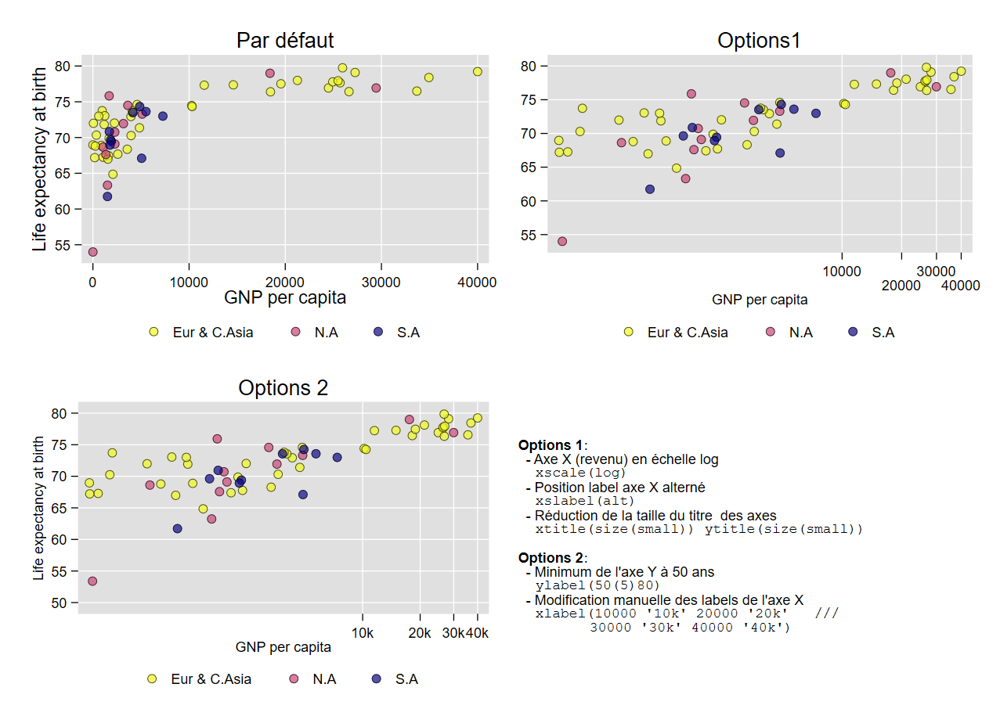{ width=75% }

**Attention** pour la dernière option, le label doit-être indiqué par des doubles quotes **" label "** et non par **'label'**: **`xlabel(10000 "10k" 20000 "20k" 30000 "30k" 40000 "40k")`**

**Graphique options 1**
```{r,eval=F, echo=T}
tw scatter lexp gnppc if region==1,                      ///
|| scatter lexp gnppc if region==2,                      ///
|| scatter lexp gnppc if region==3,                      ///
,  title("Options 2")                                    ///
   legend(order(1 "Eur & C.Asia" 2 "N.A" 3 "S.A"))       /// 
   xscale(log) xlabel(,alt) xtitle(, size(small))        ///
   ylabel(50(5)80)          ytitle(, size(small))                
```


**AIDES**  

* https://www.stata.com/manuals/g-3axis_options.pdf#g-3axis_options
  * **`help axis_options`**
  * **`help axis_title_options`**
  * **`help axis_label_options`**
  * **`help axis_scale_options`**
  * **`help axis_choice_options`**

#### Légendes

* **legend()**: **`legend()`**
* Ne pas afficher une légende: **`legend(off)`**
* Position par défaut: 6 heures (Sud) - Extérieur. Modifiable avec **`pos(#)`** et **`ring(#)`**  [voir Annexe plus bas]
* Modifier le nombre de lignes et de colonne: **`row(#)`** et **`col(#)`**
* Modifier les labels de la légende:
  * **order()**: *`order( 1 "label1" 2 "label2" .....)`* 
  * **lab()**:   *`lab(1 "label1") lab(2 "label2") ...)`* 
  * L'apparence (gras, itallique...) sont modifiables avec des balises **smcl**
* Modifier l'aspect de la région:  **`region(options)`** ou **`r(options)`**
* Texte sous le symbol: **`stack`**

*Graphique 17*  
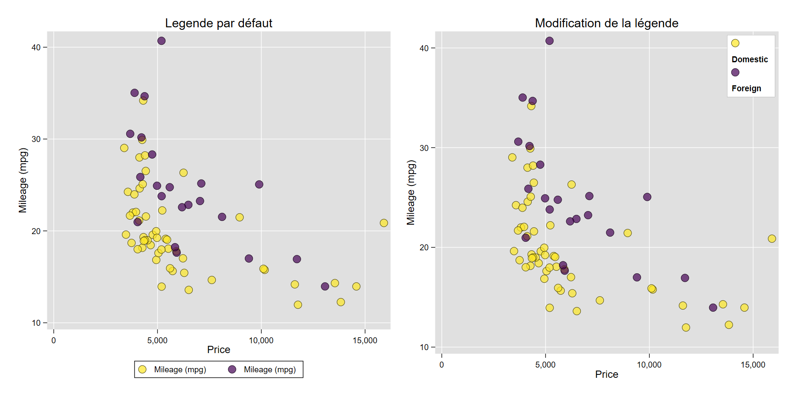{ width=75% }

**Par défaut**
```{r,eval=F, echo=T}
tw scatter   mpg price if foreign==0   ///
|| scatter   mpg price if foreign==1   ///
title("Legende par défaut")
```

**Avec modification**
```{r,eval=F, echo=T}
tw scatter   mpg price if foreign==0                ///
|| scatter   mpg price if foreign==1                ///
,  title("Modification de la légende")              ///
   legend(order(1 "{bf:Domestic}" 2 "{bf:Foreign}") ///
   pos1) ring(0) col(1)                             ///
   region(lw(vvthin))                               ///
   stack ) 
```   

* Changement des labels de la légende, affichés en gras (balise smcl):  **`order(1 "{bf:Domestic}" 2 "{bf:Foreign}")`**
* Position à 1 heure dans le graphique et affichage sur une ligne : **`pos(1) ring(0) col(1)`**
* Modification de la boite avec un contour très fin: **`region(lw(vvthin)`** 
* Texte sous le symbol: option **`stack`**   

**AIDES**  

* https://www.stata.com/manuals/g-3legend_options.pdf
* **`help legend_options`**
* Pour les graphiques de type **countour** et **contourline** les options sont renseignées par **clegend()** et **`plegend`** 


#### Titres - Notes - Texte

* Modification de la position
  * Titre par défaut: à 12 heures à l'extérieur
  * Note par  défaut: à 17 heures à l'extérieur
  * Caption par défaut: Sous la note
  * Titre(s) - Notes - Texte: position modifiable avec **`pos(#)`** et **`ring(#)`**  [voir Annexe plus bas]
  * Texte libre: positionné sur les coordonnées des axes (x,y)
* L'apparence (gras, italique, polices...) sont modifiables avec des balises **smcl** + ajout de symboles mathématiques + lettres grecques
* Tailles et couleurs modifiables avec **`size`** et **`color`**
* Texte sur plusieurs lignes: `"ligne1" "ligne2"....[, options]`
  Exemple: `title("Titre" "de mon" "graphique)` affiche le titre sur trois lignes

<br>
**ANNEXE: POSITION**    

**Texte positionné au Nord et au Sud**  
*Graphique 18*  
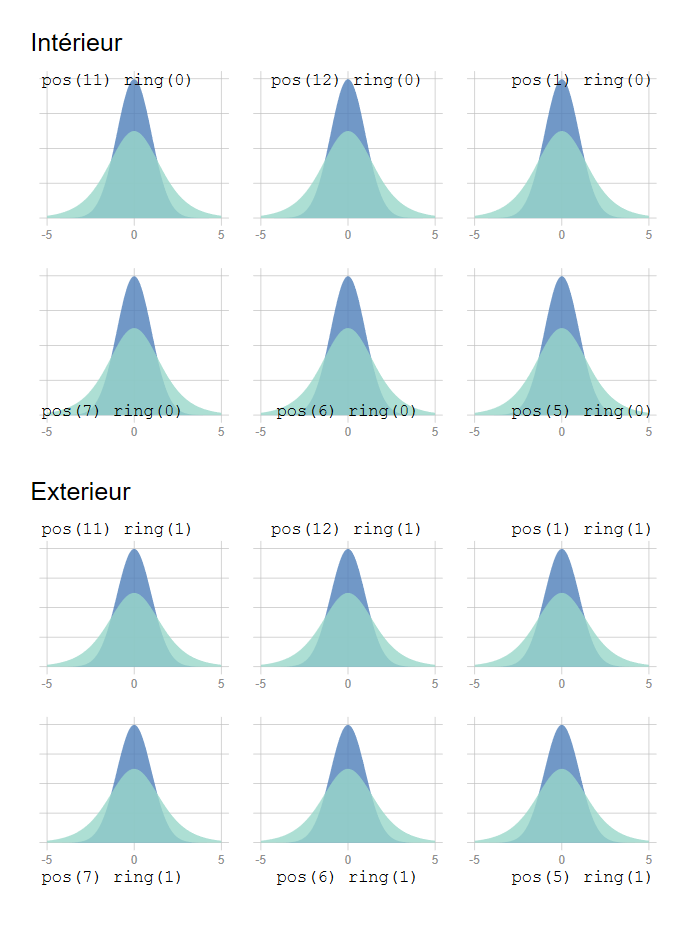{ width=75% }

**Texte positionné à l'Ouest et à l'Est**  
*Graphique 19*  
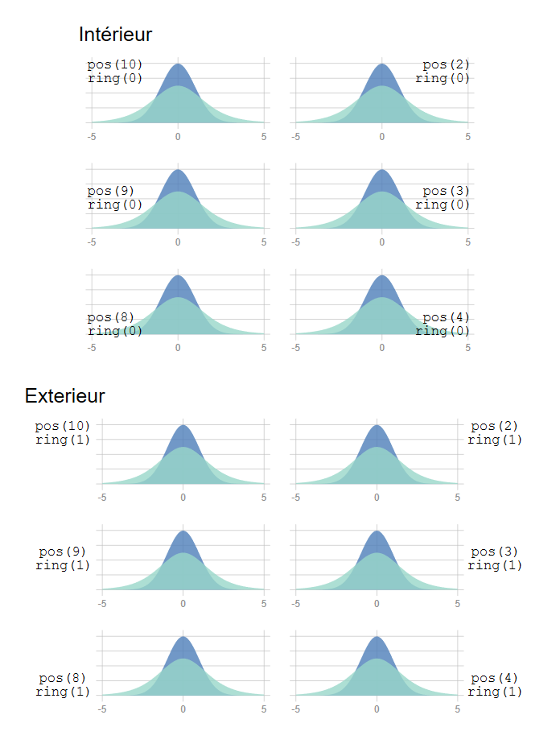{ width=75% }
  
  
### Autres


* Modification des couleurs de fond:
  * Zone intérieure du graphique: **`plotr(color())`**
  * Zone extérieure du graphique: **`graphr(color())`**


* **name**: sauvegarde temporaire sur la session
  * utiliser l'option replace pour écraser le graph, sinon effectuer **`graph drop noms_graphs`** ou **`graph drop _all`** 
  * Exemple: **`tw line y x, name(g1,replace)`**
* **save**: sauvegarde en dur sur le disque
  * Utile de créer un répertoire par défaut avec une macro (type **`global`**): **`global g "D:/stata_graph/"`** puis **`tw line y x, save($g/g1, replace)`**
  * récupérer les infos d'un graph enregistré: **`graph describe nom_grap.gph`** (le code est affiché)
* **scale(#)**: permet de modifier la taille de tous les éléments générés par le graphique, en particulier le texte. Utile, par exemple, lorsque le texte d'une légende sort du contour. Valeur de référence=1
* **nodraw**: équivalent de *`quietly`* pour les graphiques. Permet de réduire le temps d'exécution pour les graphiques combinés 


## Les graphiques combinés

Un graphique combiné consiste à mettre en page plusieurs graphiques dans un seul graphique

* 2 commandes:
  * interne: **graph combine**
  * externe: **grc1leg** pour avoir une seule légende, si elle est partagé pour tous les graphiques  

```{r,eval=F, echo=T}
tw graph1, name(g1, replace) nodraw 
tw graph2, name(g2, replace) nodraw 
graph combine g1 g2, iscale(.9) xsize(20) ysize(15) scheme(style1 style2) title("graphique combiné")
```

<br>

* préférer **`name()`** à **`save()`** pour les graphiques composants le graphique combiné
* utiliser **`nodraw`** pour raccourcir le temps d'exécution
* **graph combine** et  **gr1leg** (externe: permet d'afficher une seule légende)
  * **row(#)** - **cols(#)**
  * **iscale(#)**: baisse ou augmente la taille des éléments textes par un coefficient multiplicateur
  * **xsize(#)** - **ysize(#)**: modifie la taille du graphique combiné en *pt* (max # = 20), la combinaison modifiant le rendu des graphiques individuels avec un effet écrasement:
    * Pour un graphique à plusieurs colonnes et une ligne: on peut augmenter le ratio xsize(#)/ysize(#)
    * Pour un graphique à plusieurs lignes et une colonne: on peut baisser  le ratio  xsize(#)/ysize(#)
  * **fxsize(#)** - **fysize**: on peut modifier la taille relative des graphiques qui seront combinés. # est un %
  * **xcommon** - **ycommon**: ajuster les axes pour tous les graphiques
  * **legendfrom**: une seule légende avec l'option **legendfrom(name)** de la commande **`grc1leg`**
  * gestion des styles: si les graphiques utilisent des thèmes graphiques différents, le dernier sera appliqué à tous les graphiques. Pour conserver les thèmes de chaque graphique: **`scheme(nom_style1 nom_style2....)`**

* **Graphique vide**
    * Il peut être intéressant, en particulier lorsque le nombre de graphique est impair, d'utiliser un graphique vide pour ajouter des éléments de texte: un titre si le graphique vide est sur la première ligne ou des notes s'il est situé sur la dernière
    * La syntaxe de ce graphique peut-être enregistrée sous la forme du'une macro en dur (*global*) pour le réutiliser facilement
  
*Graphique vide*  
```{r,eval=F, echo=T}  
global gvide "scatteri 1 1,  ylab(,nogrid) xlab(,nogrid) mc(%0) xtitle("") ytitle("") yscale(off noline) xscale(off noline) nodraw name(gv,replace)"
tw $gvide [options]
```  

**Exemples**
4 Graphique combinés avec le nombre de lignes et de colonnes par défaut: `col(2)` ou `row(2)`

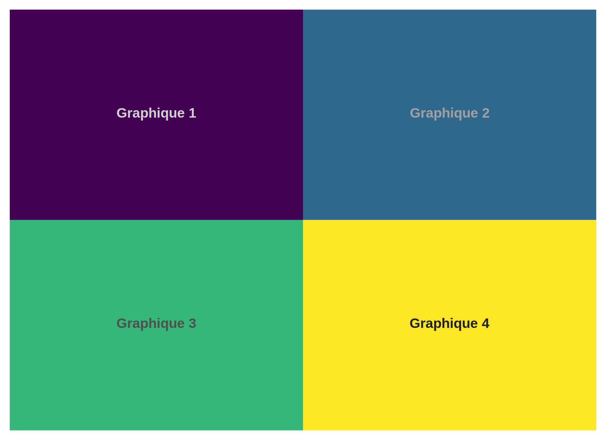

Dans le graphique suivant on modifie avec `fxsize()` et fysize()` la taille raltive des 4 graphiques individuellement.

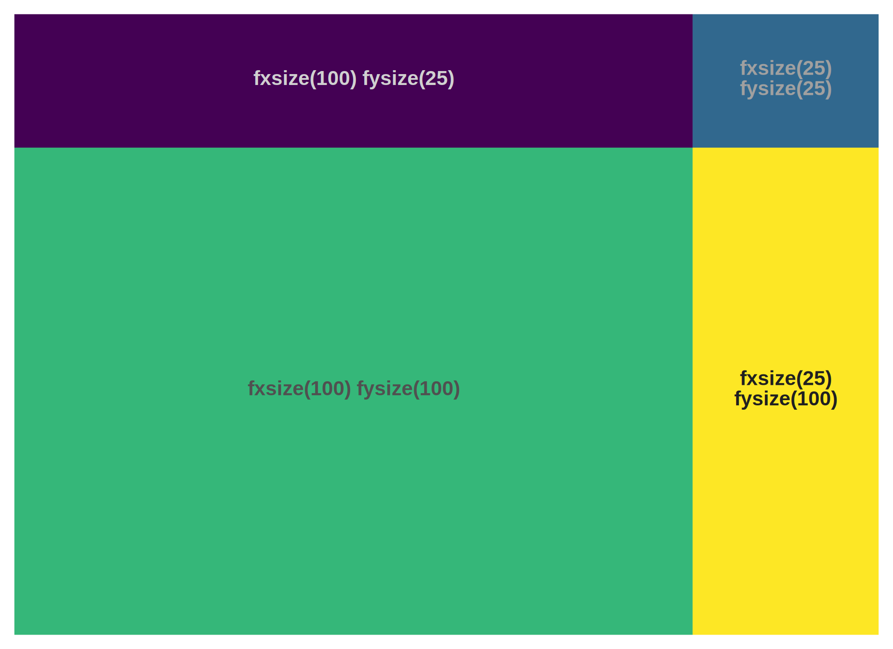

Dans les graphique suivant, le second est un graphique vide sert à afficher le titre. Les graphiques donnent les distributions marginales de deux variables, ainsi quele nuage de point représentant la distribution croisée

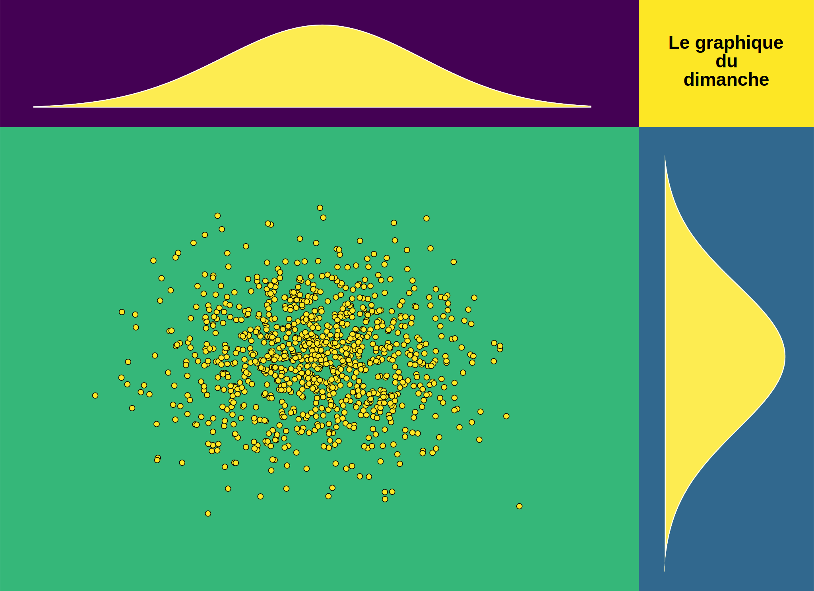


*Pour en savoir plus*  
**Graph combine—Combining graphs - Lars ̈Angquist**
https://journals.sagepub.com/doi/pdf/10.1177/1536867X1401400115


## Python 

* Implémentation de Python avec la version 16 de Stata: 
  * Stata n'intalle pas Python: [Installation de Python] https://mthevenin.github.io/stata_fr/python.html 
  * Commandes Stata dédiées pour gérer l'utilisation de Python [`python query` `python describe` `python clear` ....]
  * Python est exécutable dans la fenêtre *command* ou dans l'éditeur de programme
  * Mise à disposition d'Une librairie Python pour faciliter le passage d'une application à une autre (**SFI**) 
  * Les macros Stata sont reconnues par Python (très intéressant pour les graphiques)

**Exemple 1**  
```{r,eval=F, echo=T}  
Exemple 1
python:
----------------------- python (type end to exit) --------------------
 a=1
 b=2
 a+b
 3
 end
----------------------------------------------------------------------
```

**Exemple 2: importation d'une base Stata avec la librarie `pandas`**
**Fonction panda**: read_stata('path/nom_bas')
```{r,eval=F, echo=T}  
python:
----------------------- python (type end to exit) --------------------

import pandas as pa 
df = pa.read_stata('D:/stata_temp/auto.dta')
df.head(10)
   price  mpg  turn  displacement  gear_ratio   foreign
0   4099   22    40           121        3.58  Domestic
1   4749   17    40           258        2.53  Domestic
2   3799   22    35           121        3.08  Domestic
3   4816   20    40           196        2.93  Domestic
4   7827   15    43           350        2.41  Domestic
5   5788   18    43           231        2.73  Domestic
6   4453   26    34           304        2.87  Domestic
7   5189   20    42           196        2.93  Domestic
8  10372   16    43           231        2.93  Domestic
9   4082   19    42           231        3.08  Domestic
end
----------------------------------------------------------------------
```
  

* Graphiques et data-visualisation 
 * Les trois principales librairies pour les graphiques
   * **`matplotlib`**: https://matplotlib.org/
   * **`seaborn`**:    https://seaborn.pydata.org/
   * **`plotly`**      https://plotly.com/graphing-libraries/ 
 * Autres: **`ggplot`** et **`plotnine`** pour des graphiques types ggplot2 (R) 
   * *ggplot*: la librairie n'est plus mise à jour - très imcomplète
   * *plotnine*: la librairie est mise à jour - incomplète

* Remarques : 
  *	Certaines librairies comme altair ou bokeh ne sont utilisables que sous environnement conda (anaconda ou miniconda) avec les applications jupyter (notebook) ou spyder 
  *	Cartographie : les librairies plotly (voir plus bas) et folium (en cours de test) sont utilisables sous Stata
 

### Librairie seaborn

* Graphiques statiques

**Exemple 1**

```{r,eval=F, echo=T}  

* Partie Stata
sysuse auto, clear
xtile mpg2 = mpg, n(2)
label define mpg 1 "mpg<20" 2 "mpg>=20", modify
label value mpg2 mpg
keep price mpg weight displacement turn mpg2
save auto2, replace

* Partie Python
python:
import pandas as pa 
import seaborn as sns
df = pa.read_stata('auto2.dta')
g = sns.pairplot(df, hue="mpg2",palette="hls")
g.savefig("graph1.png")
end
! graph1.png

```

*Graphique 20*  
{ width=75% }

**Remarques**:  

* Les labels de la variable **mpg2** ont été lus par la fonction Python **`pairplot`**
* Le graphique a du être enregistré avec la fonction **`savefig(nom_graph)`** et ouvert avec l'invite de commande windows: **`! nom_graph`** ou **`shell nom_graph`**
  * Ce n'est pas une obligation, tout dépend de la fonction. 
  * Si le graphique peut-être affiché directement, on peut utiliser la fonction **`show()`**
  
**Exemple 2 

**Histogrammes et heatplot**
```{r,eval=F, echo=T}   
use nhanes2, clear
keep height weight
save pression, replace

python:
import pandas as pa 
import seaborn as sns
df = pa.read_stata('pression.dta')
sns.set(style="ticks")
g = sns.jointplot(x="height", y="weight", kind="hex", color="mediumvioletred", data=df)
g.savefig("graph2.png")
end
! graph2.png 
```

*Graphique 21*     
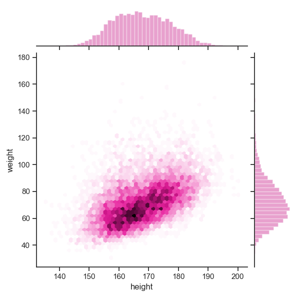{ width=50% }


**Densité**: en remplaçant l'option **`kind="hex"`** par **`kind="kde"`**  
*Graphique 22*  
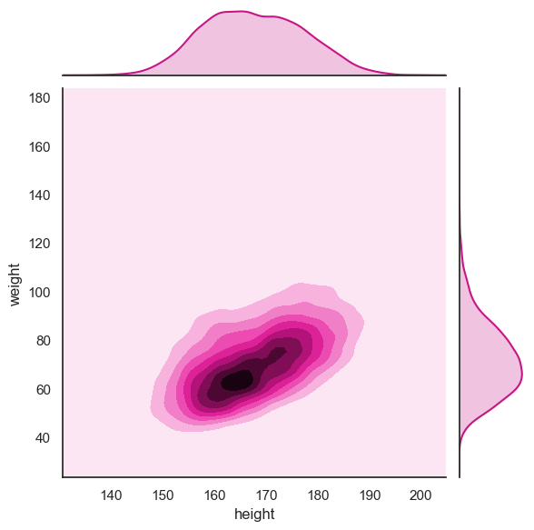{ width=50% }


### Plotly

Graphiques de type interactifs et/ou dynamiques - possibilité de programmer des dashboards [A tester]

* Graphiques interactif et dynamique:
  * Des informations s'affichent en passant sur le(s) élément(s) du graphique 
  * On peut choisir de faire apparaître une partie des éléments composant le graphique. Pratique pour les courbes (clic et double clic dans la légende)
  * Des options en haut et à gauche du graphiques permettent de zoomer/dezoomer...
* Graphique enregistré en format html. Pour une capture *png*, on peut l'enregistrer directement (voir menu en haut et à gauche)  


**Exemple 1:**
**Graphique intéractif de type line**  
https://plotly.com/python/line-charts/
```{r,eval=F, echo=T} 
sysuse uslifeexp.dta , clear
keep year le le_male le_female
rename le le1
rename le_male le2
rename le_female le3
reshape long le, i(year) j(pop)
label define pop 1 "tot" 2 "Hommes" 3 "Femmes"
label value pop pop 
save uslifeexp.dta , replace

python:
import pandas as pa 
import plotly.express as px
df = pa.read_stata('uslifeexp.dta')
fig = px.line(df, x="year", y="le", color="pop")
fig.update_layout( title="Espérance de vie US de 1900 & 1999", yaxis_title="Espérance de vie")
fig.show()
end
```

*Graphique 23*  
<iframe width="800" height="600"  src="imgf/g27.html"></iframe>


**Exemple 3 :** 
**Graphique interactif de type treemap**  
https://plotly.com/python/treemaps/
```{r,eval=F, echo=T} 
use "gm2.dta", clear
des
/*
--------------------------------------------------------------------------------
              storage   display    value
variable name   type    format     label      variable label
--------------------------------------------------------------------------------
country         str30   %30s                  
continent       str14   %14s                  
lifeexp         double  %6.2f                 
year            float   %9.0g                 
pop             long    %12.0g                
world           str5    %9s                   
--------------------------------------------------------------------------------
*/

python:
import pandas as pa 
import plotly.express as px
df = pa.read_stata('gm2.dta')
fig = px.treemap(df, path=['world', 'continent', 'country'], values='pop', color='lifeexp')
fig.show()
end
```

*Graphique 24*  
<iframe width="800" height="600"  src="imgf/g29.html"></iframe>

*Lecture*:  

* Les périmètres des boîtes sont relatifs à la taille de la population: taille relative des *continents* - taille relative des pays dans chaque *continent*
* Les différentes couleurs sont relatives à l'espérance de vie
* Pour  *world* et les continents les espérances sont calculées par une moyenne pondérée: avec stata pour l'Europe: **`sum lifeexp [iw=pop] if continent=Europe"`**
* Manque quelques pays dont le continent n'était pas renseigné dans la base d'origine et que je n'ai pas pris la peine et/ou le temps de modifier, ainsi que les pays avec moins de 1 million d'habitant.e.s

**Exemple 3 :** 
**Graphique interactif et dynamique de type barres**      
https://plotly.com/python/bar-charts/
```{r,eval=F, echo=T} 
use gm3, clear
drop if year<1960
drop if continent==""
replace continent="Asia & Oceania" if inlist(continent, "Asia", "Oceania")
bysort country: gen N=_N
sort year pop
drop if N<61   // On conserve seulement les pays avec toutes les années renseignées
tostring year, replace
drop N
save gm4, replace
des
--------------------------------------------------------------------------------
              storage   display    value
variable name   type    format     label      variable label
--------------------------------------------------------------------------------
country         str30   %30s                  
continent       str14   %14s                  
pop             long    %12.0g                
year            float   %6.0f                 
--------------------------------------------------------------------------------

python:
import pandas as pa 
import plotly.express as px
df = pa.read_stata('gm4.dta')
fig = px.bar(df, x="continent", y="pop", color="continent",
animation_frame="year", animation_group="country", range_y=[0, 5000000000])
fig.update_layout( title="Evolution de la population mondiale  depuis 1960",
yaxis_title="Population", xaxis_title="Continents")
fig.show()
end
```

*Graphique 25*  
<iframe width="800" height="600"  src="imgf/g28.html"></iframe>


**Exemple 4**

* Carte intéractive, sans trop d'intérêt, avec Plotly 
* Problème pour me sortir de l'échelle continue
* Nombre moyen d'hôtels & campings dans les communes par département (hors Paris: peut-être enlever toute l'Idf en raison des hôtels type "Samu Social")
* Coordonnées récupérées sur le site de *Grégoire David* 

```{r,eval=F, echo=T} 
python:
from urllib.request import urlopen
import json
import pandas as pd
import plotly.express as px

df = pd.read_csv("D:/Marc/SMS/FORMATIONS/2020/graph ur9/formation/hotcamp.csv", dtype={"dep": str})

fig = px.choropleth(
    df,
    geojson="https://raw.githubusercontent.com/gregoiredavid/france-geojson/master/departements-version-simplifiee.geojson",
    featureidkey='properties.code',
    locations='dep',
    color='mhotcamp3',
	title="Nombre moyen d'hotels et de campings par commune (hors Paris)",
	projection="mercator",
	color_continuous_scale=px.colors.sequential.YlGnBu,
	)

fig.update_geos(fitbounds="locations", visible=False)
fig.show()
end
```

<iframe width="800" height="600" src="imgf/carte.html"></iframe>


# Utilisation des macros

Une macro est un objet simple qui enregistre une valeur ou une expression, et qui sera utilisé une ou plusieurs fois dans un programme. Elles permettent de générer des expressions en boucle. 
<br>
Leur utilisation est essentielle pour générer des graphiques Stata et faciliter leur réutilisation, entre autres :  

-	Alléger la syntaxe de l’habillage dans la commande graphique
-	Reporter automatiquement des valeurs (moyenne, minimum, maximum…) dans un graphique
-	Produire des graphiques complexes, en particulier en générant des macros empilées


##  Types et objets macro

* **Rappel important**:  (toujours) tester le contenu de la macro avec **`display`** (`di`) ou **[très conseillé]** avec **`macro list`** si la macro implique la conservation des double quotes:
  * *macro list
  * Si macro temporaire (*local*): **`macro list _nom_macro`** [mac list]
  * Si macro en dur     (*global*):    **`macro list  nom_macro`**

* **boucles**: pour générer des boucles se reporter à l'aide: **`help foreach`** - **`help forvalue`**


### local - global 

* **global**: macro en dur (enregistrée)
  * Appelé avec **$**
  * Supression: **`macro drop nom_macro1 nom_macro2...``**  

  * Pas de grande utilité à mon sens pour les graphiques, sauf pour utiliser un répertoire par défaut de sauvegarde des graphiques
```{r,eval=F, echo=T}   
    mkdir "D:/stata_graph"
    global g "D:/stata_graph"
    tw scatter y x, save($g/nom_graph)
```

* **local**: macro temporaire (à l'exécution)
  * Appelé avec des quotes simples **``nom_macro'`** (première quote: [alt6]) 

**Exemple**
```{r,eval=F, echo=T}
sysuse auto, clear

global varlist price mpg 
tw scatter $varlist
macro drop varlist

local varlist price mpg 
tw scatter `varlist'
```


* **Macro et doubles quotes apparentes [TRES IMPORTANT]**
  * se fier à **`macro list`** et non à `di` pour vérifier la lecture de la macro si on doit conserver les doubles quotes dans une expression (couleur, legende...).
  * Attention à l'intégrité des doubles quotes lorsqu'une macro est réutilisée dans une autre
  * Important pour utiliser une palette de couleur utilisée dans un graphique, et pour générer des légendes [voir plus bas]


**Cas 1
```{r,eval=F, echo=T}

local x "A" "B" "C"
mac list _x
* _x:    A" "B" "C

local x `" "A" "B" "C" "'
mac list _x
* _x:    "A" "B" "C"

local x `""ABC""'
mac list _x
* _x:    "ABC"

``` 

En revanche, si dans une macro une expression texte avec des double quotes est précédée d’une expression sans ce type de quotes, elles sont conservées.

```{r,eval=F, echo=T}
local order 1 "Non" 2 "Oui"

mac list _order
* _order:         1 "Non" 2 "Oui" 
```


* **La commande magique LEVELSOF**
   * Transforme les valeurs d'une variable en expression macro
   * Syntaxe: **`levelsof nom_var [if/in], local(nom_macro)`**
   * Remarque: pour les variable caractère l'ordre d'affichage suit l'ordre alphabétique [voir graphique 91 ]
 
**Exemple**
```{r,eval=F, echo=T}
levelsof foreign, local(f)
di "`f'"

0 1

levelsof rep78, local(r)
di "`r'" 

1 2 3 4 5
``` 

 
  
* **Fonctions associées au macro**:
  * On peut associer des fonctions aux macros, certaines sont utiles pour les graphiques (`help macro` - https://www.stata.com/manuals/pmacro.pdf)
  * Exemple:  **`word count()`**, **`labn`**, **`lab`** 

*word count()*   
On compte le nombre d'objets contenus dans une macro (séparé par un espace).
Utile pour compter le nombre de boucles a effectuer avec `forvalue`
```{r,eval=F, echo=T}
levelsof rep78, local(r)
local n: word count(`r')
di `n'

5
``` 

*value label nom_variable*
Récupère le nom d'un label
```{r,eval=F, echo=T}
local varname foreign
local labn: value label `varname'
di "`labn'"

origin
``` 

*label nom_label valeur*
Récupère le nom de la modalité associé à une valeur d'un nom de label
```{r,eval=F, echo=T}
local lab0: label origin  0
local lab1: label origin  1

di "`lab0'"
Domestic
di "`lab1'"
Foreign
``` 


**Exemple dans une boucle**
```{r,eval=F, echo=T}
sysuse auto, clear
gen rep= rep78<4
label define rep 0 "rep<4" 1 "rep>=4", modify
label value rep rep

local varname rep
local labn: value label `varname'
levelsof `varname', local(l)
foreach l2 of local l {
local lab`l2': label `labn'  `l2'
}

tw scatter price mpg if `varname'==1, mc("237 248 177")   mlc(black) mlw(vvthin) msiz(medlarge) jitter(2)  ///
|| scatter price mpg if `varname'==0, mc("65 182 196")    mlc(black) mlw(vvthin) msiz(medlarge) jitter(2)  ///
, legend(order(1 "`lab0'" 2 "`lab1'") pos(7) color("163 218 186") region(color("8 29 88*2.2")))            ///
ytitle(,  color("163 218 186")) xtitle(, color("163 218 186"))                                             ///
ylabel(, labc("163 218 186")    glw(vvthin))  xlabel(,  labc("163 218 186")  glw(vvthin))                  ///
plotr(color("8 29 88*2.2"))     graphr(color("8 29 88*2.2"))                                               ///
title("local varname rep",      pos(11) color("227 244 178")) 

```


En changeant **`local varname rep`** (g26) par **`local varname foreign`** (g27)

*Graphiques 26 & 27*  
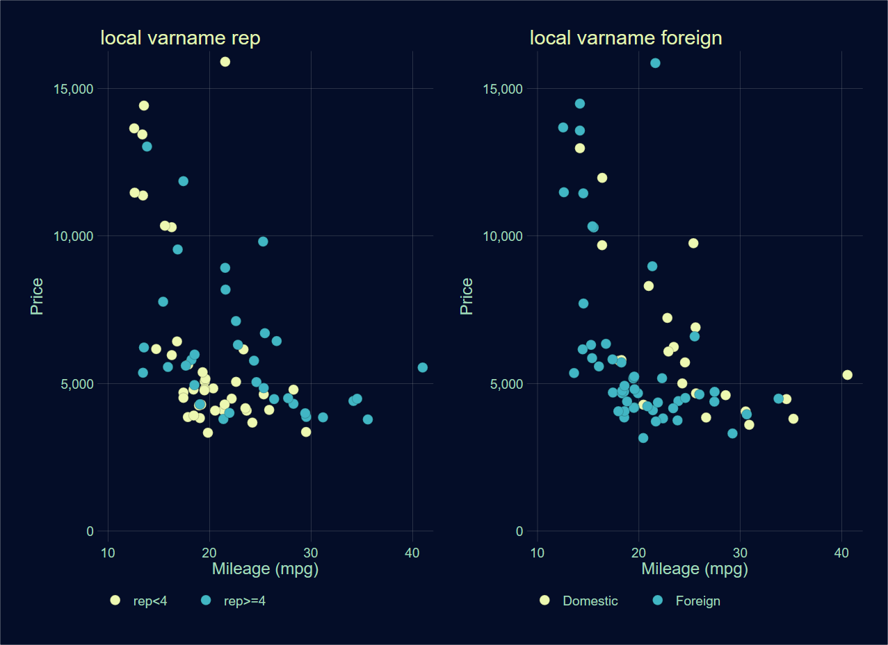{ width=50% }


* **Mofication du format d'une valeur numérique (changement du nombre de décimale)**
  * On peut utiliser les objets types **`r()`** ou **`e()`** dans un graphique (voir plus bas)
  * Certaines valeurs en mémoire comporte un nombre élévé de decimales
  * On peut modifier le format d'affichage de ces valeurs avec une macro: **`di format valeur**`
  
```{r,eval=F, echo=T}
local dec2: di %6.2f 10.64654654654
di `dec2'
10.65

local dec 10.64654654654
local dec: di %6.2f `dec'
di `dec'
10.65
```


* **Expression numérique calculée dans une macro**: **`local nom_macro = expression`**
```{r,eval=F, echo=T}
local a= 1 + 1
di `a'
2


local b= `a'^2
di `b'  
4
```


### Objets type return et ereturn  

Après l'exécution d'une commande, un certains nombre d'objets sont conservés en mémoire jusqu'à l'exécution de la commande suivante  

* **objet return** [result] : **`r()`**
  * Affichage liste: **`return list`**
* **objet ereturn**  [estimation]: **`e()`**
  * Affichage liste: **`ereturn list`**
* **Autres**
  * Matrices: **`matrix list`**


**Exemple**
```{r,eval=F, echo=T}
sum price, d
                            Price
-------------------------------------------------------------
      Percentiles      Smallest
 1%         3291           3291
 5%         3748           3299
10%         3895           3667       Obs                  74
25%         4195           3748       Sum of Wgt.          74

50%       5006.5                      Mean           6165.257
                        Largest       Std. Dev.      2949.496
75%         6342          13466
90%        11385          13594       Variance        8699526
95%        13466          14500       Skewness       1.653434
99%        15906          15906       Kurtosis       4.819188

return list
scalars:
                  r(N) =  74
              r(sum_w) =  74
               r(mean) =  6165.256756756757
                r(Var) =  8699525.97426879
                 r(sd) =  2949.495884768919
           r(skewness) =  1.653433511704859
           r(kurtosis) =  4.819187528464004
                r(sum) =  456229
                r(min) =  3291
                r(max) =  15906
                 r(p1) =  3291
                 r(p5) =  3748
                r(p10) =  3895
                r(p25) =  4195
                r(p50) =  5006.5
                r(p75) =  6342
                r(p90) =  11385
                r(p95) =  13466
                r(p99) =  15906
```


* Ces résultats peuvent être utilisés, tels quels,  lors de l'exécution de la commande suivante
* Ces résultats peuvent être conservé en mémoire dans une macro, et être utilisés tout du long du programme

Exemple
```{r,eval=F, echo=T}
local varlist price mpg
foreach v of loc varlist {
qui sum `v'
local m`v' : di %6.2f `r(mean)'
di "Moyenne `v'= `m`v''"
}
```

* Niveau graphique:
  * Permet d'afficher des valeurs dans le graphique
  * Permet de générer automatiquement des éléments de type **`xline`** **`yline`** 
  * Permet de généré des graphiques de type **scatteri** ou **pci** [on entre directement les coordonnées des axes et non des variables]
  
**Exemple**
```{r,eval=F, echo=T}
capt drop xtile qprice = price, n(4)
label define qp 1 "<Q25" 2 "Q25-Q50" 3 "Q50-Q75" 4 ">Q75", modify
label value qprice qp

local varname qprice
local labn: value label `varname'
levelsof `varname', local(l)
foreach l2 of local l {
local lab`l2': label `labn'  `l2'
}

local varlist price mpg
foreach v of loc varlist {
qui sum `v'
local  m`v' : di %6.2f `r(mean)'
}

tw scatter price mpg if qprice==1, mlc(black) mlw(vthin) mc("31 121 179")  msiz(medlarge)  jitter(2)       ///
|| scatter price mpg if qprice==2, mlc(black) mlw(vthin) mc("60 174 194")  msiz(medlarge)  jitter(2)       ///
|| scatter price mpg if qprice==3, mlc(black) mlw(vthin) mc("132 206 187") msiz(medlarge)  jitter(2)       ///
|| scatter price mpg if qprice==4, mlc(black) mlw(vthin) mc("211 238 180") msiz(medlarge)                  ///
|| , legend(order(4 "`lab4'" 3 "`lab3'" 2 "`lab2'" 1 "`lab1'")                                             ///
            col(1) pos(9)  color("163 218 186") region(color("8 29 88*2.2")) size(vsmall) )                ///
yline(`mprice', lw(vthin) lc("247 252 201") noext) xline(`mmpg', lw(vthin) lc("247 252 201") noext)        ///
ytitle(,  color("163 218 186")) xtitle(, color("163 218 186"))                                             ///
ylabel(, labc("163 218 186")    glw(vvthin))  xlabel(,  labc("163 218 186")  glw(vvthin))                  ///
plotr(color("8 29 88*2.2"))     graphr(color("8 29 88*2.2"))                                               ///
note("Moyenne Price = `mprice'" ///
     "Moyenne Mpg   = `mmpg'", color("163 218 186") pos(7))  
```

*Graphique 28*  
{ width=50% }  


### Autres


**Token**  

* Plutôt utilisé dans la programmation de routines (.ado) mais peut s'avérer utile pour transformer les variables du graphique en macro. 
* **Token** est une macro qui prend comme expression des numéros
* On transforme une expression en token avec la commande **`tokenize`**


```{r,eval=F, echo=T}
tokenize price mpg
sum `1' `2'

    Variable |        Obs        Mean    Std. Dev.       Min        Max
-------------+---------------------------------------------------------
       price |         74    6165.257    2949.496       3291      15906
         mpg |         74     21.2973    5.785503         12         41
```

Ou avec une expression sous forme de macro

```{r,eval=F, echo=T}
local varlist price mpg
tokenize `varlist'
sum `1' `2'

    Variable |        Obs        Mean    Std. Dev.       Min        Max
-------------+---------------------------------------------------------
       price |         74    6165.257    2949.496       3291      15906
         mpg |         74     21.2973    5.785503         12         41
```

**Application pour un graphique**
```{r,eval=F, echo=T}
local varlist price mpg foreign 
tokenize `varlist'
tw scatter `1' `2' if `3'==0 ||
tw scatter `1' `2' if `3'==1 
```

**Compteur i++** 

* Utile dans les boucles `foreach` pour générer un compteur type macro qui fonctionne comme dans une boucle `forvalue`
* Dans une boucle de type `forvalue` permet de générer un compteur dont les valeurs de départ et d'arrivée diffèrent des valeurs de la boucle  
* On peut initialiser sa valeur initiale par une macro: **`local j=valeur`**, ou dans une boucle `forvalue` utiliser directement la macro définie par la bouble. Le comportement de l'incrément ne sera pas le même

```{r,eval=F, echo=T}
local i = 1
forvalue v=10/15 {
di `i++'
}
1
2
3
4
5
6
```

```{r,eval=F, echo=T}
local i = 1
local varlist price mpg turn length
foreach v of local varlist {
di "var`i++' = `v'"
}
var1 = price
var2 = mpg
var3 = turn
var4 = length
```

*Différents comportement de l'incrément*
```{r,eval=F, echo=T}

 forv i=1/5 {
  di "iteration `i': i++ ="  `i++' 
   }
iteration 1: i++ =1
iteration 2: i++ =2
iteration 3: i++ =3
iteration 4: i++ =4
iteration 5: i++ =5


forv i=1/5 {
di "iteration `i': i++ ="  `i++' 
di "iteration `i': i++ ="  `i++' 
  }
iteration 1: i++ =1
iteration 2: i++ =2
iteration 2: i++ =2
iteration 3: i++ =3
iteration 3: i++ =3
iteration 4: i++ =4
iteration 4: i++ =4
iteration 5: i++ =5
iteration 5: i++ =5
iteration 6: i++ =6

 
local k=1
forv i=1/5 {
  di "iteration `i': "  `k++'
  di "iteration `i': "  `k++'
  }
iteration 1: 1
iteration 1: 2
iteration 2: 3
iteration 2: 4
iteration 3: 5
iteration 3: 6
iteration 4: 7
iteration 4: 8
iteration 5: 9
iteration 5: 10

 
local k=1
forv i=1/5 {
 local j = `k++'
 di "iteration `i': "  `j'
 di "iteration `i': "  `j'
  }
iteration 1: 1
iteration 1: 1
iteration 2: 2
iteration 2: 2
iteration 3: 3
iteration 3: 3
iteration 4: 4
iteration 4: 4
iteration 5: 5
iteration 5: 5
```

Si l'incrément est appelé plusieurs fois dans une itération et que sa valeur doit y être fixe, utiliser absolument la dernière expression


**Exemple

* Le graphique suivant représente les valeurs moyennes d'une des variables de la base auto par nombre de réparations (*rep78*)
  * Il est fortement inspiré d'un graphique de Cédric Scherer (https://raw.githubusercontent.com/Z3tt/TidyTuesday/master/plots/2019_19/2019_19_StudentTeacher.png)
* Les observations sont reportées par un nuage légèrement perturbé avec l'option `jitter(2)`
* La moyenne sur l'ensemble des observations est reporté avec `xline`
* Les moyennes pour chaque niveau de réparation sont reportées à l'aide de *lollipop* (voir section *visualisation des données avec Stata*)

* On a utilisé le compteur pour généré le nom des macros qui conservent la valeur des moyennes 
* On a utiliser les tokens pour le nom des variables:

```{r,eval=F, echo=T}

recode rep78 (1=2)	

graph set window fontface Consolas

tokenize weight rep78  // graph gauche
* tokenize mpg         // graph droite

qui sum `1' 
local mt `r(mean)'

local i=1
levelsof `2' , local(l)
foreach l2 of local l {
qui sum `1'  if rep78==`l2'
local m`i++' `r(mean)'
}

tw ///
|| scatter `2' `1' if `2' ==2,       mc("35 81 161%90")   msiz(small) mlc("8 29 88*2.3") mlw(vthin) jitter(5)  ///
|| scatter `2' `1' if `2' ==3,       mc("30 142 190%90")  msiz(small) mlc("8 29 88*2.3") mlw(vthin) jitter(5)  ///
|| scatter `2' `1' if `2' ==4,       mc("83 187 193%90")  msiz(small) mlc("8 29 88*2.3") mlw(vthin) jitter(5)  ///
|| scatter `2' `1' if `2' ==5,       mc("163 218 186%90") msiz(small) mlc("8 29 88*2.3") mlw(vthin) jitter(5)  ///
|| pci       2.015 `mt' 2.015 `m1' , lc("211 238 186")    lw(thick)                                            ///
|| scatteri  2.015 `m1'            , mc("35 81 161")      msiz(large) mlc("211 238 186") mlw(thin)             ///
|| pci       3 `mt' 3 `m2'         , lc("211 238 186")    lw(thick)                                            ///
|| scatteri  3 `m2'                , mc("30 142 190")     msiz(large) mlc("211 238 186") mlw(thin)             ///
|| pci       4 `mt' 4 `m3'         , lc("211 238 186")    lw(thick)                                            ///
|| scatteri  4 `m3'                , mc("83 187 193")     msiz(large) mlc("211 238 186") mlw(thin)             ///
|| pci       4.985 `mt' 4.985 `m4' , lc("211 238 186")    lw(thick)                                            ///
|| scatteri  4.985 `m4'            , mc("163 218 186")    msiz(large) mlc("211 238 186") mlw(thin)             ///
|| , xline(`mt', lw(thick) lc("211 238 186") noext)                                                            ///
legend(off)                                                                                                    ///
xlabel(, glw(vvthin)) ylabel(,glw(vvthin))                                                                     ///
xtitle("`var'",  color("211 238 186")) ytitle("rep78", color("211 238 186"))                                   ///
title("Averages of `1'", pos(11) color("127 205 180"))                                                         ///
plotr(color("8 29 88*2.2"))     graphr(color("8 29 88*2.2"))                                                   /// 
```


*Graphique 29*  
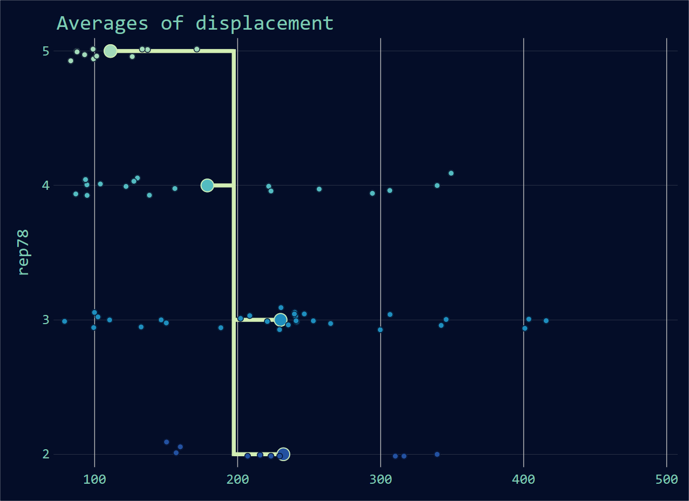{ width=50% } 

**Pour info**: *autres compteurs* 

* **`++i`** 
```{r,eval=F, echo=T}
local i=1
  forvalue j=1/5 {
   di `++i'
   }
* Renvoi la liste: 2 3 4 5 6
```
Remarque: pour retrouver les valeurs du compteur `i++`, il suffit s'initialiser `i` à 0

* **`i--`**  
```{r,eval=F, echo=T}
local i=10
forvalue j=1/5 {
   di `i--'
   }
* renvoi la liste: 10 9 8 7 6
```

* **`--i`**  
```{r,eval=F, echo=T}
local i=10
forvalue j=1/5 {
   di `--i'
   }
* renvoi la liste: 9 8 7 6 5
```


**Objet temporaire: tempvar, tempfile, tempname....**        

* **tempvar**: très utile.
  * Evite de créer des variables qui entre en conflit avec des variables existantes dans la base
  * La variable temporaire est conservée en mémoire, mais n'apparait pas dans la base.
  * Une nouvelle variable est créée lorsque le programme est exécuté à nouveau
  * syntaxe: **`tempvar nom_variable`** 
  * Lecture: Stata va créer une variable dont le nom est **_0000#**

 
```{r,eval=F, echo=T} 
tempvar X
gen `X' = runiform()
sum `X'

-------------+---------------------------------------------------------
    __000000 |         74    .4725448    .3017723   .0030522   .9944572
```
 
  
```{r,eval=F, echo=T}
sysuse auto, clear

tempvar qprice
local varlist price mpg `qprice'
tokenize `varlist'
xtile `qprice' = `1', n(4)

local i=1
foreach v of loc varlist {
qui sum `v'
local  m`i++' : di %6.2f `r(mean)'
}

tw scatter `1' `2' if `3'==1, mlc(black) mlw(vthin) mc(%70) msiz(medlarge) ///
|| scatter `1' `2' if `3'==2, mlc(black) mlw(vthin) mc(%70) msiz(medlarge) ///
|| scatter `1' `2' if `3'==3, mlc(black) mlw(vthin) mc(%70) msiz(medlarge) ///
|| scatter `1' `2' if `3'==4, mlc(black) mlw(vthin) mc(%70) msiz(medlarge) ///
yline(`m1', lw(vthin) lc(black)) xline(`m2', lw(vthin) lc(black))           ///
note("Moyenne `1' = `m1'" ///
     "Moyenne `2' = `m2'"  ) legend(off)
describe

                                              (_dta has notes)
-----------------------------------------------------------------------------------------------------
              storage   display    value
variable name   type    format     label      variable label
-----------------------------------------------------------------------------------------------------
make            str18   %-18s                 Make and Model
price           int     %8.0gc                Price
mpg             int     %8.0g                 Mileage (mpg)
rep78           int     %8.0g                 Repair Record 1978
headroom        float   %6.1f                 Headroom (in.)
trunk           int     %8.0g                 Trunk space (cu. ft.)
weight          int     %8.0gc                Weight (lbs.)
length          int     %8.0g                 Length (in.)
turn            int     %8.0g                 Turn Circle (ft.)
displacement    int     %8.0g                 Displacement (cu. in.)
gear_ratio      float   %6.2f                 Gear Ratio
foreign         byte    %8.0g      origin     Car type
__000000        byte    %8.0g                 4 quantiles of price
-----------------------------------------------------------------------------------------------------

sum __000000
variable __000000 not found

```  
  
  
  
* **tempfile**:  utile seulement si une base doit être générée, pas d'application trouvée pour le document


## Alleger la syntaxe d'un graphique...  

... et surtout faciliter les changements d'options

**Exemple**  

Dans le graphique suivant beaucoup d'options sont répétées, au niveau des couleurs en particulier [une couleur est utilisée 7 fois]. Si on veut modifier une option, on devra donc les modifier plusieurs fois

```{r,eval=F, echo=T}
graph set window fontface Magneto

recode rep78 (1=2)	

tw scatter price mpg if rep78==2, mc("145 50 5")    mlw(vvthin) mlc(black)  msiz(medlarge)  ///
|| scatter price mpg if rep78==3, mc("221 95 11")   mlw(vvthin) mlc(black)  msiz(medlarge)  ///
|| scatter price mpg if rep78==4, mc("254 162 50")  mlw(vvthin) mlc(black)  msiz(medlarge)  ///
|| scatter price mpg if rep78==5, mc("254 211 112") mlw(vvthin) mlc(black)  msiz(medlarge)  ///
|| , legend(off)  ///
graphr(color("102 37 6*4"))  plotr(color("102 37 6*4"))          ///
ylabel(, labc("254 211 112") glc("254 211 112") glw(vvthin))     ///
xlabel(, labc("254 211 112") glc("254 211 112") glw(vvthin))     ///
ytitle(, color("254 211 112")) xtitle(, color("254 211 112"))    ///
title("Price versus Mpg", color("254 211 112") pos(11)) 
```

Je me suis un peu lâcher sur la police (*magneto*) mais elle est adaptée au thème (cf *Pininfarina*)

*Graphique 30*  
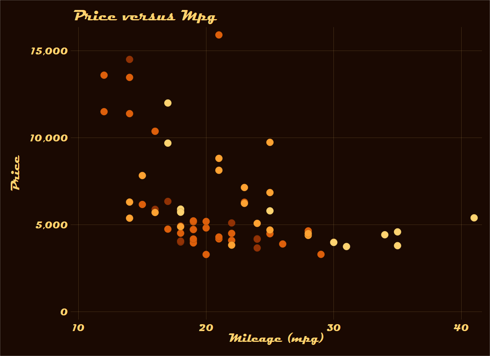{ width=50% } 

Si on passe toutes les options répétées sous forme de macros (*mopt* *col1* *col2*): 

```{r,eval=F, echo=T}
local mopt mlw(vvthin) mlc(black)  msiz(medlarge)
local col1 102 37 6*5
local col2  254 211 112

tw scatter price mpg if rep78==2, mc("145 50 5")    `mopt'   ///
|| scatter price mpg if rep78==3, mc("221 95 11")   `mopt'   ///
|| scatter price mpg if rep78==4, mc("254 162 50")  `mopt'   ///
|| scatter price mpg if rep78==5, mc("254 211 112") `mopt'   ///
|| , legend(off)  ///
graphr(color("`col1'"))  plotr(color("`col1'"))        ///
ylabel(, labc("`col2'") glc("`col2'") glw(vvthin))     ///
xlabel(, labc("`col2'") glc("`col2'") glw(vvthin))     ///
ytitle(, color("`col2'")) xtitle(, color("`col2'"))    ///
title("Price versus Mpg", color("`col2'") pos(11))

```

Si on veut modifier quelques paramètres des bulles (macro mopt) et la couleur du texte (macro col2) répétées 8 fois:

```{r,eval=F, echo=T}
local mopt mlw(vthin) mlc(white)  msiz(medlarge) jitter(2)
local col1 102 37 6*4
local col2  gs14

tw scatter price mpg if rep78==2, mc("145 50 5")    `mopt'  ///
|| scatter price mpg if rep78==3, mc("221 95 11")   `mopt'  ///
|| scatter price mpg if rep78==4, mc("254 162 50")  `mopt'  ///
|| scatter price mpg if rep78==5, mc("254 211 112") `mopt'  ///
|| , legend(off)                                            ///
graphr( color("`col1'"))  plotr(color("`col1'"))            ///
ylabel(, labc("`col2'")   glc("`col2'") glw(vvthin))        ///
xlabel(, labc("`col2'")   glc("`col2'") glw(vvthin))        ///
ytitle(, color("`col2'")) xtitle(, color("`col2'"))         ///
title("Price versus Mpg", color("`col2'") pos(11))
```


*Graphique 31*  
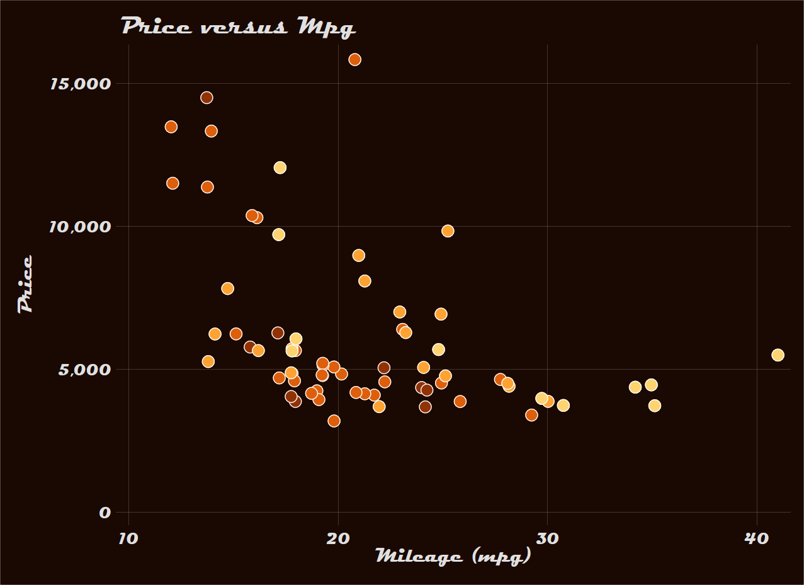{ width=50% } 


## Macro empilée

### Définition d'une macro empilée

* **Macro simple**

```{r,eval=F, echo=T}
local l objetA objetB objetC 
foreach i of local l {
local ms `i'
 }

objetA
objetB
objetC

* expression de la macro après l'exécution de la boucle
mac list _ms
objetC
```

* **Macro empilée**

* Conserve l'expression de la macro de la boucle précédente
* Syntaxe:

```{r,eval=F, echo=T}
local nom_macro `nom_macro` expression_macro
```

```{r,eval=F, echo=T}
local l objetA objetB objetC 
foreach i of local l {
local ms `ms' `i'
mac list _ms
}

objetA
objetA objetB
objetA objetB objetC

_ms:            objetA objetB objetC
```

* Boucle 1: (macro boucle 1)
* Boucle 2: (macro boucle 1) + (macro boucle 2)
* Boucle 3: (macro boucle 1) + (macro boucle 2) + (macro boucle 3)
* etc....


### Créer un graphique avec une macro empilée

```{r,eval=F, echo=T}
levelsof rep78, local(l)

foreach i of local l {
  local scat `scat' scatter price mpg if rep78==`i' ||
  }
```

Lecture dans l'output: 

**Boucle 1: rep78=(1)**
```{r,eval=F, echo=T}  
scatter price mpg if rep78==1 ||
```

**Boucle 2: rep78=(1,2)**
```{r,eval=F, echo=T} 
scatter price mpg if rep78==1 || scatter price mpg if rep78==2 ||
```
  
**Boucle 3: rep78=(1,2,3)** 
```{r,eval=F, echo=T} 
scatter price mpg if rep78==1 || scatter price mpg if rep78==2 || scatter price mpg if rep78==3 ||
```

**Boucle 4: rep78=(1,2,3,4)** 
```{r,eval=F, echo=T} 
scatter price mpg if rep78==1 || scatter price mpg if rep78==2 || scatter price mpg if rep78==3 ||
scatter price mpg if rep78==4 ||
```
 
**Boucle 5: rep78=(1,2,3,4,5)** 
```{r,eval=F, echo=T}  
scatter price mpg if rep78==1 || scatter price mpg if rep78==2 || scatter price mpg if rep78==3 || 
scatter price mpg if rep78==4 || scatter price mpg if rep78==5 ||
```
  

On adonc de générer un graphique dans une boucle. Pour l'exécuter:

```{r,eval=F, echo=T}
tw `scat', legend(off)
```

### Générer une légende avec une macro élargie

Utiliser la bonne expression pour les macros simple car les doubles quotes doivent être apparentes dans la définition de la légende

**Application 1 **  

* on n'utilise pas les fonctions pour générer les labels (cf Application 2)
* On génère également le graphique avec une macro élargie comme ci-dessus.


**On génère la légende avec une macro empilée**
```{r,eval=F, echo=T}
sysuse auto

local l1 `""Domestic""'
local l2 `""Foreign""'
forvalue i=1(1)2 {
local ord `ord' `i' `l`i'' 
}

macro list _ord

_ord:  1 "Domestic" 2 "Foreign"
```

**On génère les éléments du  graphique avec une macro empilée** 
```{r,eval=F, echo=T}
levelsof foreign, local(l)

local ops mlc(black) mlw(vthin)
foreach i of local l {
local scat `scat' scatter price mpg if foreign==`i', `ops' ||
}
macro list _scat
_scat: scatter price mpg if foreign==0, mlc(black) mlw(vthin) || scatter price mpg if foreign==1, mlc(black) mlw(vthin) ||

```

**On génère le graphique avec la légende**

```{r,eval=F, echo=T}
tw `scat', legend(order(`ord'))
```

**Application 2 **  

* Même graphique mais on va automatiser sa création avec:
  * des tokens pour les variables
  * les fonctions associées aux macros pour récurérer les labels automatiquement (voir plus haut)
    * Fonction **`value label`** pour récupérer le nom du label
    * Fonction **`label`** dans une boucle pour récupérér les libellés
  
```{r,eval=F, echo=T}
local varlist price weight foreign
tokenize `varlist'

* Légende

local labn: value label `3'
levelsof `3', local(l)
local i=1

foreach l2 of local l {
local lab`l2': label `labn'  `l2'
local lab`l2' `""`lab`l2''""' 
local ord `ord' `i++' `lab`l2'' 
}

* Graphique
local ops mlc(black) mlw(vthin)
foreach i of local l {
local scat `scat' scatter `1' `2' if `3'==`i', `ops' ||
}
macro list _scat

tw `scat', legend(order(`ord'))  
```


Ci-dessous une transformation très simple en routine, appelée **`sgraph`** [syntaxe: **`sgraph varlist`** ]


## Routine - Commande

**Aide Stata**  

* Manuel Stata *programming*: https://www.stata.com/manuals/p.pdf#ppProgramming  [entrée **syntax**]


* principe des programmes qui exécutent des commande (**.ado**)
* la routine peut être programmée dans le programme principe (**.do) ou enregistré comme **.ado** dans le répertoire où sont enregistré les commandes externes (répertoire *ado*). Il est conseillé de les enregistrer dans un sous répertoire appelé *personal*
* Syntaxe: 
  * Si la routine est programmée dans le .do:
```{r,eval=F, echo=T}
capture program drop nom_routine
program define nom_routine [options]

syntax [arguments]

....programme de la routine...

end

```  
  
  * Si la routine est enregistrée, la première ligne n'est pas pas obligatoire
   
Exemple simple: une soustraction

```{r,eval=F, echo=T}
capture program drop soustraction 
program define soustraction

syntax anything
tokenize `anything'
di ""
di as result "Le résultat de ma soustraction est: "  `1' - `2'
end

soustraction 1245 722
523

```  


Exemple "simple" pour un graphique

* On reprend le programme précédent (macro élargie et légendes), avec quelques options modifiées (une ligne pour la légende, perturvation des coordonnées (`jitter(#)`), couleur de la bulle)
* On fixe les arguments de la commande: `varlist(min=3 max=3)`


```{r,eval=F, echo=T}
capture program drop sgraph 
program define sgraph

syntax varlist(min=3 max=3),  [title(string)] [palette(string)] [gops(string)]

* installation de colorpalette et grstyle si nécessaire (rarement fait dans les ado externe => installation automatique des dépendances)
local packg colorpalette grstyle
foreach p of local packg {
capture which `p'
if _rc==111 ssc install `p'
} 

tokenize `varlist'

* légendes
qui levelsof region2, local(l)
local n: word count(`l')
local i=1
local labn: value label `3'
foreach l2 of local l {
local lab`l2': label `labn'  `l2'
local lab`l2' `""`lab`l2''""' 
local ord `ord' `i++' `lab`l2'' 
}

grstyle init
grstyle set mesh, compact

* Option palette
if "`palette'"=="" {
colorpalette viridis, n(`n') opacity(70) nograph
}

if "`palette'"!="" {
colorpalette `palette', n(`n') opacity(70) nograph
}

forv  i=1/`n' {
local ops mlc(black) mlw(vthin) jitter(3) mc(%80) msiz(medsmall) mlc(`mlc') mc("`r(p`i')'")
local scat `scat' scatter `1' `2' if `3'==`i', `ops' ||
}

* Graphique selon modification ou non des options générales
if "`gops'"==""{
tw `scat', legend(order(`ord') rows(1) pos(7)) title("`title'", pos(11))
}
if "`gops'"!=""{
tw `scat', legend(order(`ord') rows(1) pos(7)) title("`title'", pos(11)) `gops'
}
end
```  


On exécute la commande **`sgraph`**

```{r,eval=F, echo=T}
sysuse auto, clear
sgraph price mpg foreign
```

**Exemple**

```{r,eval=F, echo=T}
sysuse citytemp4.dta, clear
replace tempjan =   (tempjan - 32 )*5/9
replace tempjuly  = (tempjuly - 32 )*5/9
gen     region2 = region
recode region2 (1=4) (4=1)
label define r 1 "West" 2 "North-Central" 3 "South" 4 "North-East", modify
label value region2 r

sgraph tempjuly tempjan region2, mlc(black) title("Températures moyennes [sans l'option palette()]") ///
gops(ytitle("Juillet") xtitle("Janvier"))

sgraph tempjuly tempjan region2, mlc(black) title("Températures moyennes [avec l'option palette(magma)]") ///
gops(ytitle("Juillet") xtitle("Janvier"))

```

*Graphique 32*  
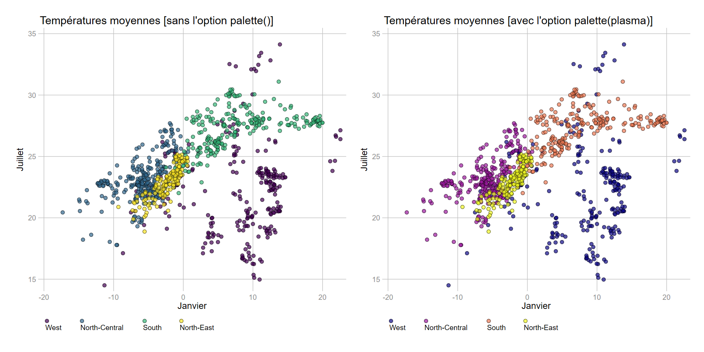{ width=75% } 


# Palettes de couleurs & thèmes

* Les graphiques lorsqu'ils sont générés appliquent un thème/style par défaut:
  * Ces thèmes sont appelés **scheme** 
  * Les options entrées dans la commande graphique visent à modifier les paramètres du thème
  * Les paramètres du style thèmes appliquées aux couleurs, tailles/épaisseurs, positions des éléments de texte, définitions des axes....
  * Stata dispose de 5 thèmes officiels
  * Des thèmes externes peuvent être installés 

* Les thèmes graphiques utilisent des palettes de couleurs
  * Trois types de palettes:
    * Palettes qualitatives  (variables non ordonnées)
    * Palettes séquentielles (variables ordonnées)
    * Palettes divergentes   (variables ordonnées dans plusieurs sens)
* Des commandes externes permettent d'augmenter le nombre de palettes, de les modifier ou d'en créer
  * Pour la cartographie, la commande **`spmap`** (*Pisatti*) intégre une quarantaine de palettes, principalement séquentielles
  * La librairie **`brewscheme`** (*W.Buchanan*) dispose de plusieurs commande pour générer des palettes de couleurs.
  * La commande **`colorpalette`** (B.Jann) charge plusieurs dizaine de palettes de couleurs, de tout type, et permet de les modifier et permet de les utiliser très facilement dans la création de graphique. Adopté!


## Les Palettes de couleurs Stata


### Les palettes Stata 

Stata dispose de 5 palettes de couleurs qui sont associées à des thèmes graphiques: la palette **s2** est associée au thème **s2color** par exemple

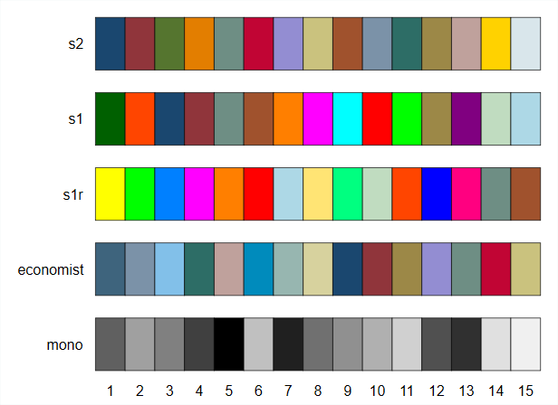{width=50%}

* Les palettes sont de type qualitative
  * Remarque On peut les utiliser de manière séquentielle en sélectionnant une couleur et en baissant ou en augmentant l'intensité `(couleur*#)`
  * la palette mono peut(être partiellement utilisée de manière séquentielle: ordre des couleurs 7 à 11 par exemple)
* Elles sont composées de 15 couleurs
* Toutes les couleurs ont un nom et un code RGB qui lui est associé
* Dans un graphique, les couleurs utilisées par défaut suivent leur ordre dans la palette

{width=50%}


La palette mono (black + grey scale) est d'une grande utilité pour modifier les couleurs des objets types textes, fond, grid....


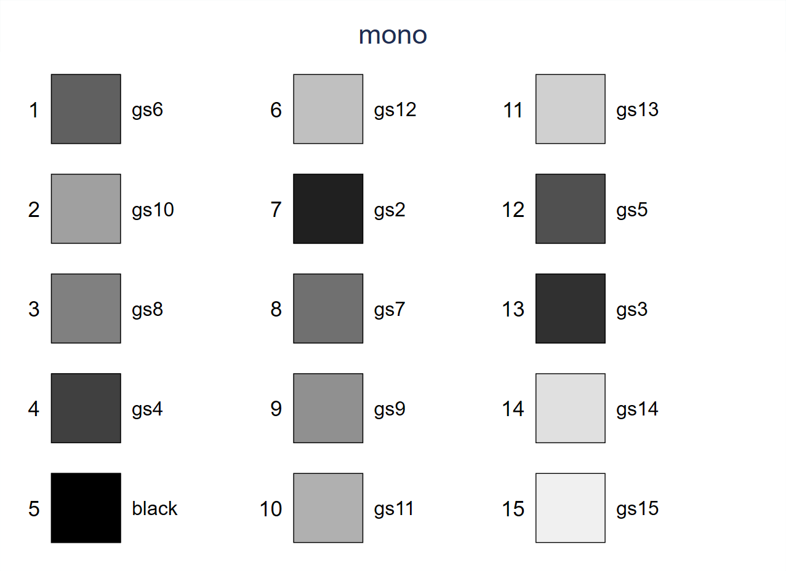{width=50%}

*Graphiques 34* 

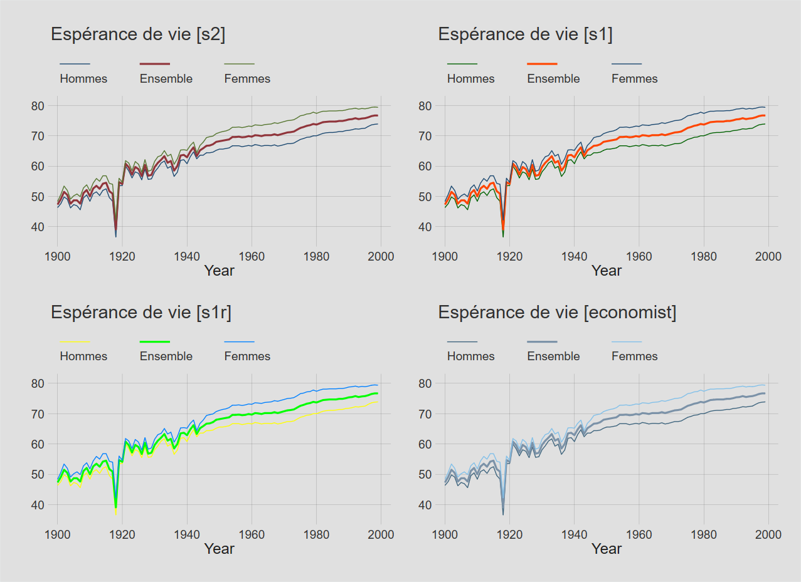{width=50%}


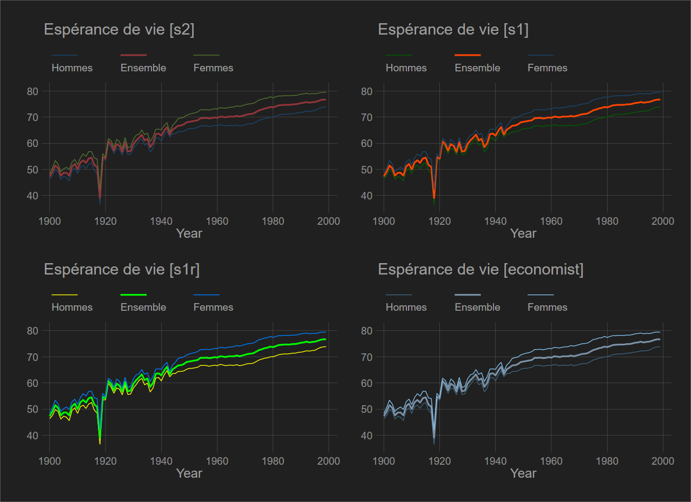{width=50%}


Pour tester les couleurs selon le fond:  
<details>
<summary><B><font color="#178ACC">PROGRAMME</B></font></summary>
```{r ,eval=F, echo=T} 
mac drop comb
colorpalette s2, n(15) gropts(graphr(color(black)) plotr(color(black)) ///
title("", color(white))  name(g1,replace) nodraw nonumbers)
forvalue i=2/15 {
local j= 17 - `i'
colorpalette s2, n(15) gropts(graphr(color(gs`i')) plotr(color(gs`i')) ///
title("", color(gs`j'))  name(g`i',replace) nodraw nonumbers)
global comb $comb g`i'
}
graph combine g1 $comb , col(3) xsize(20) ysize(10) iscale(.2) title("S2", pos(11) color(gs3))
```
</details>


On est clairement vite limité par l'utilisation des palettes maison de Stata  

A mon sens, la commande **colorpalette** de *Ben Jann* permet de démultiplier les possibilités dans l'utilisation des couleurs avec Stata. C'est aucun doute la plus grande contribution des 10 dernières années niveau graphique avec le logiciel. 

## Colorpalette de Ben Jann

### Syntaxe et options   

**Installation `colorpalette**
```{r ,eval=F, echo=T} 
    ssc install palettes,  replace
    ssc install colrspace, replace
```


**syntaxe**: **colorpalette nom_palette [, nom_sous_palette  options]**

Exemple
```{r ,eval=F, echo=T} 
* Charge et affiche la palette hue
  colorpalette hue
  
* Charge et affiche la palette viridis
  colorpalette viridis

* Charge et affiche la palette summer de la collection matplotlib (palette Python)
  colorpalette matplotlib, summer  
```


**Visualiser des palettes disponibles dans l'aide**: **`help colorpalette`**

**Principales options**  

* **Modifier la taille de la palette**: **`n(#)`**
  * Important car la réduction de la taille pour certaines palette ne consiste pas à prendre les # premiers éléments de la palette par défaut (cf palette **hue** ou **viridis**)
* **Modifier l'intensité et l'opacité**: **`intensity(#)`** et **`opacity(#)`**
    * On peut créer une palette avec séquentielle à partir d'une couleur de départ avec **`intensity`**
    * On peut créer une palette divergente avec des couleurs de départ, d'arrivée et de transition avec **`ipolate(#)`**
* **Sélectionner des couleurs d'une palette**: **`select(numlist)`** 
* **Inverser les couleurs de la palette**: **`reverse`**
* **Ne pas afficher la palette**: **`nograph`**. à utiliser systématiquement pour charger la palette avant son utilisation dans un graphique 


*Exemple 1*: 

```{r,eval=F, echo=T}
colorpalette viridis, n(5) intensity(.4 1 .4 1 .4) reverse
```

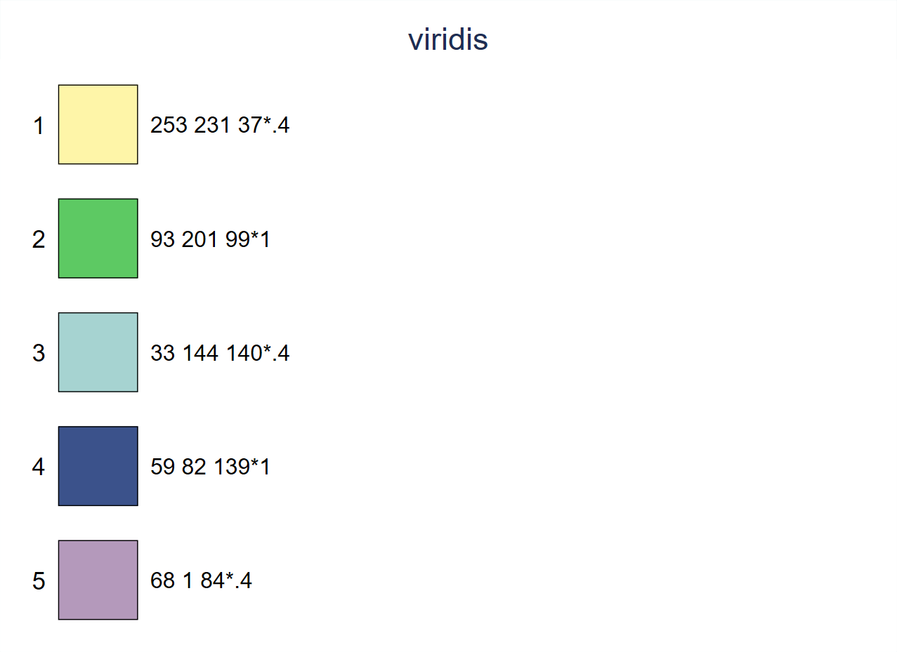{width=50%}

* On a sélectionné la palette *viridis*
* On a réduit la taille de la palette à 5 couleurs: **`n(5)`**
* On a alterné les intensités: une sur deux à .5: **`intensity(.4 1 .4 1 .4)`** 
* On a inverse l'ordre des couleurs (*navy* en dernier) **`reverse`**

*Exemple 2*    
Création d'une palette séquentielle de 10 couleurs avec `intensity` à partir de la première couleur de la palette **viridis** (rgb="68 1 84")  

```{r,eval=F, echo=T}
colorpalette "68 1 84", intensity(0.1(.1)1)
```

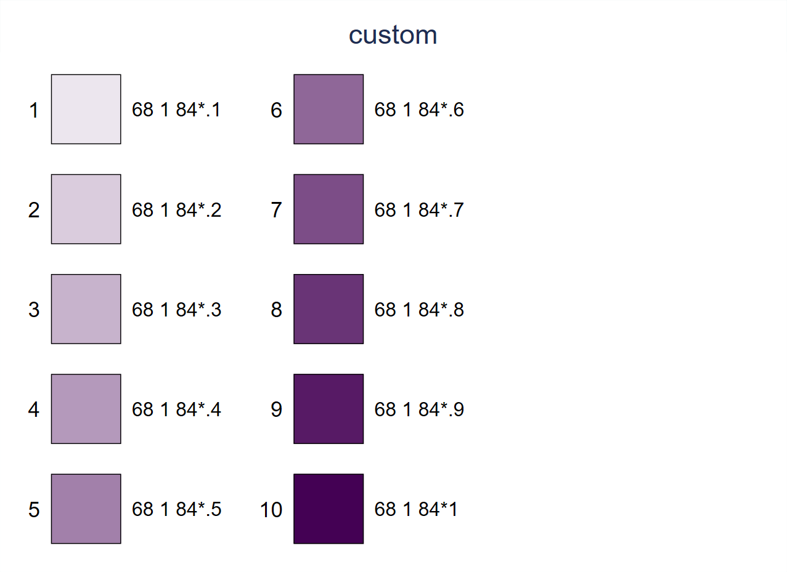{width=50%}

*Exemple3* 

Création d'une palette divergente avec `ipolate` avec la troisième et la treizième couleurs de la palette *viridis* en couleurs de départ et d'arrivée

3b: sans couleur intermédiaire
```{r,eval=F, echo=T}
colorpalette "70 50 127" "159 218 58, ipolate(10)
```

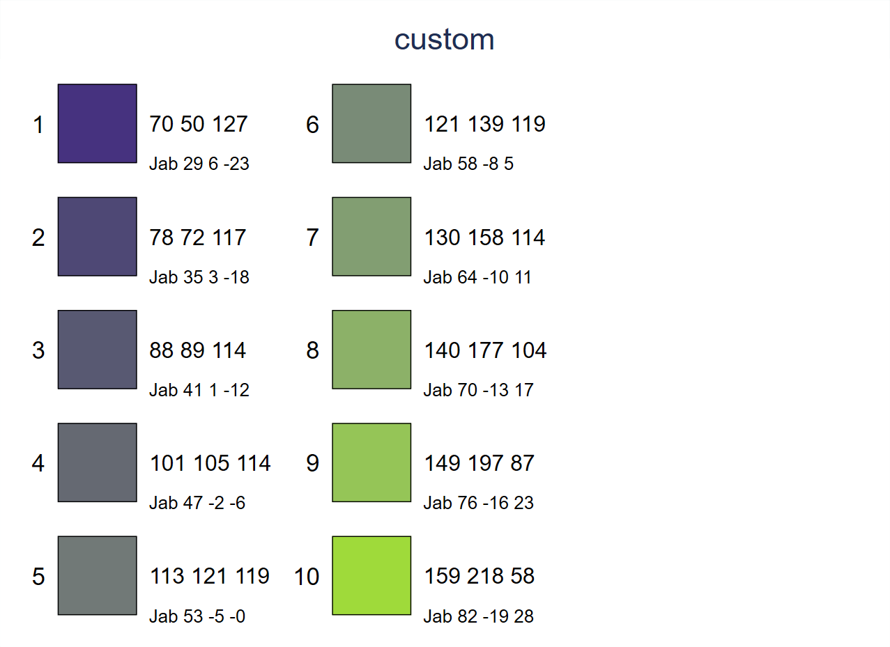{width=50%}

Mêmes couleurs de départ et d'arrivée, avec la huitième couleur de la palette viridis en transition
```{r,eval=F, echo=T}
colorpalette "70 50 127" "33 144 140" "159 218 58" , ipolate(10)
```

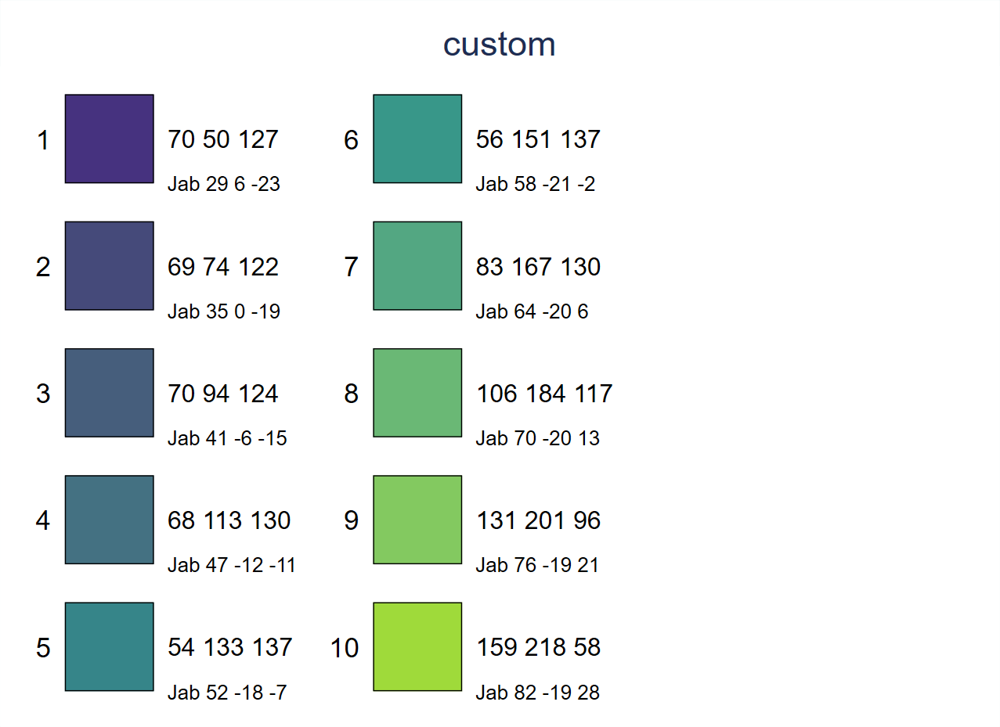{width=50%}

Idem, mais avec la couleur blanche en transition

```{r,eval=F, echo=T}
colorpalette "70 50 127" white "159 218 58" , ipolate(10)
```

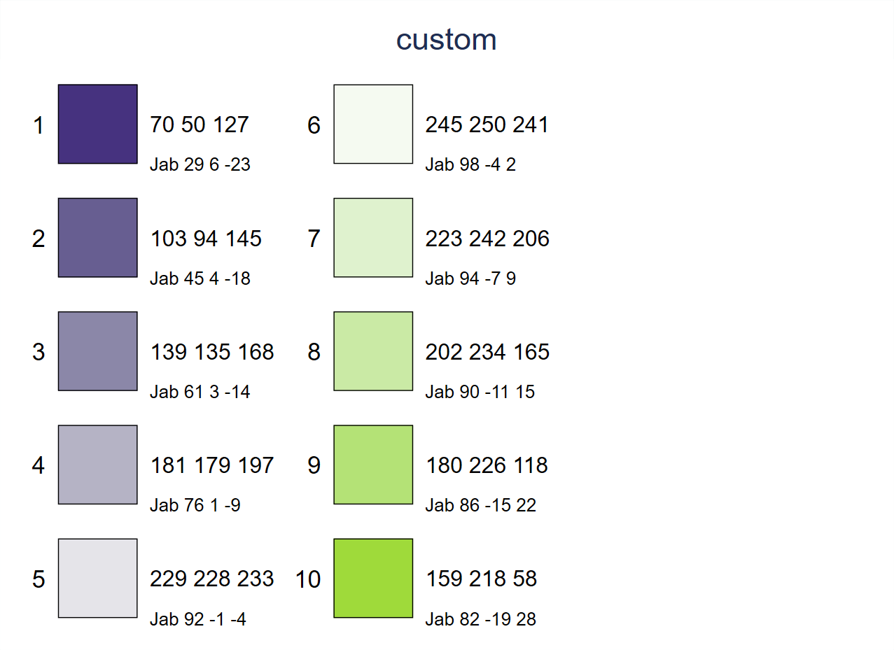{width=50%}

### Utilisation pour un graphique  

### colorpalette et graphique  

* Utilisation des macros générées par colorpalette
  * la commande génère une liste de macro permettant de récupérer les codes et les noms des couleurs
    * la macro **r(p)** permet d'utiliser les couleurs de la palette dans un graphique à un seul bloc d'élements
    * les macros **r(p#)** permettent d'utiliser les couleurs dans un graphique composé de plusieurs élements 

```{r,eval=F, echo=T}
colorpalette navy cranberry, ipolate(5)
return list

scalars:
                  r(n) =  5

macros:
              r(ptype) : "color"
              r(pname) : "custom"
              r(pnote) : "interpolated"
                  r(p) : ""26 71 111" "76 73 96" "111 71 92" "151 58 78" "193 5 52""
             r(p5info) : "Jab 46 36 12"
                 r(p5) : "193 5 52"
             r(p4info) : "Jab 42 25 5"
                 r(p4) : "151 58 78"
             r(p3info) : "Jab 38 14 -3"
                 r(p3) : "111 71 92"
             r(p2info) : "Jab 34 2 -11"
                 r(p2) : "76 73 96"
             r(p1info) : "Jab 30 -9 -19"
                 r(p1) : "26 71 111"

```


Exemple
```{r,eval=F, echo=T}
sysuse uslifeexp.dta, clear
local opw lw(medthick medthick medthick medthick medthick) 

colorpalette "70 50 127", n(4) intensity(1(.25).25)  nograph
local opc lc(`r(p)')

tw line le_w le_wmale le_b le_bmale year, `opw' `opc' ///
legend(order(1 "White" 2 "White man" 3 "Black" 4 "Black man") pos(11) ring(0) row(1) color(gs10)) ///
xlabel(, glw(vvthin)) ylabel(, glw(vvthin))   graphr(color(gs2))   plotr(color(gs2))              ///
xtitle(, color(gs10))                                                                             ///
title("{bf:Espérance de vie}", pos(11) color(`r(p3)'))                                            ///
subtitle("{it: Couleurs générées avec colorpalette}", pos(11) color(`r(p2)')) 
```


*Graphique 35*   

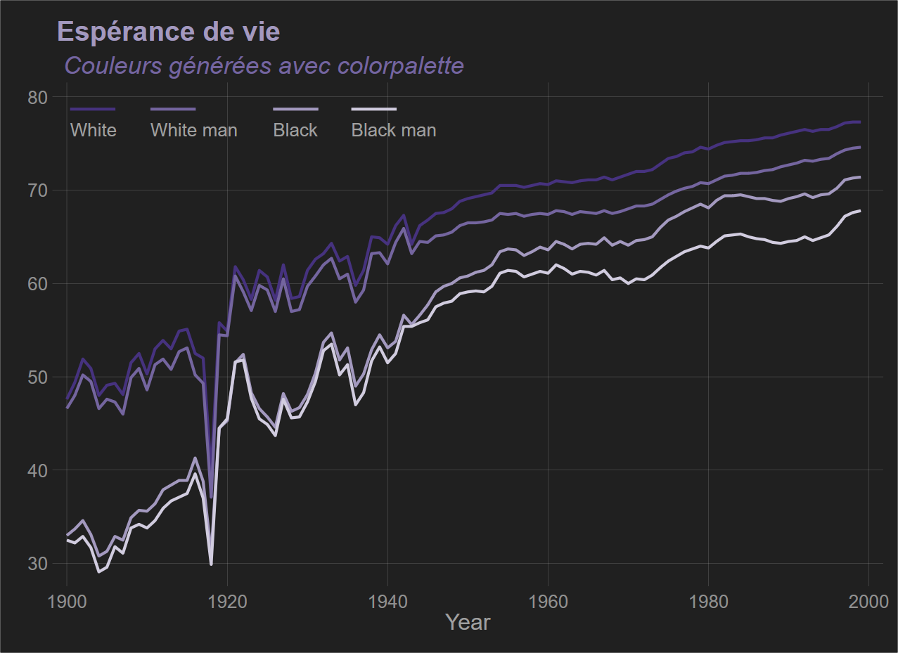{width=50%}


* La syntaxe de **colorpalette** est transposable à la commande **grstyle**. Cela faciletera l'intégration des couleurs dans le graphique.

### Exemples de palettes

#### Qualitatives

**Palette HUE** 

* Il s'agit de la palette par défaut de  **ggplot2** (**R**)
* De plus en plus remplacée par la palette *Viridis* (voir plus bas)

```{r,eval=F, echo=T}
colorpalette hue [,options]
```

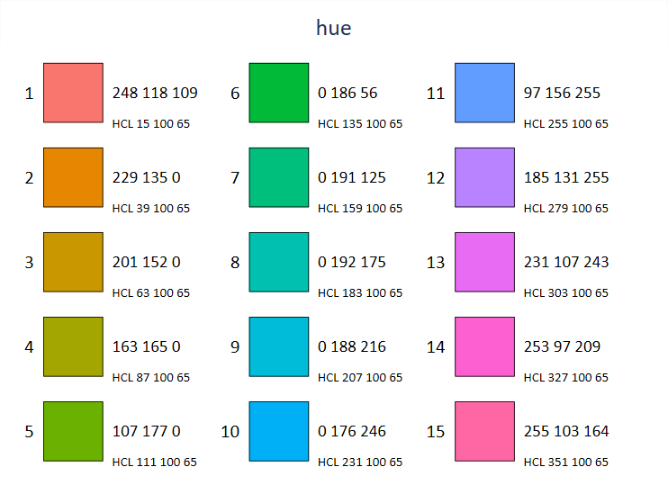{width=50%}

* Elle a plusieurs cycles de couleurs: Un "rouge" => un "vert => un "bleu" => un rose
* Si on utilise donc cette palette à 10 couleurs pour un graphique composée de deux éléments, par exemple deux courbes,
le rendu ne sera pas satisfaisant car les deux premières couleurs seront sélectionnées (une couleur plutôt "rouge" et une couleur plutôt"orange. Il convient dont de réduire la taille 
de la palette (`n2`)

* Couleurs selon la taille de la palette

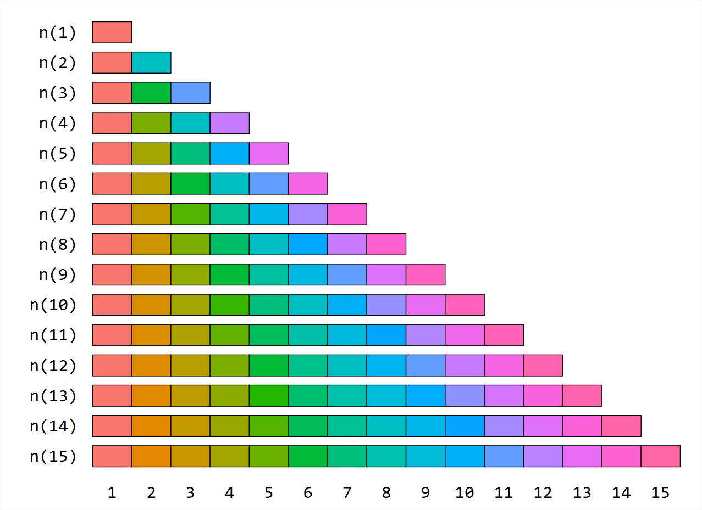{width=50%}

Exemple 1  
*Graphique 36*   

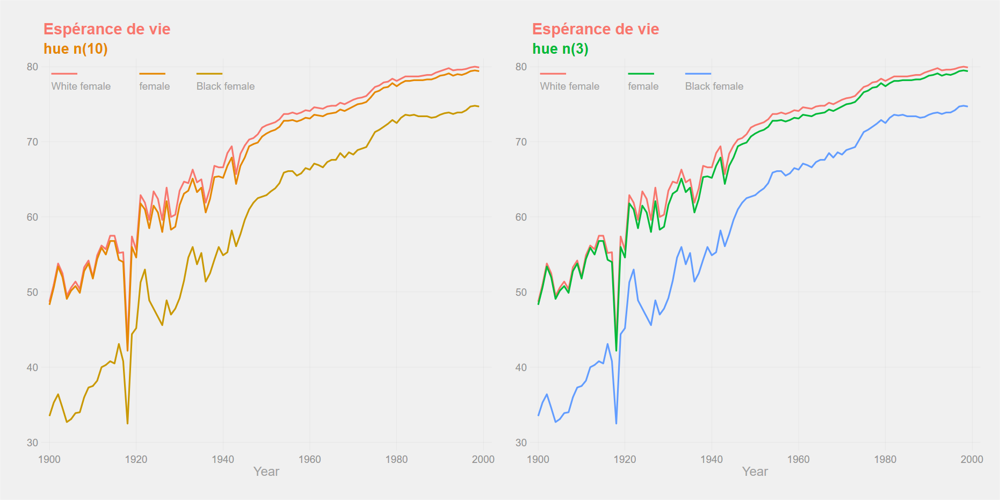{width=50%}

{width=50%}

Remarque: voir également la palette du thème externe *`plottig`*


**Les palettes qualitatives de Colorbrewers** 

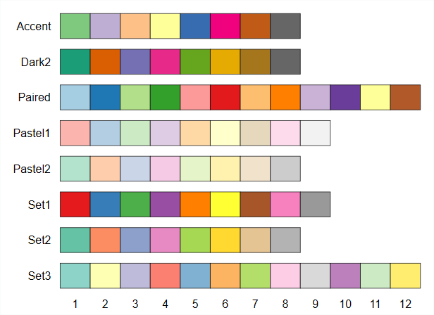{width=50%}

Exemple  
*Graphiques 37*   

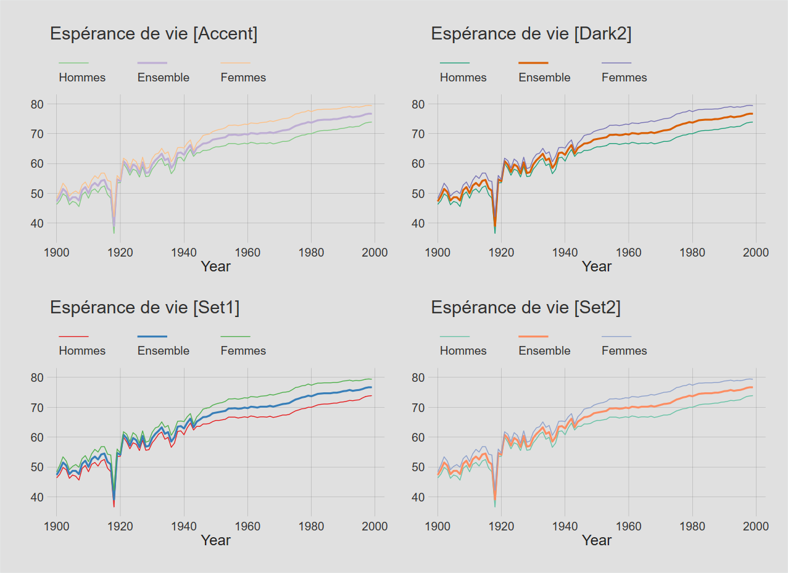{width=50%}

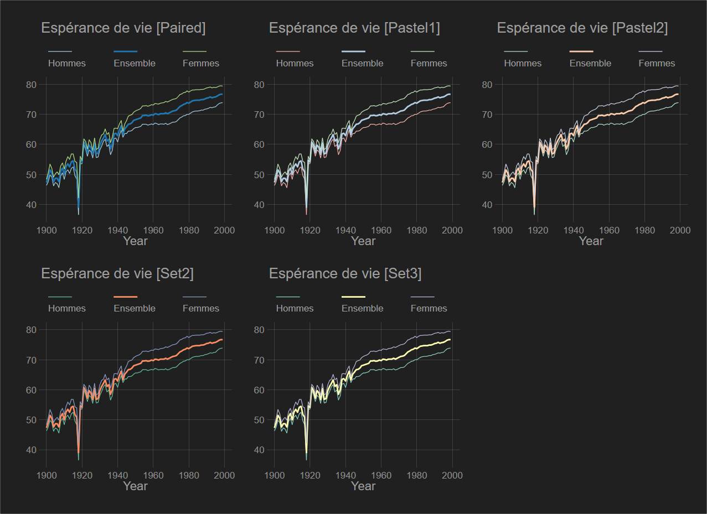{width=50%}

**Palette séquentielle à taille réduite: viridis**

En réduisant la taille de certaines palettes séquentielles ou divergentes, on peut obtenir une palette plutôt qualitative.
C'est le cas de la palette *star*  **viridis** 

```{r,eval=F, echo=T}
colorpalette viridis, n(3)
```

{width=25%}


#### Séquentielles

* Utilisées massivement en cartographie et, plus généralement pour représenter des fréquences (graphique type barre) ou des valeurs ordonnées
* Couleurs allant du plus clair au plus foncé (ou inversement)
  * Modification de l'intensité d'une couleur
  * Un ou plusieurs cycles de couleurs: par exemples du jaune au rouge, du jaune au noire.....
* Pour les courbes, voire les barres, prévoir un fond noir ou gris foncé [exemples ci-dessous]


**COLORBREWER**

* Collection populaire en cartographie

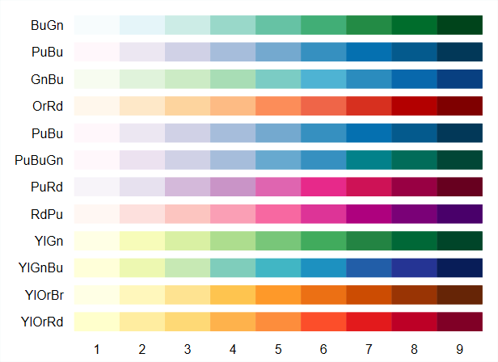{width=50%}

Exemple  
*Graphiques 40*   
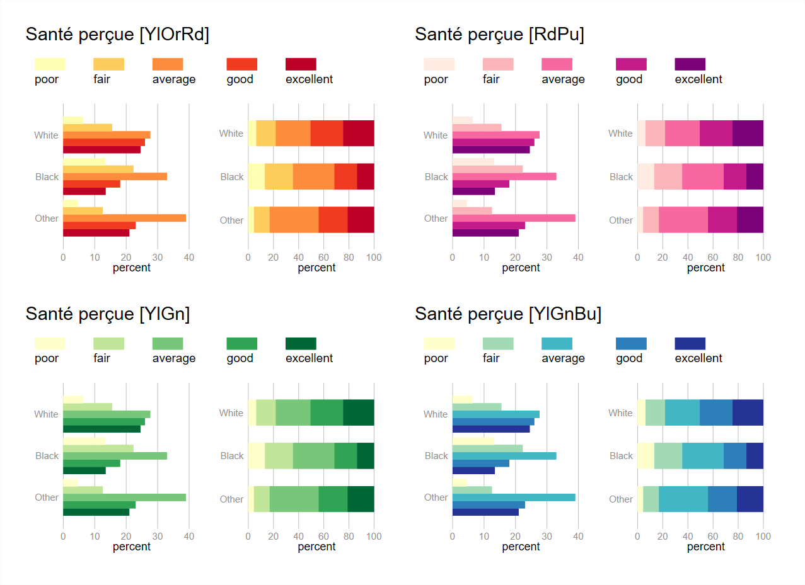{width=75%}

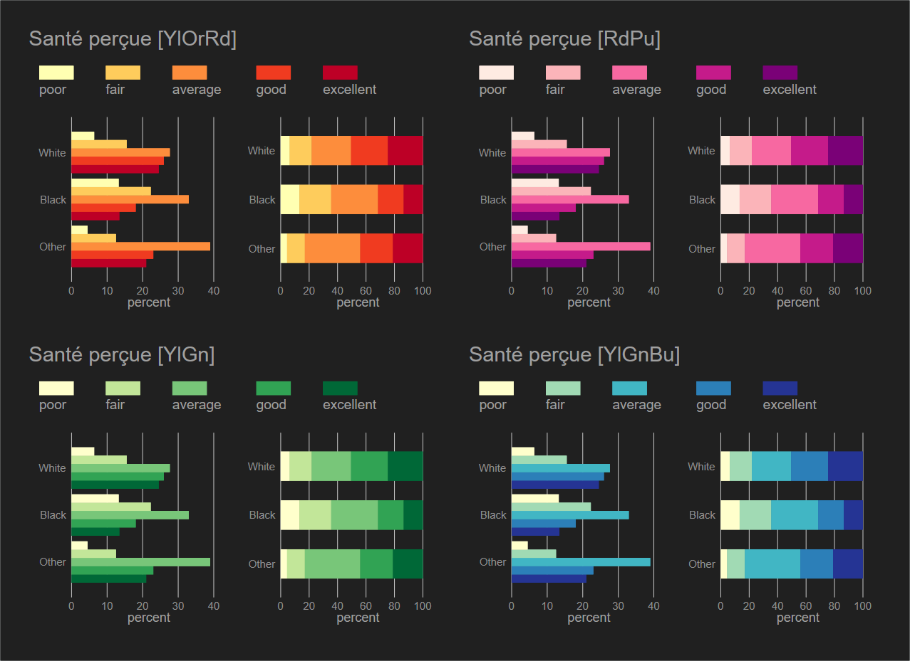{width=75%}

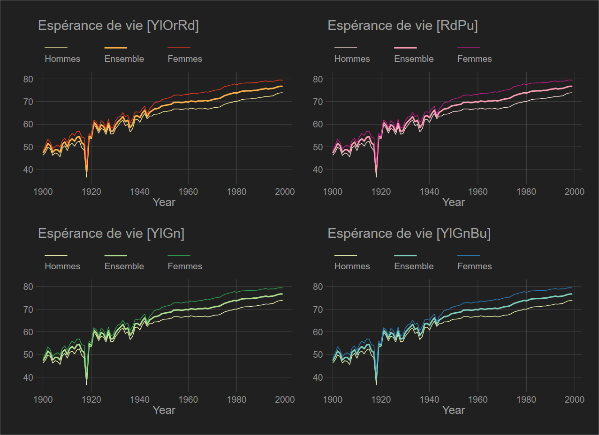{width=75%}


**MATPLOTLIB**

* Palettes du même nom que la librairie graphique de Python
* Implémenté dans de nombreux logiciels
* De plus en plus remplacée par la collection *Viridis*

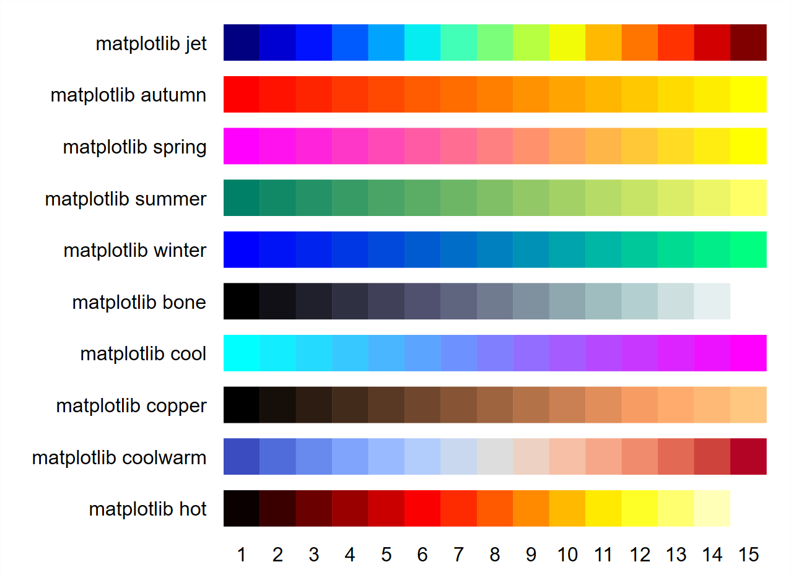{width=50%}

Exemple: les 4 saisons  
*Graphiques 41*   
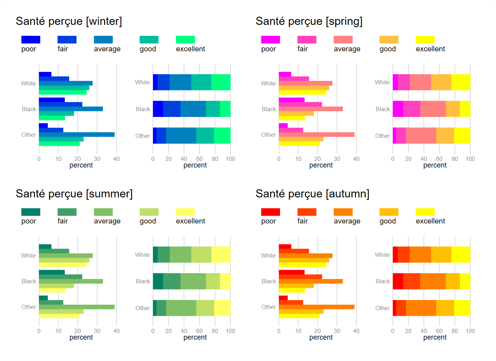{width=75%}

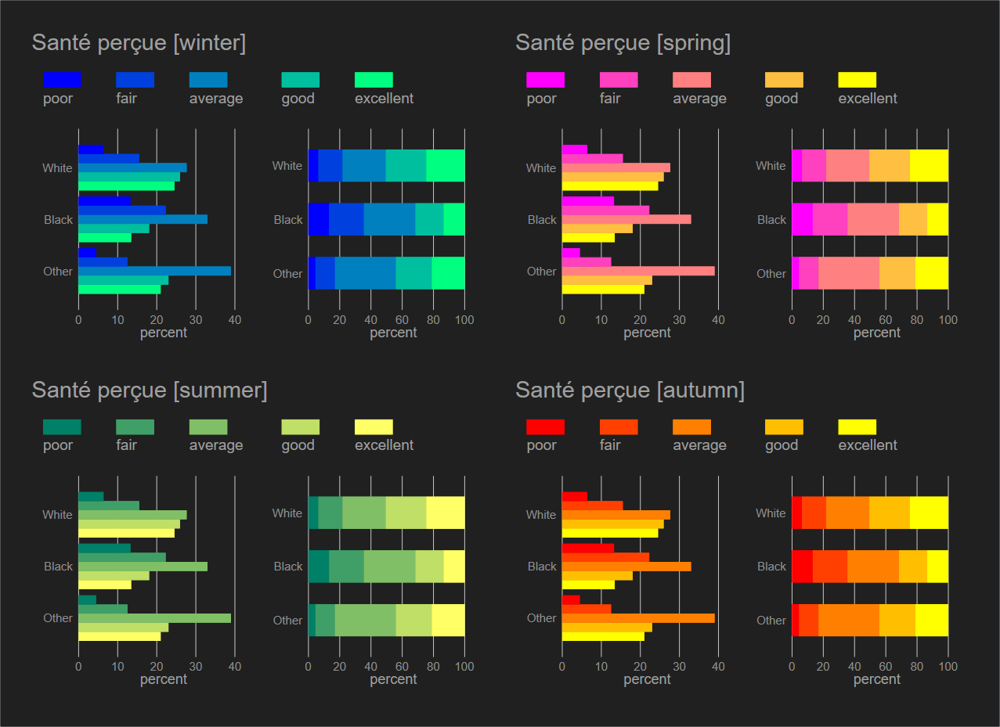{width=75%}

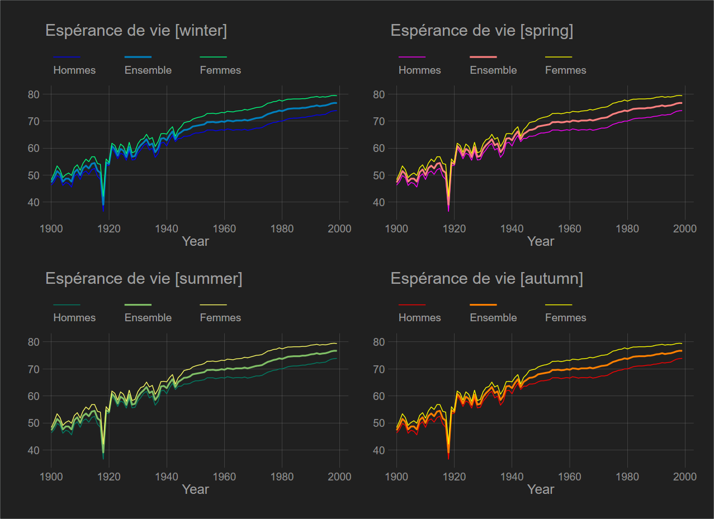{width=75%}


**VIRIDIS**

* La palette Viridis et les 4 palettes associées, est la palette *star* du moment
* Développée pour Python pour données une palette alternative à Matplotlib, elle est devenu la palette par défaut de la librairie graphique
* Avantages: 
  * Même rendu, ou très proche, des couleurs sur toutes les parties d'un écran (uniformité)
  * Différences de couleurs maintenue à l'impression n&b
  * Gère la plupart des formes de daltonisme
  * Elle est franchement belle
* Limites: pour les courbes un fond blanc ou très clair ou un fond noir ou très foncé, les couleurs aux extrêmités ne passent pas très bien pour les courbes. Prévoir un fond gris moyen ou ne pas sélectionner les couleurs aux extremités de la palette (voir exemple ci-dessous) 
* Les autres palettes: *plasma* est également très utilisée, en particulier pour le remplissage de surface  

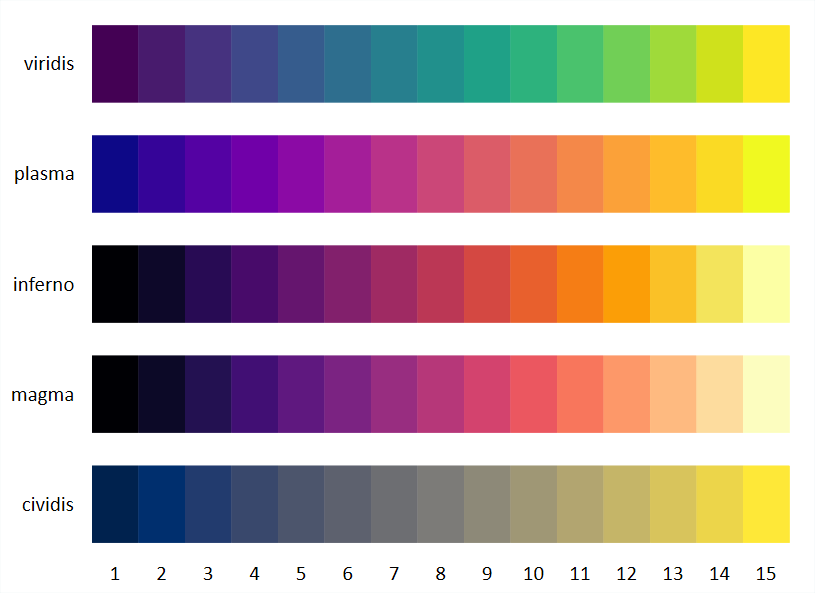{width=50%}


Exemple  
*Graphique 42*

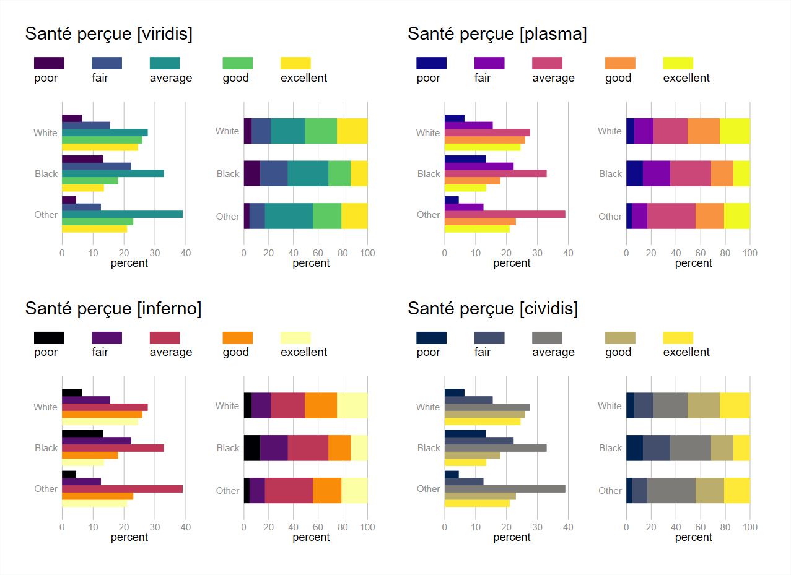{width=75%}

{width=75%}

{width=75%}


{width=75%}


Les deux solutions précédentes ne sont pas satisfaisantes: en inversant le sens de la palette et en sélectionnant une taille à 4 objets pour éliminer le violet foncé avec `colorpalette viridis, n(4) reverse nograph`, les trois courbes sont bien identifiables


{width=75%}


*Comparaison Viridis et Matplotlib Jet*  
Source: https://rtask.thinkr.fr/fr/ggplot2-welcome-viridis/

**Matplotlib Jet**


**Viridis**


Il y a photo ou pas pas photo?


#### Palettes divergentes 

* Un peu le même principe que les palettes séquentielles, en mettant en avant un point central (de transition) représenté par une couleur de transition, souvent très clair. Typiquement:  
  * Du bleu (negatif/faible/inférieur à la moyenne...) - vers le blanc (nul/moyen/proche moyenne) - vers le rouge (positif/élevé/supérieur à la moyenne...) avec une partie séquentielle du bleu vers le blanc, et une autre du blanc vers le rouge.
* Pour certains type de graphique, lorsque la couleur centrale est proche du blanc, la couleur de fond du graphique doit être prise en considération


[ Pour les exemples je partirais bien sur une carto (spmap): mais help pour les données]


**Colorbrewer**

{width=50%}


   
## Styles - scheme

## Principes - thèmes internes et externe

* Tous les graphiques ont un thème, appelé **scheme** qui paramètre tous les éléments composant graphiques: palette de couleurs, épaisseurs/tailles, positions, contour, marges....
* Les options entrées dans le graphique visent à modifier ce paramétrage
* Stata dispose de 11 thèmes internes, celui utilisé par défaut est **s2color** (factory scheme)
* Sans modifier des options, un thème graphique peut ne pas être adapté à une représentation graphique 

**Changer de thème**

* Par les boîtes de dialogue: **Edit** => **Préférences** => **Graph preferences**
* Ligne de commande
  * On peut indique le thème en option du graphique le thème à appliquer: **`scheme(nom_scheme)`**
  * On peut dans un fichier .do ou .ado charger un thème de façon temporaire (session) ou permanente un thème: **`set scheme nom_scheme [,permanently]**
  * Le choix du thème peut-être également intégré au fichier profile (charge le thème au début de chaque programme)

**Thèmes internes**

A partir d'un exemple donné dans l'aide Stata pour un graphique type **spike** (`help spike`) 

<details>
<summary><B><font color="#178ACC">PROGRAMME</B></font></summary>
```{r ,eval=F, echo=T} 
sysuse sp500, clear

local scheme  s2color s2mono s2gcolor s2manual s2gmanual s1rcolor s1color ///
              s1mono s1manual economist sj

foreach s of local scheme {
twoway  line close date, yaxis(1)                                           ///
        ||  spike change date, yaxis(2)                                     ///
        ||,  ysca(axis(1) r(700  1400)) ylab(1000(100)1400, axis(1))        ///
             ysca(axis(2) r(-50 300))   ylab(-50 0 50, axis(2))             ///
             ytick(-50(25)50, axis(2) grid)                                 ///
                legend(off)                                                 ///
                xtitle("Date")                                              ///
                title("S&P 500")                                            ///
                subtitle("Scheme = `s'")                                    ///
                yline(950, axis(1) lc(black)) scheme(`s') name(`s', replace) nodraw

* graph combine ......                
                
}
```
</details>

  
*Graphique 43*     


*Graphique 44*   


**Thèmes externes**

* Plusieurs thèmes et collection de thèmes externe sont instalables: **`search scheme`** **`ssc instal nom scheme`**
* Exemples: La collection de François Briatte (Burd) et la collection de Daniel Bischoff (plottig, plotplainblind...)...

*Graphique 45*   


##  grstyle

* Auteur: Ben Jann
* Autre générateur de thèmes: **brewscheme** de W.Buchanan, mais à mon sens beaucoup plus complexe
* Ici utilisation minimale, par l'exemple de **grstyle** avec **`grstyle set`** avec seulement 4-5 lignes de paramètres réutilisables et facilement modificable avec seulement **`grstyle set`**. 
* Il est possible de générer un thème complet pour tous les types de graphiques
* Pour voir l'ensemble des possibilités : **`help grstyle`** **`help grstyle set`**

**Installation `grstyle`**
```{r ,eval=F, echo=T} 
    ssc install grstyle
```


## Initialisation et enregistrement

* Dans un programme on initialise le générateur avec **`grstyle init`**
* Enregistrement du thème: **`grstyle init nom_thème, [path] [replace]`**
* Si le thème a été enregistré, on peut le charger dans un graphique avec scheme(nom_scheme). Visiblement on ne peut pas le charger à l'extérieur du graphique avec **`set scheme`**

```{r ,eval=F, echo=T} 
set scheme t1, path(D:\stata_temp) replace
[grstyle set ....]

tw line y x, scheme(t1)
```

## Exemple 1

Graphique proposé dans l'aide de **line**, légèrement simplifié

Avec le thème Stata **s2color**

<details>
  <summary><B><font color="#178ACC">PROGRAMME</B></font></summary>
```{r ,eval=F, echo=T} 
sysuse uslifeexp, clear
gen difference = le_wm - le_bm

*[graphique]
tw line le_wm year, yaxis(1 2)                                       ///
|| line le_bm year                                                   ///
|| line diff  year                                                   ///
|| lfit diff  year,                                                  ///
             ylabel(0(5)20, axis(2) gmin )                           ///
             ylabel(0 20(10)80,     gmax )                           ///
             ytitle("", axis(2))                                     ///
             ylabel(, axis(2) grid)                                  ///
             ytitle("Life expectancy at birth (years)")              ///
             title("White and black life expectancy")                ///
             subtitle("USA, 1900-1999")                              ///
             note("Source: National Vital Statistics, Vol 50, No. 6" ///
                  "(1918 dip caused by 1918 Influenza Pandemic)")    ///
             legend(label(1 "White males") label(2 "Black males")) 

```
</details>


*Graphique 46*   
{width=50%}


* **Background du graphique, grid...**
  * **grstyle set plain [options]**
  * **grstyle set [i]mesh [options]**  

```{r ,eval=F, echo=T} 
grstyle init 
* grstyle set plain, horizontal grid  // option dotted pour des pointillés sur le grid
* grstyle set mesh, horizontal compact
* grstyle set imesh, horizontal compact  minor
```

*Graphique 47*   


Pour la suite, on conservera comme paramètres la deuxième ligne: **`grstyle set mesh, horizontal compact`**

* **Légende**: position et box

```{r ,eval=F, echo=T} 
grstyle init 
grstyle set mesh, horizontal compact

grstyle set legend 2, nobox
```

*Graphique 48*   
{width=75%}

* **Autres paramètres généraux**: taille du graphique **`grstyle set graphsize`** et marges **`grstyle set margins`**

* **Paramètres sur les objets graphiques**
  * **Couleurs**: **`grstyle set color [options] [: type objet]`**
    * Plusieurs paramétrages possibles en définissant les objets pour lesquels la palette s'applique
    * Même syntaxe que colorpalette, la palette s'applique directement aux objets.
    * Les codes couleurs peuvent être directement appliqué au graphique sans utiliser les macros `rp(p#))   
    * `grstyle set color viridis, n(5)` = `colorpalette viridis, n(5)`
 
*Graphique 49*       
{width=75%}

**Comparaisons s2color et mini thème généré par grstyle en 3 lignes**

*Graphique 50*   
{width=75%}

*	**Intervalles de confiance**: pour appliquer directement aux intervalles de confiance du graphique  la couleur et le degré d’intensité :  grstyle set ci [couleur], [opacity()].
*	**Autres styles paramétrables**: l’intensité de la couleur (également paramétrable avec les couleurs en général), les tailles et épaisseurs pour les types de graphiques ou les éléments de texte….


## Exemple 2

*	Pour un graphique à première vue relativement simple (ici scatter + lfitci) le paramétrage avec grstyle devient assez gourmant et un peu compliqué
*	Paramétrer ses options directement par les macros avec une utilisation minimale de grstyle reste donc un méthode pertinente


*Graphique 51*   
{width=75%}


**Avec s2color**
```{r ,eval=F, echo=T} 
sysuse auto, clear

set scheme s2color
tw lfitci  price length  if !foreign,     ///         
|| lfitci  price length  if foreign,      ///
|| scatter price length  if !foreign,     ///
|| scatter price length  if  foreign,     ///
 legend(order(5 "Domestic" 6 "Foreign"))  ///
 ytitle("price") xtitle("mpg") 
```

**Avec grstyle seulement**
```{r ,eval=F, echo=T} 
grstyle init
grstyle set mesh, horizontal compact
grstyle set legend 7
grstyle set color plasma, select(4 14) opacity(50) plots(5 6): p#markfill
grstyle set color plasma, select(4 14)             plots(1 3): p#lineplot
grstyle set color black,                   plots(5 6): p#markline
grstyle set linewidth .2pt,                plots(5 6): p#mark
grstyle set symbolsize 5pt
grstyle set ci, opacity(20)

tw lfitci  price length if foreign                                              ///
|| lfitci  price length if !foreign                                             ///
|| scatter price length if foreign,  jitter(2)                                  ///
|| scatter price length if !foreign, jitter(2)                                  ///
|| , legend(order(4 "Domestic" 5 "Foreign") region(lw(vvthin))) ytitle("Price") 
```

**Grstyle + macro**
```{r ,eval=F, echo=T} 
grstyle init
grstyle set mesh, horizontal compact
grstyle set legend 7, 
grstyle set ci, opacity(20)	
	 
colorpalette plasma, select(4 14) opacity(50) nograph
local osca1 mc("`r(p1)'") mlc(black) mlw(vthin) msiz(5pt)
local osca2 mc("`r(p2)'") mlc(black) mlw(vthin)	msiz(5pt)	

colorpalette plasma, select(4 14)  nograph
tw (lfitci price length if foreign,  clc("`r(p1)'"))          ///
   (lfitci price length if !foreign, clc("`r(p2)'"))          ///
   (sca    price length if foreign,  jitter(2) `osca1')       ///
   (sca    price length if !foreign, jitter(2) `osca2'),      ///
   legend(order(5 "Domestic" 6 "Foreign") region(lw(vvthin)))
```


## Application: Inferno...

... Car oui c'était un peu l'enfer

* Objectif: affecter une palette séquentielle à une aire (ici densité), les couleurs changeant pour chaque valeur de (x,y).
* Données: Gapminder (à utiliser avec précaution). Les densités des espérances de vie calculées des pays, donc sur un nombre restreint  d'observations.
* Les estimations ne sont pas pondérées dans le programme principal (possible avec kdensity), ce qui affecte forcément le rendu: *mise à jour du 04 septembre: j'ai ajouté une version pondérée du graphique*
* Une version animée (1950 à 2015) est disponible dans la partie *graphiques interactifs et dynamique*


* **Problèmes identifiés rapidement**:
 * Comment appliquer une couleur différénte à chaque valeurs de x (espérance de vie)
   * Impossible d'utiliser directement `rarea`, une seule couleur peut-être est appliquée à l'aire
   * Solution : refaire l'aire à partir de droites (*spike*  **`tw spike`**)
   * Appliquée une palette séquentielle sur chaque ligne du graphique
   * Faire concorder la palette à tous les points d'observations (années) qui ne débutent et ne finissent pas sur les mêmes valeurs de x

* **Problèmes rencontrés durant la programmation...et j'ai pas forcément compris pourquoi**
  * Si on affecte une seule couleur au densités  avec **`rarea`**, les graphiques pour les différentes années peuvent être générées directement en translatant les valeurs de Y (offset). Là, ça ne fonctionne visiblement pas avec **`rspike`**. Les différents graphiques ont du être combinés, ce qui augmente fortement le temps d'exécution.
  * La macro empilée pour générer les couleurs de transition ne comporte que des chaines de caractères (code rgb).  Le premier code couleur n'a pas de double quotes.... et je ne comprends pas pourquoi. 

Bref, c'est vraiment un peu l'enfer...et j'ai donc tout naturellement appliqué une palette de couleur adaptée: **inferno** (collection *viridis*). Je ne conseille donc pas de se lancer sur ce genre graphique avec Stata, à moins de le simplifier en retirant la partie sur les couleurs de transition. 


L'idée est de présenter une visualisation différente du "treemap" généré plus haut avec python
  
**Treemap espérance de vie dans le monde en 2007** [cf partie Python]

<iframe width="600" height="400"  src="imgf/g29.html"></iframe>


**Graphique** 

*Graphique 52*   
{width=75%}


**Programme**

* **Partie 1**: Estimation des densités et récupération des couleurs de transition
```{r,eval=F, echo=T}
use life_exp, clear
keep if inlist(year,1957, 2007)

keep if continent!=""

local l 1957 2007
foreach i of local l {
kdensity lifeexp if  year==`i', gen(_x`i' _d`i') nograph bwidth(0) n(300) kernel(gauss)
gen x`i' = round(_x`i' - 28)
}
```

La première partie vise à générer les variables pour le graphique
* les coordonnées (x,y) (espérance de vie, densité). On a pris 200 valeurs, pour cacher au maximun l'effet d'escalier
* Les variables x1957 et x2007:
  * Elles vont permettre de générer une palette de couleurs de transition
  * On a besoin de valeurs entières pour utiliser les macros `r(p(#))` de colorpalette
  * On translate les valeurs pour démarrer la palette avec la macro `r(p1)` 

```{r,eval=F, echo=T}

    Variable |        Obs        Mean    Std. Dev.       Min        Max
-------------+---------------------------------------------------------
       x1957 |        200        25.2    13.98923          1         49
       x2007 |        200        35.5    13.22059         13         58
```

* La palette de transition à donc une longueur de 58
  * En 1957, la première couleur sera donc celle qui correspont à `r(p1)`, la dernière à `r(p49)`
  * En 2007, la première couleur sera donc celle qui correspond à `r(p13)`, la dernière à `r(p58)`

**Pourquoi autant de couleurs de transition?**  
Si on prend seulement la couleur de départ (`r(p1)`: rgb="0 0 4") et la couleur d'arrivée(`r(p58)`: rgb="252 255" "165"), la palette finale sur 200 couleurs ne serait plus calée sur la palette inferno  [voir plus bas].


* **Partie 2**: la palette de transition  

```{r,eval=F, echo=T}
** 1957 **
levelsof x1957, local(l)
colorpalette plasma,  n(58)  nograph
foreach l2 of local l {
local c`l2'  "`r(p`l2')'" 
local coul X `coul'   "`c`l2''"
}
local z: subinstr local coul "X" " ", all
```

* Pour récupérer les couleurs de transition, on programme une macro élargie dans une boucle 
* Et c'est là qu'un mystère apparait, et c'est également ici qu'on comprend la nécessité de toujours visualiser le contenu de ce genre de macro avec **`mac list _nom macro`**
  * Pour mettre à la suite les codes couleurs de la matrice de transition, normalement la macro devrait s'écrire:
```{r,eval=F, echo=T}  
  `local coul coul "`c`l2''"
```
  * Sauf que les doubles quotes du premier code couleur ont disparu (13 8 135):
  
```{r,eval=F, echo=T}
. mac list _coul
_coul:          13 8 135 "26 6 140" "36 6 145" "45 5 148" "53 4 152" "60 4 155" "68 3 158" "75 3 161" "83 2
                163" "90 1 165" "97 0 166" "104 0 168" "111 0 168" "117 1 168" "124 2 168" "131 5 167" "137 9
                166" "144 13 164" "150 18 161" "156 23 158" "162 28 155" "167 33 151" "173 38 147" "178 43
                143" "183 48 139" "188 53 135" "192 58 131" "197 63 126" "201 68 122" "205 73 118" "209 78
                114" "213 84 110" "217 89 106" "221 94 102" "224 99 98" "227 104 95" "231 110 91" "234 115
                87" "237 121 83" "239 126 79" "242 132 75" "244 138 72" "246 144 68" "248 150 64" "250 156
                60" "251 162 56" "252 169 52" "253 176 49" "254 182 45"
```  
  
  * Solution:
    * Visiblement pour retrouver les premières doubles quotes il faut ajouter une expression au début de la macro, ici la lettre X [solution du désespoir: éessayons ça pour voir ce que ça donne]:
```{r,eval=F, echo=T}    
    **`local coul X `coul' "`c`l2''"`**
```

```{r,eval=F, echo=T}
mac list _coul
_coul:          X X X X X X X X X X X [58 en tout] X X X X X X X X X X X "13 8 135" "26 6 140" "36 6 145" "45 5 148" "53 4 152"
                "60 4 155" "68 3 158" "75 3 161" "83 2 163" "90 1 165" "97 0 166" "104 0 168" "111 0 168" "117 1 168" 
                "124 2 168" "131 5 167" "137 9 166" "144 13 164" "150 18 161" "156 23 158" "162 28 155" "167 33 151"
                "173 38 147" "178 43 143" "183 48 139" "188 53 135" "192 58 131" "197 63 126" "201 68 122" "205 73 118"
                "209 78 114" "213 84 110" "217 89 106" "221 94 102" "224 99 98" "227 104 95" "231 110 91" "234 115 87"
                "237 121 83" "239 126 79" "242 132 75" "244 138 72" "246 144 68" "248 150 64" "250 156 60" "251 162 56"
                "252 169 52" "253 176 49" "254 182 45"
``` 
  
  * Les double quotes sont bien affiché pour le premier code couleur **"13 8 135"**
  * Il ne reste plus qu'à se débarasser des X qui ont été générés avec la fonction **`subinstr`**.

```{r,eval=F, echo=T}  
local z: subinstr local coul "X" " ", all
mac list _z
_z:              "13 8 135" "26 6 140" "36 6 145" "45 5 148" "53 4 152" "60 4 155" "68 3 158" "75 3 161" "83
                2 163" "90 1 165" "97 0 166" "104 0 168" "111 0 168" "117 1 168" "124 2 168" "131 5 167" "137
                9 166" "144 13 164" "150 18 161" "156 23 158" "162 28 155" "167 33 151" "173 38 147" "178 43
                143" "183 48 139" "188 53 135" "192 58 131" "197 63 126" "201 68 122" "205 73 118" "209 78
                114" "213 84 110" "217 89 106" "221 94 102" "224 99 98" "227 104 95" "231 110 91" "234 115
                87" "237 121 83" "239 126 79" "242 132 75" "244 138 72" "246 144 68" "248 150 64" "250 156
                60" "251 162 56" "252 169 52" "253 176 49" "254 182 45"
``` 


**Partie 3: le graphique**

```{r,eval=F, echo=T}  
grstyle init w57, replace 
grstyle set legend, nobox stack
grstyle set mesh,  horizontal
grstyle set color `z', n(200)
forvalue i=1/200 {
local sp `sp' spike _d1957  _x1957 in `i'  if _x1957>30 &  _x1957<83, lw(vthick) lc("`r(p`i')'") ||
}
tw `sp'  , legend(order(1 "30 ans" 41 "40 ans" 81 "50 ans" 121 "60 ans" 161 "70 ans" 200 "80 ans") pos(2) col(1)   /// 
            xlabel(30 40 50 60 70 80 85) ylabel(0(.02).05, nogrid labc(%0))                                        ///
            xtitle("Espérance de vie") ytitle("") title("1957", pos(11)) scheme(w57) save(w1, replace)             ///


** 2007 **
[Idem 2007]: on change la variable de la ligne levelsof... 2007 au lieu de 1957, et l'année dans le titre [peut-être automatisé dans une boucle]

** Graphique combiné

graph combine  w2 w1, col(1) xcommon ycommon xsize(20) ysize(10)        ///
         legendfrom(w1) pos(3)                                          ///
         title("Monde", pos(11)) graphr(color(white)) scheme(w07 w57)
```

* Pas de difficulté particulière pour le graphique:
  * On utilise la palette de transition pour récupérer 300 couleurs (nombre de coordonnées estimées avec **`kdensity`**) **`grstyle set color couleurs_de_transition, n(300)`**  
  * On génère 300 droites avec *`spike`*, en appliquant la couleur de l'option *lc()* avec l'expression de la macro **r(p#)**
  * Je ne vois pas l'intérêt d'afficher une légende, les couleurs étant directement gradées sur l'axe x.
  * Je conseille de sauvegarder le graph en dur. J'ai eu des problèmes de mémoire en répétant l'exécution avec **`name()`**
* Graphique combiné
  * Temps d'exécution forcément très long. J'espère quand même trouver un jour une solution avec **`rspike`** appliquant un seuil différent à chaque graphique
  * Au bout de certains
  * La combinaison par un logiciel type **irfan** est également une solution rationnelle


**Version pondérée [taille de la population]**  

* ajout de l'option *`[iw=pop]`*

{width=75%}


**Niveau continents**  

* Faire un `clear serset` régulièrement, Stata fatigue rapidement
* Enregistrer en dur les graphiques individuels avec `saving()`, le rendu peut partir un peu en sucette avec `name()`

*Graphique 53*   
{width=75%}


**Graphiques sans couleurs de transition**

*Graphique 54*   
Plus simple à programmer, car on a besoin seulement d'une couleur de départ et d'une couleur d'arrivée, la seconde partie du programme n'est pas nécessaire


# Visualisation des données avec Stata  

**Principe de la section**: 

* Reprendre les principales représentations graphiques:  https://www.data-to-viz.com
* Commande(s) Stata internes ou externes
* Rappel sur des points de vigilance et limites, et lorsque c'est possibles les solutions ou les moyens de les contourner
* Plusieurs exemples programmés avec Stata s'appuient sur les visualisations du site https://www.data-to-viz.com [liens vers code `ggplot2`]


**Liens sites Stata**
**Stata sheets**:  https://www.stata.com/links/resources-for-learning-stata/cheat-sheets/StataCheatSheet_visualization_2016_June-REV.pdf
<br>
**Galerie Sdas** [programmes courts]: https://www.surveydesign.com.au/tipsgraphs.html
<br>
**Galerie Maarten Buis**: http://www.maartenbuis.nl/workshops/graphs_in_stata/workshop.html
<br>
**Site de Demetris Christodoulou** [Référence]  
https://graphworkflow.com/   

* Partie dédiée à la sémiologie graphique
* Galerie de graphiques Stata
  * Explication des objectifs
  * Justification des choix
  * Mise à disposition du programme
  

## Histogrammes et densités

* Analyse des distributions: une ou plusieurs variables numériques, croisement avec une ou plusieurs variables catégorielles 
* Vue de face
* Limite: Nombre d'objets empilés sur un même graphique 
* Combinaison possible avec les visualisation vue de dessus (nuages - contourplot - heatplot) pour faire apparaitre les distributions marginales dans le graphique
* Warning pour les histogrammes: la définition des bornes des peut différées d'un logiciel à l'autre, c'est le cas avec R (voir exemple ci-dessous)

**Exemple**   

Données: 

* Prix des nuitées des logements proposés par "Airbnb" sur la côte d'Azur
* N=10000
* Exemple avec codes R: https://www.data-to-viz.com/story/OneNum.html


### Histogramme

* Commande `histogram` si une variable ou `tw histogram` si plusieurs variables ou croisément dans un même graphique avec une variable catégorielle
* **`help histogram`**. La version **tw** est plus souple et permet d'orienter l'histogramme horizontalement.

Syntaxe avec 2 variables [graph non reporté]
```{r,eval=F, echo=T}
tw histogram var1, fc(couleur) lc(couleur) || histogram var2 [, fc(couleur) lc(couleur) horizontal...] 
```

*Graphique 55* 
<details>
<summary><B><font color="#178ACC">PROGRAMME</B></font></summary>
```{r,eval=F, echo=T}
clear
import delimited "https://raw.githubusercontent.com/holtzy/data_to_viz/master/Example_dataset/1_OneNum.csv"

* intervalle=10 => ici intervalles par défaut
sort price
tw histogram price if price<300, freq fc("65 182 196%80") lc("29 145 192") lw(vvthin)      ///
title("{bf:Night price distribution of Airbnb appartements}", pos(11))                     ///
start(0) width(10)                                                                         ///
xlabel(0(50)300, glw(vvthin) glc(gs4)) ylabel(0(250)800, glw(vvthin) glc(gs4))
```
</details>

  
{width=50%}


Avec ggplot (R)

*Graphique 56*   
{width=50%}

La définition des bornes des intervalles n'est donc pas la même: **Stata** $[lb;ub[$ et **R** $]lb;ub]$.  
Pour obtenir le même histogramme: `gen price2 = price - 1`

*Graphique 57*   
{width=50%}

### Densité

* Commande **`kdensity`** [interne] **`kdens`** [externe - Ben Jann] pour tracer une courbe seulement
* Pour reporter une aire on génère les coordonnées sous forme de variables avec l'option `gen(x d)` et on utilise les graphiques type **`area`** ou **`rarea`** 
* options principales
  * **`kernel()`** pour le type de smoothing.
  * **`bw(#)`** pour le fenêtrage. Préférer `kernel(gauss)` pour un bon rendu.
  * **`n(#)`** pour le nombre de coordonnées générées. 
  * **`nograph`** pour une densité sous forme d'aire, et gagner du temps d'exécution
* Points de vigilance: peut estimer des valeurs hors bornes acceptables (âge, revenus négatifs...), ne contrôle pas le sample size

*Graphique 58*  
<details>
<summary><B><font color="#178ACC">PROGRAMME</B></font></summary>
```{r,eval=F, echo=T}
local o  fc("65 182 196%80") lc("29 145 192")  lw(vthin)

capt drop d x
kdensity price if price<300, gen(x d) nogr
tw area  d x,  `o' ytitle("") ///
   title("Par défaut", pos(11) size(medium))  name(g1,replace) nodraw

capt drop d x
kdensity price if price<300, gen(x d) nogr kernel(gauss) 
tw area  d x,  `o' ytitle("") ///
   title("kernel(gauss)", pos(11) size(medium)) name(g2,replace) nodraw

capt drop d x
kdensity price if price<300, gen(x d) nogr kernel(gauss) n(200) 
tw area  d x, `o' ytitle("") ///
   title("kernel(gauss) + n(200)", pos(11) size(medium)) name(g3,replace) nodraw

capt drop d x
kdensity price if price<300, gen(x d) nogr kernel(gauss) bw(10) n(200) 
tw area  d x,  `o' ytitle("") ///
title("kernel(gauss) + n(200) + bw(10)", pos(11) size(medium)) name(g4,replace) nodraw

graph combine g1 g2 g3 g4
```
</details>

*Graphique 58*   
{width=75%}


## Boxplot et violin plot 


### Boxplot 

* Commande **`graph box`**. La syntaxe peut s'avérer pénible avec, au final, de grosses limitations (voir application plus bas)
  * Pour changer les options des box [sans l'option `over`]:  **`box(1, options) box(2, options)...`**
  * Pour changer les options des markers (outliers) [sans l'option `over`]:  **`m(1, options) m(2, options)...`**
  * Sans l'option `over()`  impossible de passer le libellé des box sur un axe (obligatoirement une légende)
  * Avec l'option `over()`  les options `box(#,..)`* et *`marker(#,...). Aller savoir pourquoi. On peut de nouveau appliquer des couleurs différentes recréant des vartiables avec **`separate`**....lourd
  * Graphique de type oneway, on ne peut pas superposer d'autres information via un autre objet graphique
* Analyse des distributions: une ou plusieurs variables numériques ou une variable numérique par niveau d'une variable catégorielle
* Résume la distribution de la variable numérique: Quartiles (la boite - box) - limites jusqu'à outliers (moustaches - whiskers) - outliers reportés par un nuage (option)


* Limites: 
  * Ne permet pas de visualiser la forme de la distribution (unimodale, multimodale...) 
  * Ne permet pas de visualiser si les différences d'effectifs
* Si deux variables, combinaison possible avec une visualisation vue de haut (*nuages* - *contourplot* - *heatplot*) 
* Amélioration de la box: retrait au niveau de la valeur médiane pour mieux la faire apparaître (*notches*): Non implémenté dans Stata
* Ajout d'un nuage de point, d'un histogramme ou de spike pour vizualiser les distributions et les tailles des effectifs : Non implémenté dans Stata, mais on peut passer par des graphiques combiné Voir l'exemple ci-dessous

**Exemple**   

* Voir https://www.data-to-viz.com/caveat/boxplot.html
* Données: 4 variables générées aléatoirement
* On utilisera la palette de couleur **Spectral** (collection *colorbrewer*)

```{r,eval=F, echo=T}
clear
set obs 1000

gen A = rnormal(10,5)
gen B = rnormal(13,1) in 1/500
replace B = rnormal(18,1) in 501/1000
gen C = rnormal(25,5) in 1/20
gen D = rnormal(12,2) in 1/100

grstyle init
grstyle set mesh, compact 
grstyle set legend 6, nobox
```

**Box plot**    
<br>
*Graphique 59* 
<details>
<summary><B><font color="#178ACC">PROGRAMME</B></font></summary>
```{r,eval=F, echo=T}
local varlist A B C D
colorpalette Spectral, n(4) nograph 
forvalue i=1/4 {
local box `box' box(`i', fc("`r(p`i')'") lc(black) lw(vthin)) m(`i', mc("`r(p`i')'") mlw(vthin) mlc(black) msiz(vsmall))
} 
graph box `varlist' , `box' legend(col(4))  name(g1,replace) 
```
</details>
  
{width=75%}

* Avantage: résume bien l'information niveau quantiles et présence potentielle d'outliers
* Limite: pas d'information sur la forme des distributions et la taille des effectifs

**Box plot + Histogramme**

*Graphique 60* 

<details>
<summary><B><font color="#178ACC">PROGRAMME</B></font></summary>
```{r,eval=F, echo=T}
local k=1
* local varlist A B C D
foreach v of local varlist {
colorpalette Spectral, n(4) nograph 
local j=`k++'
tw histogram `v', xlabel(0(.05).25,nogrid) ylabel(-10(10)40) xtitle("") ytitle("") ///
horizontal fc("`r(p`j')'") lc("`r(p`j')'") name(`v', replace) nodraw
} 

graph combine `varlist', col(4) name(g2,replace) ysize(10) xsize(20)
graph combine g1 g2, col(1) ysize(20) xsize(20)
```
</details>

{width=75%}

* **Avantage**: la variable B apparaît bien comme bimodale, la largeur des barres permet de visualiser la taille des effectifs, par exemple faible pour la variable B
* **Limite**: la commande `histogram` ne permet pas de mettre l'histogramme à l'horizontal....balot

**Box plot + scatter**

*Graphique 61*  

<details>
<summary><B><font color="#178ACC">PROGRAMME</B></font></summary>
```{r,eval=F, echo=T}
capt drop y
gen y = runiform(400,600)

local k=1
*local varlist A B C D
foreach v of local varlist {
colorpalette Spectral, n(4) nograph 
local j=`k++'
tw scatter   `v'  y,  xlabel(200(200)800) ylabel(-10(10)40) xlabel(,nogrid labc(%0)) ///
xtitle("") ytitle("") jitter(1)                                                      ///                                                      
mc("`r(p`j')'")  mlw(vvthin) msiz(tiny) name(`v'2, replace) nodraw
}

graph combine A2 B2 C2 D2 , col(4) name(g3,replace) 
graph combine g1 g3, col(1) ysize(20) xsize(20)
```
</details>

  
{width=75%}


* **Avantages**: 
  * Idem qu'avac les histogrammes, on peut visualiser la bimodalité de B et les différences d'effectifs
  * lecture dans le même sens que les box
* **Limites/à prévoir**: 
  * Couleurs vraiment nécessaires??? 
  * Prévoir un nuage sur un sous-échantillon (problème d'overplotting). C'est limite pour les variables A et B


**Box plot + spike** [variante du nuage]

*Graphique 62*   

<details>
<summary><B><font color="#178ACC">PROGRAMME</B></font></summary>
```{r,eval=F, echo=T}
local k=1
* local varlist A B C D
foreach v of local varlist {
colorpalette Spectral, n(4) nograph intensity(1) 
local j=`k++'
spikeplot `v' ,  horizontal lc("`r(p`j')'") lw(vvthin) ///
xlabel(0 1, labc(%0)) ylabel(-10(10)40) ytitle("") name(`v'3, replace) nodraw
}

graph combine A3 B3 C3 D3 , col(4) name(g4,replace) 
graph combine g1 g4, col(1) ysize(20) xsize(20)
```
</details>

{width=75%}

**Avantages** et **limites** identiques que pour le nuage de points

### Violin plot

Le graphique de type *violon* ajoute aux box plot un graphique de type aire représentant la densité d'une variable

* Seulement une commande externe **`vioplot`** de **Nick Winter** [**`ssc install vioplot`**]
  * On garde la main sur l'estimation de la densité avec les option `bw()` `kernel()` et `n()`
  * Les échelles de la densité sont standardisée: affecte le rendu, et donc différence avec des fonctions issues d'autres logiciels. Ce n'est pas forcément une critique, mais il faut le savoir
* Principe du violon: Densité reportée en mirroir + boxplot
* Si seulement les densités: **bean plot**
* Combinaison possible avec les visualisation de haut (nuages - contourplot - heatplot) pour faire apparaitre les distributions marginales dans le graphique
* Pas dans la commande `vioplot`
  * Ajout de jitters ou d'un histogramme sur des intervalles très fins pour faire apparaître les sample size. On peut représenter un demi violon d'un côté et un histogramme de l'autre
  * Voir le dernier exemple de la section **macro** pour visualiser une variante, croisant 2 valeurs d'une variable catégorielle (pas possible avec vioplot) sur 2 demi violon

*Graphique 63*  

<details>
<summary><B><font color="#178ACC">PROGRAMME</B></font></summary>
```{r,eval=F, echo=T}
grstyle init v, replace
grstyle set mesh, compact 
grstyle set legend 6, nobox
grstyle set color Spectral, n(4)

local k=1
local varlist A B C D
foreach v of local varlist {
**colorpalette Spectral, n(4) nograph 
local j=`k++'
tw scatter   `v'  y,  xlabel(200(200)800) ylabel(-10(10)40) xlabel(,nogrid labc(%0)) ///
   xtitle("") ytitle("") jitter(1)  mc(black)  mlw(vvthin) msiz(tiny)                ///
   name(`v'4, replace) nodraw
}
graph combine A4 B4 C4 D4 , col(4) name(g5,replace)

vioplot A B C D, kernel(gauss) ygap(120)       ///
median(m(pipe) msa(90) mc(white) mlw(vvthin))  ///
density(lc(black) lw(vthin))  ///
scheme(v) name(g6,replace)

graph combine  g6 g5, col(1)
```
</details>


{width=75%}


Ici on a ajouté le nuage en couleur noir, bien plus lisible pour les deux variables avec petit nombre d'observations


### Application densités, box plot, violin

Densités - Box Plot - Violin (bean) plot - densités de ridge

*Comment représenter un nombre important de densités (ou histogramme) sur un même graphique [densité - box plot - violin plot - ridge line]*

*Données*:
Question posée sur un forum de *Reddit* (N=49): quelle probabilité vous affectez à des expressions telles que "almostnochance" "unlikely" "abouteven" "probably" "almostcertainly"....En tout 17 expressions.  La base comporte 17 variables (les expressions) et 46 observations. 

Application données par le site **data to viz**. Code R disponible: https://www.data-to-viz.com/caveat/multi_distribution.html

*Préparation des données*

<details>
<summary><B><font color="#178ACC">PROGRAMME</B></font></summary>
```{r,eval=F, echo=T}
clear
import delimited "https://raw.githubusercontent.com/zonination/perceptions/master/probly.csv" 

set obs `=_N+200'

order almostnochance highlyunlikely chancesareslight improbable /// 
      littlechance unlikely wedoubt probablynot abouteven betterthaneven ///
	  likely probable webelieve probably verygoodchance highlylikely almostcertainly

qui ds	  
local varlist `r(varlist)'
*local varlist almostnochance unlikely abouteven probable almostcertainly

sum `varlist'
/*
  Variable |        Obs        Mean    Std. Dev.       Min        Max
-------------+---------------------------------------------------------
almostnoch~e |         46    5.631522    13.81477        .05         95
highlyunli~y |         46    10.13043      13.523          2         90
chancesare~t |         46    14.08696    8.948808          5         40
  improbable |         46    18.02176    14.38436          0         50
littlechance |         46    15.97826    14.32091          2        100
-------------+---------------------------------------------------------
    unlikely |         46    19.93478    10.04745          2         36
     wedoubt |         46    27.86957    20.17546          1        100
 probablynot |         46    29.47609    14.85888         10        100
   abouteven |         46    49.56522    1.857743         40         52
betterthan~n |         46    58.39348    11.78821          5         98
-------------+---------------------------------------------------------
      likely |         46          72    9.874771         40         90
    probable |         46    71.45652    10.24306         50         90
   webelieve |         46    68.52174    16.73418          5        100
    probably |         46    71.52174    10.97419         45         90
verygoodch~e |         46    79.76087    6.467645         65         91
-------------+---------------------------------------------------------
highlylikely |         46    86.21739    12.87877         15         99
almostcert~y |         46    92.64565    7.103542         60         99
*/
```
</details>


*Densités sur un même graphique: illisible*    
<br>
*Graphique 64*
<details>
<summary><B><font color="#178ACC">PROGRAMME</B></font></summary>
```{r,eval=F, echo=T}
qui ds	  
local varlist `r(varlist)'
local w: word count(`varlist')	    
grstyle init
grstyle set plain, horizontal grid
grstyle set mesh
grstyle set legend, nobox
grstyle set color viridis, n(`w') opacity(60) 

capt drop _x* _d*

local i = 1
foreach v of local varlist {
colorpalette viridis, n(`w') nograph opacity(50)
local j = `i++'

local lab`j': variable label `v'
local leg `leg' `j' "`lab`j''"

local coul`j' ""`r(p`j')'""
qui kdensity `v', generate(_x`j' _d`j') nogr kernel(gauss) n(200)
qui replace _x`j'=100 if _x`j'>100
qui replace _x`j'=0 if _x`j'<0
local area `area' area _d`j' _x`j', xscale(r(0 100)) xlabel(0(10)100) fc(`coul`j'') lc(`coul`j'')   ||
}
tw `area', legend(order(`leg') pos(2) col(1)) xtitle("Probabilité assignée") scale(.6)
```
</details>

{width=75%}


*Solution 1: faceting*   
<br>
Densité [pas d'échelle commune pour l'axe y]   
<br>
*Graphique 65*  
<details>
<summary><B><font color="#178ACC">PROGRAMME</B></font></summary>
```{r,eval=F, echo=T}
capt drop _x* _d*
qui ds
local varlist `r(varlist)'

local i = 1
foreach v of local varlist {
colorpalette viridis, n(17) nograph  opacity(80)
local j = `i++'
local coul`j' ""`r(p`j')'""
qui kdensity `v', generate(_x`j' _d`j') nogr kernel(gauss) n(200)
qui replace _x`j'=100 if _x`j'>100
qui replace _x`j'=0 if _x`j'<0
tw area _d`j' _x`j', xscale(r(0 100)) xlabel(0(25)100) ytitle("") fc(`coul`j'') lc(`coul`j'') name(g`j', replace) nodraw  
local comb `comb' g`j'
}
graph combine `comb' , col(5)  title("Probabilité assignée", pos(11)) // xcommon ycommon
```
</details>


{width=75%}

*Graphique 66*   
Histogramme [échelle commune pour l'axe y] 

<details>
<summary><B><font color="#178ACC">PROGRAMME</B></font></summary>
```{r,eval=F, echo=T}
capt drop _x* _d*
qui ds
local varlist `r(varlist)'
local i = 1
foreach v of local varlist {
colorpalette viridis, n(17) nograph  opacity(80)
local j = `i++'
local coul`j' ""`r(p`j')'""
tw histogram `v', xscale(r(0 100)) xlabel(0(25)100) ytitle("") fc(`coul`j'') lc(`coul`j'') name(g`j', replace) nodraw 
local comb `comb' g`j'
mac drop `comb'
}

graph combine `comb' , col(5) title("Probabilité assignée", pos(11)) ycommon
```  
</details>

{width=75%}


*Solution 2: Box plot*  
<br>
*Graphique 67*   
<details>
<summary><B><font color="#178ACC">PROGRAMME</B></font></summary>
```{r,eval=F, echo=T}
grstyle init
grstyle set legend, nobox
grstyle set mesh, compact
grstyle set color viridis, n(17) opacity(100) 

forvalue i=1/17 {
colorpalette viridis, n(17)  nograph
local coul`i' ""`r(p`i')'""
local barc `barc' bar(`i', fc(`coul`i'') lc(black) lw(vthin))
local marc `marc' m(`i', mc(`coul`i'') msiz(small) mlc(black) mlw(vthin))
}

graph hbox almostnochance-almostcertainly, legend(pos(2) col(1) size(vsmall))  ///
 `barc' `marc' 
```
</details>

{width=75%}

* Maudits graphiques oneway, obligé de passer par une légende

*Solution 3: Violin plot*
<br>
*Graphique 68*   
<details>
<summary><B><font color="#178ACC">PROGRAMME</B></font></summary>
```{r,eval=F, echo=T}
capt drop _x* _d*
capt drop _md*

grstyle init
grstyle set plain
grstyle set legend, nobox
grstyle set mesh

qui ds
local varlist `r(varlist)'
local i = 1
foreach v of local varlist {
colorpalette viridis, n(17) nograph 
local j = `i++'
local k = (`j'-1)*.7
local coul`j' ""`r(p`j')'""
local lab`j': variable label `v'
local ylab `ylab' `k' "`lab`j''"
qui kdensity `v', generate(_x`j' _d`j') nogr kernel(gauss) bw(2) n(200) 
qui replace _x`j'=100 if _x`j'>100
qui replace _x`j'=0 if _x`j'<0
qui sum _d`j', d
local min`j'  `r(min)'
local max`j'  `r(max)'
*qui replace _d`j'  = _d`j'*(.3/(`max`j''- `min`j''))
qui gen _md`j' = `k' - _d`j' 
qui gen _d0`j'= `k'
qui replace _d`j' = _d`j' + `k'
local ops  xscale(r(0 100)) fc(`coul`j'') lc(`coul`j'') lw(vvthin) 
local rarea `rarea' rarea _d`j' _d0`j' _x`j', `ops' || rarea _md`j' _d0`j' _x`j', `ops' ||
}

tw `rarea', legend(off)  xtitle("Probabilités assignées") ///
yscale(r(0 `k')) xtitle("Probabilités assignées") ylabel(`ylab', nogrid angle(0)) title("Violin Plots") 
```
</details>

{width=75%}


*Solution 4: Ridge line* 

* Appelé également **Joy plot**, en référence à la pochette de album de **Joy Division** *Unkown Pleasure*. 
* **FAUX ARCHI FAUX!!!!!** **C'est simple à programmer, et bien plus que le précédent!!!!** *Beaucoup plus difficile, et plus long, à programmer si on veut appliquer proprement la théorie car on ne part pas d'une estimation des densités une à une. Sinon, on peut se contenter les densités du graphique précédent en excluant les densités en mirroir et en reparamétrant l'offset (différence entre les minimums des axes y pour chaque densité)*
* Solution dans R [**`ggridges`**] et Python. 
* Programmer à l'aide du programme de `ggridges`

La base a été transformée en format long, pour la récupérer en format .dta :
```{}
webuse set  "https://raw.githubusercontent.com//mthevenin/stata_fr/master/"
webuse "probability_long.dta", clear
webuse set
```


<details>
<summary><B><font color="#178ACC">PROGRAMME</B></font></summary>
```{r,eval=F, echo=T}
* iscale
tempvar x0 d0
qui kdensity p, gen(`x0' `d0') kernel(gauss)  nograph
qui sum `d0'
local maxd `r(max)'

glevelsof -proba, local(l)
qui sum proba
local ymin `r(min)'
local ymax `r(max)'

local wc: word count(`l') 
local n_1= `wc' - 1
local yrange = `ymax' - `ymin'

local iscale `yrange'/(`n_1'*`maxd')

* Syntaxe du graphique
foreach j of local l {
gen y0_`j' = `j'
qui kdensity p if proba==`j', kernel(gauss) n(200) gen(x_`j' d_`j') nograph
qui gen y1_`j' = y0_`j' + d_`j'*`iscale'*.5

colorpalette viridis, nograph n(17) opacity(70) 

local graph `graph' rarea y0_`j' y1_`j' x_`j' if x_`j'>=0 & x_`j'<=100, ///
                    lw(0) fc("`r(p`j')'") ||                            ///
                    rline  y0_`j' y1_`j' x_`j' if x_`j'>=0 & x_`j'<=100, lw(.2) lc(gs15) ||	 }

* labels sur l'axe y
local labn: value label proba
forv i=1/17 {
local  ylab`i' : label `labn' `i'
local ylab `ylab' `i' "`ylab`i''"
}
* Exécution du graphique
tw `graph',  legend(off)                                  ///
 graphr(color(gs15)) plotr(color(gs15))                     ///
 ylabel(`ylab', glw(0) labs(2)) xlabel(,glw(0) labs(1.8)) ///
 title("Probabilités assignées", pos(11) color(gs2)) xtitle("")
```
</details>

Donc le meilleur pour la fin

{width=75%}


## Nuages (scatter) et Densités 2d

* Représentation des distributions vues du dessus. La commande Stata est **scatter** [**scatteri** si on applique directement des coordonnées]
* On peut ajouter dans un graphique combiné les représentations précédentes pour visualiser simultanément les distributions marginales
* Le principal point de vigilance sur ce type de graphique est l'**overplotting** qui peut rendre le graphique difficile à lire:
  Solutions: ajouter des contours, réduire la taille des bulles, sélectionner un sous-échantillon, estimer et représenter les densités croisées
* Densités croisées: plus il y a de bulles dans une zône, plus la densité est élevée.
  * Représentation empruntée à la topologie: des courbes de niveau. Plus la densité s'élève, plus l'écart entre deux courbes se ressère
    * Commande **contourline** et **contourline** après avoir estimé les densités avec la commande externe **kdens2** [Christopher J Baum]
  * Histrogrammes vue de haut. On applique une palette de couleur séquentielle à la surface supérieure de l'histogramme
    * Commandes externe **heatplot** et **hexplot** [Ben Jann] => solution la plus simple et rendu efficace avec **hexplot**

### Scatter 

<span class="badge badge-info">Au moins deux variables continues</span>
<span class="badge badge-info">Croisement avec variables catégorielles</span>

* Distribution croisée vue du haut de deux variables. Avec une variable catégorielles, les différentes valeurs sont identifiées par des couleurs différentes
* Limite: **overplotting**
* Combinaison possible avec les histogrammes, densités, boxplot et violin plot pour visualiser les distributions marginales des deux variables
* Extension: **bubble plot** avec un poids pour chaque coordonnées

**Exemple**  

* Données sur les prix de vente des appartements à New-York selon la surface d'habitation ()
* N = 1460
* Variables *grlivarea* (surface d'habitation) et *saleprice* (prix)
* Source: https://www.data-to-viz.com/story/TwoNum.html

```{r,eval=F, echo=T}
clear
import delimited  "https://raw.githubusercontent.com/holtzy/data_to_viz/master/Example_dataset/2_TwoNum.csv"
```

* Overplotting manifeste, graphique peu lisible

*Graphique 69*   

<details>
<summary><B><font color="#178ACC">PROGRAMME</B></font></summary>
```{r,eval=F, echo=T}
local ylab  200000 "20K" 400000 "40k" 600000 "60k" 800000 "80k", angle(0)
tw scatter saleprice grlivarea, mc("65 182 196")  ylabel(`ylab') 
```
</details>
  
{width=50%}


* **Réduction/suppression de l'overplotting**
  * Contour
  * Taille des bulles
  * Sous-échantilllon

*Graphique 70*  

<details>
<summary><B><font color="#178ACC">PROGRAMME</B></font></summary>
```{r,eval=F, echo=T}
tw scatter saleprice grlivarea, mc("`c'")  ylabel(`ylab') 

local ylab  200000 "20K" 400000 "40k" 600000 "60k" 800000 "80k", angle(0)
local c "65 182 196"
*contour
tw scatter saleprice grlivarea, mc("`c'") mlc(black) mlw(vvthin) ylabel(`ylab') ///
title("contour noir vvthin", pos(1)) name(g1,replace)

tw scatter saleprice grlivarea, mc("`c'") mlc(white) mlw(vvthin) ylabel(`ylab') ///
title("contour blanc vvthin", pos(1)) name(g2,replace) 

*taille
tw scatter saleprice grlivarea, mc("`c'") msiz(tiny) mlc("`c'") mlw(vvthin) /// 
ylabel(`ylab')  title("size tiny + contour couleur ", pos(1)) name(g3,replace)

tw scatter saleprice grlivarea, mc("`c'") msiz(vtiny) ///
ylabel(`ylab')  title("size vtiny", pos(1)) name(g4,replace)

*sample
capt gen u=runiform()

tw scatter saleprice grlivarea if u<.2, mc("`c'") mlc(black) mlw(vvthin) ///
ylabel(`ylab') xlabel(0(2000)6000) title("Sample 1: 20%", pos(1)) name(g5,replace)
tw scatter saleprice grlivarea if u<.1, mc("`c'") mlc(black) mlw(vvthin) ///
ylabel(`ylab') xlabel(0(2000)6000) title("Sample 2: 10%", pos(1)) name(g6,replace)
```
</details>


### Densités 2d 

* On reporte la densité croisée des deux variables
* Résoud le problème de l'overplotting
* **Coutour plot**:
  * Si seulement les lignes sont reportées: principe des courbes de niveau, plus les courbes se resserrent et plus la densité augmente
  * On peut afecter une palette de couleur aux surfaces entre les lignes
* **Heatplot**: principe d'un histogramme vu du dessus, avec une palette de couleurs séquentielle associée à la valeur de la densité. La surface est souvent représenté sous forme d'héxagone      


**Contourline et contour**

* On estime les densités avec la commande externe **`kdens2`** [`scc install kdens2`]
* Un représentation graphique est directement possible avec la commande (idem `kdensity`), cependant je vais générer les variables dans une nouvelle base
* **contour** et **contourline**
  * **`contourline`**: seulement les courbes de niveau sont reportées
  * **`contour`**: une palette de couleurs, plutôt séquentielle, est affectée entre les courbes de niveau
* Le nombre de courbes de niveau est généré avec l'option n(#). Ne pas en abuser avec `contour` pour eviter les effets de flou
* Options pour générer une palette de couleur: `scolor()` [start color] et `ecolor` [exit color], `cc()` [les n couleurs]. la palette générée par grstyle ou colorpalette est utilisable avec les macro `r(p(1))` (start color), `r(p(#))` (exit color) ou `r(p)` pour la totalité de la palette avec l'option `cc()`
* Option pour les légendes: **`clengend()`** pour **`contouline`** et **`plegend()`** pour `contour`

**Exemple**

On reprend les données sur le prix de vente des appartements à New-York selon la surface d'habitation

*Contourline*
<br>
*Graphique 71*   
<details>
<summary><B><font color="#178ACC">PROGRAMME</B></font></summary>
```{r,eval=F, echo=T}
* estimation de la densité
kdens2 grlivarea saleprice, saving(k2d, replace) n(100) nodraw
use k2d, clear

* couleur par défaut
tw contourline d  _saleprice _grlivarea,  lw(vthin) plegend(off)  levels(15) ///
xlabel(,glw(vvthin) glc(gs4)) ylabel(,glw(vvthin) glc(gs4))  ///
name(g1,replace)

* couleur 65 182 196
grstyle init
grstyle set color  "65 182 196" , n(15)
tw contourline d  _saleprice _grlivarea,  lw(vthin) plegend(off)  levels(15) cc(`r(p)') ///
xlabel(,glw(vvthin) glc(gs4)) ylabel(,glw(vvthin) glc(gs4))  ///
name(g2,replace)

graph combine g1 g2, xsize(20) ysize(10)
```
</details>

{width=75%}

* Il semble  préférable ici de ne sélectionner qu'une partie des observation (<3000 et <400000)
* On peut affecter une couleur par courbe (ici palette viridis avec n=15)

*Graphique 72*  
<details>
<summary><B><font color="#178ACC">PROGRAMME</B></font></summary>
```{r,eval=F, echo=T}
grstyle init
grstyle set mesh,  horizontal compact
grstyle set color  "105 179 162", n(15)
tw contourline d  _saleprice _grlivarea, plegend(off) levels(15) cc(`r(p)')  ///
title("Une seule couleur") 

* Avec une couleur par courbe de niveau 
grstyle init
grstyle set mesh,  horizontal compact
grstyle set color  YlGnBu, n(15)  reverse
tw contourline d  _saleprice _grlivarea, plegend(off) levels(15) cc(`r(p)') ///
title("Une couleur par courbe")
```
</details>


{width=75%}

*Contour*

* Appliquer une palette séquentielle simple avec une couleur d'arrivée peu intense donne un effet de flou qui ne rend pas la lecture du graphique agréable
* Les palettes séquentielles plus complexes donnent un résultat bien plus satisfaisant (ici viridis)

*Graphiques 73 et 74*  

<details>
<summary><B><font color="#178ACC">PROGRAMME</B></font></summary>
```{r,eval=F, echo=T}
* Palettes simples
grstyle init
grstyle set mesh,  horizontal
grstyle set color white "34 94 168" , n(15) 
tw contour d  _saleprice _grlivarea , levels(15) ///
clegend(off) cc(`r(p)') 

grstyle init
grstyle set mesh,  horizontal
grstyle set color white "34 94 168" , n(15) reverse
tw contour d  _saleprice _grlivarea , levels(15) ///
clegend(off) cc(`r(p)') 


* Palette YlGnBu
grstyle init
grstyle set mesh,  horizontal
grstyle set color YlGnBu , n(15) 
tw contour d  _saleprice _grlivarea , levels(15) ///
clegend(off) cc(`r(p)') 
grstyle init
grstyle set mesh,  horizontal
grstyle set color YlGnBu , n(15) reverse
tw contour d  _saleprice _grlivarea , levels(15) ///
clegend(off) cc(`r(p)') 
```
</details>

{width=75%}

{width=75%}

* L'effet image dissociée et en superposition des axes peut être corrigé avec xlab() et ylab() 

*Graphique 75*   
<details>
<summary><B><font color="#178ACC">PROGRAMME</B></font></summary>
```{r,eval=F, echo=T}
grstyle init
grstyle set mesh,  horizontal
grstyle set color YlGnBu, n(15) reverse
tw contour d  _saleprice _grlivarea , ///
xlabel(200 1000 1500 2000 2500 3000, glwidth(0) labc("199 233 180")  labs(vsmall)) ///
ylabel(50000(50000)400000, glwidth(0) labc("199 233 180") labs(vsmall)) levels(15) ///
xtitle("Surface", color("199 233 180"))  ///
ytitle("Prix", color("199 233 180")) ///
clegend(off)xlabel(,) cc(`r(p)')  graphr(color("8 29 88")) plotr(color("8 29 88") lc(%0))
```
</details>

{width=50%}

* Au prix d'un petit effort, on peut ajouter un grid avec la commande *`pci`* qui trace des courbes en entrant directement les coordonnées, ici les valeurs reportées sur les deux axes. Cet ajout est facilement automatisable.

*Graphique 75b*  
<details>
<summary><B><font color="#178ACC">PROGRAMME</B></font></summary>
```{r,eval=F, echo=T}
local x 200 1000 1500 2000 2500 3000
foreach x2 of local x {
local xl `xl' pci 50000 `x2' 400000 `x2', lw(vvthin) lc("199 233 180") ||
}

forv y=100000(50000)350000  {
local yl `yl' pci `y' 200 `y' 3000, lw(vvthin) lc("199 233 180") ||
}

grstyle init
grstyle set mesh,  horizontal
grstyle set color YlGnBu, n(15) reverse
tw contour d  _saleprice _grlivarea, levels(15) cc(`r(p)')  clegend(off) ///
|| `xl' ///
|| `yl'  ///
, xlabel(200 1000 1500 2000 2500 3000, glwidth(0) labc("199 233 180")  labs(vsmall)) ///
ylabel(50000(50000)400000, glwidth(0) labc("199 233 180") labs(vsmall))  ///
xtitle("Surface", color("199 233 180"))  ///
ytitle("Prix", color("199 233 180")) ///
legend(off)   graphr(color("8 29 88")) plotr(color("8 29 88") lc(%0))
```
</details>


{width=50%}

**Heatplot et hexplot (Ben Jann)**

* Encore une commande *magique* de B.Jann (`ssc install heatplot`): https://www.stata.com/meeting/germany19/slides/germany19_Jann.pdf
* Principe: on représente un histogramme bivarié en appliquant une palette de couleur séquentielle sur la surface du dessus qui permet de visualiser la hauteur des barres.
* Par défaut, syntaxe très simple. On peut donc l préférer aux représentations précédentes avec Stata

*Graphique 76 & 76b*  

<details>
<summary><B><font color="#178ACC">PROGRAMME</B></font></summary>
```{r,eval=F, echo=T}
grstyle init
grstyle set mesh,  horizontal
grstyle set legend 2 , nobox

local opt ylab(, glc(gs3) glw(vvthin)) xlab(, glw(vvthin)) color(YlGnBu,reverse)  p(lw(vvthin) lc(white))
heatplot saleprice  grlivarea, title("heatplot", pos(11))  `opt' name(g1,replace)
hexplot saleprice  grlivarea,  title("hexplot",  pos(11))  `opt' name(g2,replace)
graph combine g1 g2, xsize(20) ysize(10)
```
</details>

{width=75%}

{width=75%}


### Les graphiques bulles

* On ajoute un poids aux observations
* La surface de la bulle est relative à ce poids
* Utile avec des données démographiques pour tenir compte de la taille de la population

**Exemple**

* Espérance de vie et revenu par tête (échelle log)
* Données regroupées par continent (cf le graphique de l'enfer)
* Pondération sur la population des pays
* Graphique populaire en version animée: https://www.gapminder.org/tools/#$state$time$value=2019;;&chart-type=bubbles
* Une version interactive permet d'améliorer la visualisation (nom des pays et valeurs de l'espérance de vie, du revenu et taille de la population)
* Version du graphique sur data-viz:  
  * Pourquoi ne pas avoir utiiser une échelle log pour le revenu?
* Attention à l'ordre des variables et aux choix des couleurs
  * Mettre l'Asie en arrière plan en raison de la taille des population des l'Inde et de la Chine
  * Eviter les stéréotypes comme l'Asie en jaune 
* Limite Stata: la taille des bulles dans une légende avec la valeur correspondante de la pondération (voir second graphique pour une solution manuelle)

*Graphique 77*

<details>
<summary><B><font color="#178ACC">PROGRAMME</B></font></summary>
```{r,eval=F, echo=T}
local i=1
local y 1952 2007
foreach y2 of local y {

grstyle init 
grstyle set legend 2, nobox stack
grstyle set mesh,  horizontal compact
grstyle set color viridis, n(5) opacity(60) select(2 3 1 4 5)

local leg  "order(1 "Asia" 2 "Americas" 3 "Africa" 4 "Europe" 5 "Oceania")"
local mc  mc(`r(p)')  
local mlc  mlc(`r(p)')
local mlw  "mlw(vthin vthin vthin vthin)"

tw scatter as_lf am_lf af_lf eu_lf oc_lf gdppercap [w=pop] if year==`y2',   ///
`mlc' `mlw' `mc'                                                            ///
ylabel(20(10)90) ytitle("Espérance de vie")                                 ///
xlabel(300 1000 10000 25000 110000          )   xtitle("")                  ///
legend(pos(3) col(1)`leg')  ysize(10) xsize(20) xscale(log)                 ///
title("`y2'", pos(11)) xtitle("Revenu par habitant")  name(g`i++', replace) 
}

grc1leg  g1 g2, col(1) leg(g1) pos(3)
```
</details>
*Remarque: les deux graphiques étant générés dans une boucle, je n'ai pas enlevé le label de x pour 1952*

{width=75%}


*Ajout d'une légende pour la taille des bulles*  
Il y a surement mieux à faire, et voir si on peut automatiser

*Graphique 78*  

<details>
<summary><B><font color="#178ACC">PROGRAMME</B></font></summary>
```{r,eval=F, echo=T}
gen     w=1000000  in 1
replace w=10000000 in 2
replace w=50000000 in 3
replace w=100000000 in 4
replace w=500000000 in 5
replace w=1000000000 in 6

gen x=.
gen y=.
forvalue i=1/6 {
replace y=0 in `i'
replace x=`i' in `i'
}

tw scatter y x [w=w], xlab(0(1)7,nogrid labc(%0)) ylab(,nogrid labc(%0)) ///
 xtitle("") ytitle("") ///
mc(white) mlc(black) mlw(vthin) ///
text(.3 1 "1M", color(black))  ///
text(.4 2 "10M", color(black))  ///
text(.5 3 "50M", color(black))  ///
text(.6 4 "100M", color(black))  ///
text(.8 5 "500M", color(black))  ///
text( 1 6 "1000M", color(black))  ///  
fxsize(100) fysize(20) name(g3,replace) ///
title("Population size", pos(9))

grc1leg g1 g2 g3, col(1) leg(g1) pos(3) ring(1) graphr(margin(vsmall))
```
</details>

{width=75%}

## Courbes et associés


### line - connected

* Commande **`line`** ou **`tsline`** en mode série chronologique (`help tsset`)
* Commande **`connected`** pour faire apparaitre les points d'intersection des coordonnées (si point d'observation peu nombreux)
* On peut utiliser l'option recast pour transformer le graphique en un graphique d'un autre type, en particulier en ajoutant une aire: **`recast(area`)**
* On peut générer des graphiques type *facet* avec l'option `by(nom_variable)`. Mais on ne pourra pas affecter une couleur différente pour chaque courbe
* Point de vigilance: si plus de 4-5 courbes, il est difficile de les suivre: **effet spaghetti**
  * Solutions: 
    * Mettre la ou quelques courbes en highlight
    * Un graphique par courbe (facet)
    * Mixer les deux approches
* Pensez également à jouer sur la taille du graphique en particulier sur le ratio des longueurs des axes x et y avec `xsize(#)` et `ysize(#)` (max#=20)    
    
**Exemple** 

* Exemple et codes R: https://www.data-to-viz.com/story/TwoNumOrdered.html
* Sur un graphique, Stata s'en sort mieux que R...Enjoy!...mais ça ne risque pas de se reproduire
* Evolution du cours du bitcoin entre avril 2013 et avril 2018
* Je n'ai pas utilisé la commande *`tsline`* bien que l'on soit clairement avec une série chronologique (observation hebdomadaires)  
* Je ne m'étendrai pas sur la manipulation des variables date et la modification de leur format, dont j'ai horreur


*Courbe*   

*Graphique 79*      
<details>
<summary><B><font color="#178ACC">PROGRAMME</B></font></summary>
```{r,eval=F, echo=T}
clear
import delimited "https://raw.githubusercontent.com/holtzy/data_to_viz/master/Example_dataset/3_TwoNumOrdered.csv", ///
delimiter(space) 

gen Date = date(date, "YMD")
format Date %td

tw line value Date, lc("29 145 192") lw(thin)                                  ///
       tlabel(, format(%tdCy)) xsize(12) ysize(7)  ytitle("bitcoin price ($)") ///
   	   title("Evolution of Bitcoin price", pos(11))

```
</details>


{width=50%}

On peut faire un léger smoothing avec un graphique type **`lowess`** en réduisant le fenêtrage (par defaut .8) ici à .007 (*`bw(.007)`*)

{width=50%}


*Avec une aire (option recast)*  
<br>
*Graphique 80*  
<details>
<summary><B><font color="#178ACC">PROGRAMME</B></font></summary>
```{r,eval=F, echo=T}
tw line value Date, lc("29 145 192") lw(vthin)  fcolor("65 182 196%70") recast(area) ///
        tlabel(, format(%tdCy)) xsize(15) ysize(7) ytitle("bitcoin price ($)")       ///
    		title("Evolution of Bitcoin price", pos(11))
```
</details>

{width=50%}

*Connected*

* On prend seulement les 10 dernières observations
* Visiblement, on ne peut pas utiliser `connected` avec l'option `recast(area)` en gardant les markers, ajout d'un graphique `rarea`.

*Graphique 81*   
<details>
<summary><B><font color="#178ACC">PROGRAMME</B></font></summary>
```{r,eval=F, echo=T}
local o tlabel(, format(%tddm)) ylab(8000(250)9000)  
tw area      value Date if Date[_n]>Date[_N-10], lc(%0)   fcolor("65 182 196%70")                             ///
|| connected value Date if Date[_n]>Date[_N-10], mc("65 182 196") msize(2) mlc("9 145 192") lc("29 145 192")  /// 
|| , legend(off)   xsize(15) ysize(8) ytitle("bitcoin price ($)")  xtitle("2018") xlab(#10)                  ///
     title("Evolution of Bitcoin price", pos(11)) `o'
```
</details>

{width=50%}

*2 sous-aires à partir d'une valeur de référence*  


* Visiblement ça bloque un peu du côté de ggplot2, plutôt facile avec Stata (ça ne risque pas de se reproduire souvent)

*Graphique 82*   
<details>
<summary><B><font color="#178ACC">PROGRAMME</B></font></summary>
```{r,eval=F, echo=T}
gen x = value>7500

gen val0 = value        if x==0
replace val0 = 7500     if x==1
gen val1 = value        if x==1
replace val1 = 7500     if x==0

gen ref=7500

tw rarea ref val1 Date if Date>td(1jul2017), fc("29 145 192%70")   lc(%0) lw(vthin) ///
|| rarea val0 ref Date if Date>td(1jul2017), fc("127 205 187%70")  lc(%0) lw(vthin) ///
, legend(off)  xsize(15) ysize(10) xlab(,format(%td_my)) ylab(,angle(0)) ///
ytitle("bitcoin price ($)") title("Evolution of Bitcoin price", pos(11))
```
</details>

{width=50%}

**Ajout d'une différence avec les valeurs moyennes des 30 jours précédents**  

* [g83a] Solution la plus simple: ajout d'un graphique combiné, ici sous forme de `spike`, qui donne la différence entre la valeur journalière du bitcoin et sa moyenne des 30 jours précédents
* [g83b] Mettre le graphique des différences dans le même graphique en créant deux axes y (*`yaxis(1)`* et *`yaxis(2)`*). Plus de paramètres à gérer. J'ai légèrement lisser la courbe pour les valeurs journalières (`bw(.02)`) avec un graphique sous forme de courbes et un graphique sous forme d'aire. Les différences sont également repérésentées sous forme d'aire.

*Graphique 83a* 

<details>
<summary><B><font color="#178ACC">PROGRAMME</B></font></summary>
```{r,eval=F, echo=T}

qui keep if Date>td(1jul2017)
qui levelsof Date, local(d)
local N: word count(`d')

* Calcul des moyennes entre t-1 et t-30
gen x=_n
gen m=.
local j=1
forv i=31/`N' {
local k = `j++'
qui gen n=_n-30 - `k'  if x<=`i'
qui sum value if n>=-30 & n<1
qui replace m = `r(mean)' in `i'
qui drop n
}

gen diff =  value - m

tw line value Date if Date>td(1jan2017), lc("%0")  recast(area) fc("65 182 196%70") ///
|| line value Date if Date>td(1jan2017), lc("29 145 192")                           ///
|| ,   tlabel(, format(%tdmy))  xtitle("") xlab(,labc(%0))  ylab(,angle(0))         ///
ytitle("") title("Valeur du bitcoin ($)", pos(11)) legend(off)  fysize(100) fxsize(200) name(g1,replace)

tw spike diff Date if Date>td(1jan2017), lc("127 205 187")                        ///
   xlab(,format(%tdmy)) ylab(,angle(0)) fysize(35) fxsize(200) ytitle("") xtitle("") ///
   title("Valeur journalière - Moyenne des 30 jours précédents", pos(11)) name(g2,replace)

graph combine g1 g2, col(1) imargin(0 0 0 0) 
```
</details>


{width=75%}


*Graphique 83b* 

<details>
<summary><B><font color="#178ACC">PROGRAMME</B></font></summary>
```{r,eval=F, echo=T}
tw lowess value Date if Date>td(1jan2017), bw(.02)  lc("29 145 192")  yaxis(1) /*recast(area) lw(vvthin)*/            ///
|| area diff Date if Date>td(1jan2017), lc("127 205 187") fc("127 205 187") lw(vthin)  yaxis(2)                       ///
|| ,  xtitle("")  ytitle("", axis(1))   ytitle("", axis(2))                                                           ///
ylab(0(5000)20000,    labc("29 145 192")  labs(vsmall) angle(0) glw(vvthin) axis(1)) yscale(r(-5000 20000) axis(1))   ///
ylab(-5000(2500)7500, labc("127 205 187") labs(vsmall) angle(0) axis(2)) yscale(r(-5000 20000) axis(2))               ///
legend(order(1 "Valeur journalière" 2 "Différence entre la valeur journalière et la valeur moyenne des 30 jours précédents") ///
       pos(11) row(2) size(vsmall)  symysize(1))                                                                             ///
title("Evolution de la valeur du bitcoin ($)", pos(11))                                                                      ///
tlabel(, format(%tdmy) labs(vsmall) glw(vvthin) glc(gs2))

```
</details>

{width=75%}

{width=75%}


### Effet spaghetti

* Exemple et code R: https://www.data-to-viz.com/caveat/spaghetti.html
* Données: popularité des prénoms données aux filles de 1880 à 2017
* Source: je suis passé par une base R (babynames)
* Les courbes ont été légèrement lissées (`tw lowess`)

*Préparation des données*  

<details>
<summary><B><font color="#178ACC">PROGRAMME</B></font></summary>
```{r,eval=F, echo=T}
* Merci les limitations de inlist() avec les variables caractère
use "babynames.dta", clear
keep if name=="Mary" ///
| name=="Emma"       ///
| name=="Ida"        ///
| name=="Ashley"     ///
| name=="Amanda"     ///
| name== "Jessica"   ///
| name== "Patricia"  ///
| name== "Linda"     ///
| name== "Deborah"   ///
| name=="Betty"      ///
| name=="Helen"      ///
| name=="Dorothy"

* Quelques garçons avec des prénoms féminin
keep  if sex=="F"
```
</details>


**10 courbes = Spaghetti**    
<br>
*Graphique 84*  
<details>
<summary><B><font color="#178ACC">PROGRAMME</B></font></summary>
```{r,eval=F, echo=T}
levelsof name, l(name)
local i=1
foreach nom of local name {
local lin  `lin' lowess n year if name=="`nom'", bw(.05) ||
local leg `leg' `i++' "`nom'"
}

grstyle init,
grstyle set mesh, horizontal compact
grstyle set legend 2, nobox
grstyle set color viridis, n(12)

tw `lin', xlabel(1880(40)2017) ytitle("") ///
leg(order(`leg')) xsize(20) ysize(10)     ///
title("A spaghetti chart of baby names popularity", pos(11))
```
</details>

{width=75%}


**Facets**

* Avec by(nom de variables), les sous graphiques sont générés automatiquement mais pas modifiables un à un
* Mise en forme des axes interessante. Voir plus bas pour une programmation laborieuse
* Gain de temps considérable azvec by()


*Graphique 85*  
<details>
<summary><B><font color="#178ACC">PROGRAMME</B></font></summary>
```{r,eval=F, echo=T}
tw lowess n year, bw(.05) by(name, note("Popularity of american names", pos(11))) recast(area) ///
  color("45 178 125") lw(vvthin) xlabel(1880(40)2017)
```
</details>

{width=75%}


**Amanda**

* A la différence l'exemple sur data-to-viz, j'ai mis en valeur l'année où le prénom a observé son maximum 

*Graphique 86*  
<details>
<summary><B><font color="#178ACC">PROGRAMME</B></font></summary>
```{r,eval=F, echo=T}
local name Mary

qui sum n if name=="`name'", d
local nmax = `r(max)'
local nmax2 = `nmax' + 5000
qui sum year if name=="`name'" & n==`nmax', d
local ymax = `r(max)'

levelsof name, l(nom)
local other: subinstr local nom "`name'" ""
foreach o of local other {
local lin  `lin' lowess n year if name=="`o'", bw(.05) lc("45 178 125*.40") lw(vthin) ||
}
tw `lin' lowess n year if name=="`name'", bw(.05) lc("45 178 125") lw(thick) legend(off) ///
text(`nmax2' `ymax' "`name' reached `nmax'" "babies in `ymax'", ///
color("45 178 125") bc("45 178 125")) xsize(20) ysize(10) ytitle("") ///
xlabel(1880(40)2017, glw(vvthin))  ylabel(, glw(vvthin)) ///
title("Popularity of `name'", pos(11) color("45 178 125"))
```
</details>  

{width=75%}

**Facets + highlight**

* 4 mises en forme pour les graphiques selon leur position
  * 9: labels des deux axes
  * 1 et 5: labels de y seulement
  * 10 à 12: labels de x seulement
  * 2  à 4 et 6 à 8: aucun label sur les deux axes

*Graphique 87*  

<details>
<summary><B><font color="#178ACC">PROGRAMME</B></font></summary>
```{r,eval=F, echo=T}
grstyle init,
grstyle set mesh, horizontal compact
grstyle set legend 2, nobox

levelsof name, l(name)
local i=1
foreach nom of local name {
local other: subinstr local name "`nom'" ""
local j=`i++'

foreach o of local other {
local olin  `olin' lowess n year if name=="`o'", bw(.05) lc("45 178 125*.5") lw(vthin)  ||
}
local lin lowess n year if name=="`nom'", bw(.05) lc("45 178 125") lw(thick) title("`nom'", color("45 178 125") pos(11) ) ||
if `j'==1 | `j'==5 {
tw `olin' `lin', ///
xtitle("") ytitle("") legend(off) xlabel(1880 1930 1980 2017,nogrid labc(%0)) ylabel(,nogrid)          ///
name(_`j', replace) nodraw
mac drop _olin _lin
}
if `j'==9 {
tw `olin' `lin', ///
xtitle("") ytitle("") legend(off) xlabel(1880 1930 1980 2017,nogrid) ylabel(,nogrid)                   ///
name(_`j', replace) nodraw
mac drop _olin _lin
}
if `j'==2 | `j'==3 | `j'==4 | `j'==6 | `j'==7 | `j'==8    {
tw `olin' `lin', ///
xtitle("") ytitle("") legend(off) xlabel(1880 1930 1980 2017,nogrid labc(%0)) ylabel(,nogrid labc(%0)) ///
name(_`j', replace) nodraw
mac drop _olin _lin
}
if `j'==10 | `j'==11 | `j'==12 {
tw `olin' `lin', ///
xtitle("") ytitle("") legend(off) xlabel(1880 1930 1980 2017,nogrid ) ylabel(,nogrid labc(%0))         ///
name(_`j', replace) nodraw
mac drop _olin _lin
}
}

graph combine _1 _2 _3 _4 _5 _6 _7 _8 _9 _10 _11 _12, col(4) title("A spaghetti chart of baby names popularity", pos(11)) ///
xsize(20) ysize(15)
```
</details>

{width=75%}


## Barres, lollipop et parallel lines

### Barres et lollipop

* Les graphiques de types barres sont utilisés pour les variables types continues ou catégorielles

* **graph bar** (**hbar**), commande de type oneway, qui fait que je ne l'apprécie que très moyennement: beaucoup d'options et finalement peu souple 
  * Pour les variables discrètes, NJ.Cox a programmé la commande **`catplot`*, plus de souple
  * Critique des graphiques barres:
    * Signification de la largeur des barres? Rien si ce n'est qu'elle s'adapte au nombre d'objet entrant dans le graphique (voir les graphiques mosaïque - spineplot - pour les variables discretes)
   * Comparaisons des valeurs si plus d'un croisement pas facile
* De plus en plus délaissés pour les visualisations dites **lollipop** ou **haltères** selon l'épaisseur de la barre  
* **Lollipop/haltère**:   Pas de commande avec Stata, mais  principe des `dots chart` de type *connected* 
  * Facilement programmable: **`collapse`** pour les générer les statistiques + combinaison de graphiques types `scatter` et `spike` 
  * Facilite les comparaisons si plus d'une variable discrete
  

**Exemple**  

* Données issues de l'aide de la commande `graph bar`
* On compare le salaire horaires moyen de plusieurs professions
* On compare le salaire moyen de ces professions selon que les personnes sont syndiquées ou non


**Salaire moyen des professions**
 
 
*Barres* 

*Graphique 88*  
<details>
<summary><B><font color="#178ACC">PROGRAMME</B></font></summary>
```{r,eval=F, echo=T}
```{r,eval=F, echo=T} 
sysuse nlsw88, clear

* drop occup trop peu d'observations
drop if inlist(occupation,9,10,12) 

grstyle init
grstyle set mesh, compact
grstyle set legend 5, nobox
grstyle set color YlGnBu

graph hbar (mean) wage, over(occupation, sort(1) descending label(labc(`r(p9)'))) ytitle("")  bar(1,color(`r(p7)'))  ///
title("{bf:Hourly wage}", color(`r(p9)') pos(11))  ytitle("") 
```
</details>

{width=50%}

*Lollipop*    

* Le passage vers un graphique de type two-way, laisse plus de souplesse niveau couleurs. On a appliqué ici une palette séquentielle aux salaire horaire moyen de chaque profession. 
* Le programme qui suit est facilement automatisable pour l'exécuter dasn une routineµ.
* Le graphique est facilement modifiable pour faire apparaitre des barres au lieu des spike, en jouant seulement sur leur épaisseur (graphique 90)


*Graphiques 89*
<details>
<summary><B><font color="#178ACC">PROGRAMME</B></font></summary>
```{r,eval=F, echo=T} 
preserve

collapse wage, by(occ)
drop if occ==.
decode occ, gen(occ2) 

capt drop i x0
gen x0=0
sort wage
drop if wage==.
gen i=_n
gsort -i

* ylabel [attention levelsof ordre alphabétique]
* on génère une palette séquentielle sur les dix dernières couleurs à partir
* d'une palette de 20 couleurs en ordre inverse
local n 20
qui des
local i = 1
forvalues j = 1/`r(N)' {
     local o `o' "`=occ2[`j']'"
	 local j2 = `n' - `j' + 1
	 local col `col' `j2'
}

qui des
local j = `r(N)'
grstyle init
grstyle set mesh, compact
grstyle set legend 1, nobox
grstyle set color YlGnBu, n(20)  select(`col') 

local lw 2pt
* local lw 7.1pt
local mopts msiz(6.3pt) mlw(0pt) mlc("%0") mlw(vthin)

foreach o2 of local o {
local k  `i++'
local ylab `ylab' `j--' "`o2'"
local spik `spik ' pcspike i x0  i wage in `k', lw(`lw') lc("`r(p`k')'") ||
local scat `scat'  scatter i wage       in `k', `mopts'  mc("`r(p`k')'") ||
}
mac list _scat

tw `spik'  `scat'   ///
, ylabel(`ylab', angle(0)) ///
title("{bf:Hourly wage}" " ", color("`r(p1)'") pos(11)) ylabel(,nogrid)   ytitle("") legend(off) 

restore
```
</details>


{width=75%}

En modifiant la taille des spikes , on peut obtenir un graphique barre 

*Graphique 90*  

{width=75%}

Le passage vers un graphique de type two-way, laisse plus de souplesse niveau couleurs 


**Salaire moyen des professions par statut syndical**


*Barres*


*Graphique 91*  

Barres triées par le salaire moyen de *non union*.


<details>
<summary><B><font color="#178ACC">PROGRAMME</B></font></summary>
```{r,eval=F, echo=T} 
sysuse nlsw88, clear

graph set window fontface "Avenir"
graph set window fontfaceserif "Minion Pro"

grstyle init
grstyle set mesh, compact
grstyle set legend 5, nobox
grstyle set color plasma, select(3 13)
local col "203 71 120"

separate wage, by(union)

graph hbar (mean) wage0 wage1, over(occ, sort(1) descending)  ///
legend(order(1 "Non Union" 2 "Union") color(`col') ) ///
title("{bf:Hourly wage}" " ", color(`col') pos(11))
```
</details>


{width=50%}

*Lollipop*


*Graphique 91* 

Les professions ont été triées par la moyenne des salaires horaires moyens d'*union=0* et d'*union=1*

<details>
<summary><B><font color="#178ACC">PROGRAMME</B></font></summary>
```{r,eval=F, echo=T} 
preserve

collapse wage, by(occ union)
drop if union==.
drop if occ==.
reshape wide wage, i(occ) j(union)
egen wage3= rowmean(wage0 wage1)
decode occ, gen(occ2) 

capt drop i x0
gen x0=0
sort wage3
drop if wage3==.
gen i=_n
gsort -i

qui des
forvalues j = 1/`r(N)' {
     local o `o' "`=occ2[`j']'"
}
local j = `r(N)'
foreach o2 of local o {
local ylab `ylab' `j--' "`o2'"
}

grstyle init
grstyle set mesh, compact
grstyle set legend 5, nobox
grstyle set color YlGnBu, n(15) select(15 11 6)
local col "203 71 120"

local m1 msiz(6.5pt) mlw(0pt) mc("`r(p1)'")
local m2 msiz(6.5pt) mlw(0pt) mc("`r(p3)'")
local l lw(1.5pt) 
*local l lw(7pt) 

tw pcspike  i wage0  i wage1, `l' lc("`r(p2)'")                        ///
|| scatter i wage0, `m1'                                               ///
|| scatter i wage1, `m2'                                               ///
||  , legend(order( 2 "Non Union" 3 "Union") color("`r(p2)'") pos(11)) ///
      ylabel(`ylab', labc("`tcol'") angle(0))                          ///
      title("{bf:Hourly wage}", color("`r(p2)'") pos(11))              ///
      ytitle("") ylab(, nogrid labc("`r(p2)'"))

restore
```
</details>

{width=75%}

{width=75%}


Ce type de représentation apparait supérieure au graphique barre du dessus, les salaires moyens apparaissent clairement sur une même ligne, ainsi que les différences 


### Parallel coordinates plot

**Exemple: gender wage gape**

Source: https://www.data-to-viz.com/story/OneNumSevCatSubgroupOneObsPerGroup.html

*Lignes ordonnées sur les valeurs*


*Graphique 93*

{width=50%}

* Limites: sensible à l'effet spaghetti. J'ai du composer pour labelliser les pays de manière automatique (un pays sur deux pour 2000 et 2015), avec un rendu finalement pas optimal [préciser que j'ai très légèrement bidouiller les valeurs les us et le canada]

*Lignes ordonnées sur les rangs*   

* Limite l'effet spaghetti
* Elimine les superpositions des labels des pays
* Les valeurs peuvent être reportées facilement 


*Graphique 94*

<details>
<summary><B><font color="#178ACC">PROGRAMME</B></font></summary>
```{r,eval=F, echo=T} 
clear
import delimited  ///
 "https://raw.githubusercontent.com/holtzy/data_to_viz/master/Example_dataset/9_OneNumSevCatSubgroupOneObs.csv"

grstyle  init
grstyle set mesh, compact 

bysort country: gen N=_N
keep if N==4
drop if country=="OECD - Average"
reshape wide value, i(country) j(time)

gsort value2000
gen r1 = _n
gsort value2005
gen r2 = _n
gsort value2010
gen r3 = _n
gsort value2015
gen r4 = _n

gsort -r1

gen x1=1
gen x2=2
gen x3=3
gen x4=4

capt drop x0 xn
gen x0= .05
gen xn=4.1

des
local N = `r(N)'
colorpalette viridis, n(15) nograph intensity(1.02)

forvalue i=1/`N' {
local spik1 `spik1' pcspike r1 x1 r2 x2 in `i' , lc("`r(p`i')'") lw(.6)  ||
local spik2 `spik2' pcspike r2 x2 r3 x3 in `i' , lc("`r(p`i')'") lw(.6)  ||
local spik3 `spik3' pcspike r3 x3 r4 x4 in `i' , lc("`r(p`i')'") lw(.6)  ||
local scat1 `scat1' scatter r1 x1              in `i' , mc("`r(p`i')'") msiz(.2) || 
local scat2 `scat2' scatter r4 x4              in `i' , mc("`r(p`i')'") msiz(.2) || 
local scat0 `scat0' scatter r1 x0              in `i' , mc(%0) mlab(country) mlabc("`r(p`i')'")  ||
local scat5 `scat5' scatter r4 xn              in `i' , mc(%0) mlab(country) mlabc("`r(p`i')'")  ||
}

tw `spik1' `spik2' `spik3' `scat1' `scat2' `scat0' `scat5' ///
, legend(off) ///
xlabel(1 "2000" 2 "2005" 3 "2010" 4 "2015", labc("159 42 99") ) xscale(r(0 5)) ///
ylabel(1(1)15, angl(0) nogrid labc("159 42 99")) title("Gender Wage Gap [rangs]", pos(11) color("159 42 99"))
```
</details>

{width=50%}


Parallel lines sur données individuelles

* Voir le graphique de *Dimitri Christodoulou* [https://graphworkflow.com/2019/07/30/nba-shots/]
* Limiter à 4-5 variables maximum
* Tester l'ordre des variables, cela peut affecter le rendu final et donc la lecture
* Si on compare le *variables pattern* pour plusieurs niveaux d'une variable discrète, il est préférables que les effectifs soit relativement proches pour ces niveaux (50%-50%. Eviter si un niveau ou un évènement est rare (dans le graphique de DC, le nombre de tirs réussis et ratés est presque identique).
* On doit utiliser une standardisation pour reporter les coordonnées sur Y. Le rendu est modifié selon la méthode de standardisation utilisée


*Exemple*  

* J'ai repris les données de la base nls88 
* Le programme est bien évidemment fortement inspiré de celui de Demetris Christodoulou
* Je suis sorti un peu des clous en prenant comme première variable le fait d'être syndiqué ou non
  * Les observations ont été placé de manière aléatoire sur l'axe Y dans l'intervalle des proportions [0,0.75] pour les non syndiquées et [.75,1] pour les syndiqués
  * Si on exécute le programme plusieurs fois, le rendu va donc être légèrement modifié pour les lignes amenant à la variable *hours*
* Le choix de la méthode de standardisation qui s'impose pour les trois variables (heures, expérience et salaire): *`var_obs/var_max`*
* J'ai reporté les valeurs moyennes des variable
* Le programmes est assez simple et facilement automatisable. Il faut néanmoins jouer sur l'altération des couleurs pour obtenir un rendu satisfaisant
* Quant à l'utilisation de ce genre de graphique .......


<details>
<summary><B><font color="#178ACC">PROGRAMME</B></font></summary>
```{r,eval=F, echo=T} 
sysuse nlsw88, clear

graph set window fontface "Consolas"

* drop occup trop peu d'observation
drop if inlist(occupation,9,10,12) 

gen x1=0 
gen x2=.5
gen x3=1
gen x4=1.5

foreach var of varlist ttl_exp hours wage {
qui sum `var', d
gen _`var' = `var'/`r(max)'
qui sum _`var'
gen _m`var' = `r(mean)'
}


qui sum union
local m= 1 - `r(mean)'
gen _munion = `m'
gen     _union = runiform(0,`m')   if union==0
replace _union = runiform(`m',1)   if union==1

local pal YlGnBu
local lw ".01"
colorpalette YlGnBu, select(2)   opacity(40) nograph
local c1 `""`r(p1)'""'
colorpalette YlGnBu, select(5)   opacity(50) nograph 
local c2 `""`r(p1)'""'
colorpalette YlGnBu, select(4)   nograph
local c3 `""`r(p1)'""'
colorpalette YlGnBu, select(2)   nograph
local c4 `""`r(p1)'""'
colorpalette YlGnBu, select(5)   nograph
local c5 `""`r(p1)'""'
colorpalette YlGnBu, select(9)   nograph
local c6 `""`r(p1)'""'


tw  pcspike _union   x1 _hours    x2  if  union==0, lw(`lw') lc(`c1')  ///
||  pcspike _hours   x2 _ttl_exp  x3  if  union==0, lw(`lw') lc(`c1')  ///
||  pcspike _ttl_exp x3 _wage     x4  if  union==0, lw(`lw') lc(`c1')  ///  
||  pcspike _union   x1 _hours    x2  if  union==1, lw(`lw') lc(`c2')  ///
||  pcspike _hours   x2 _ttl_exp  x3  if  union==1, lw(`lw') lc(`c2')  ///
||  pcspike _ttl_exp x3 _wage     x4  if  union==1, lw(`lw') lc(`c2')  ///
||  pci 1 0 1 1.5, lw(vvthin) lc(gs12)                                 ///
||  pci 0 0 0 1.5, lw(vvthin) lc(gs12)                                 ///
||  , plotr(color(`c6')) graphr(color(`c6')) legend(off)                       ///
   ylabel(,glw(0) labc(%0))                                                                  ///
   xlabel(0 "Union" .5 "Hours" 1 "Experience" 1.5 "Wage", labc(`c3') glw(vvthin) glc(gs12))  ///
   xscale(r(-.2 1.7)) yscale(r(0 1.1))     ///
   text(0.4 -.12 "Non Union", color(`c4')) ///
   text(0.85 -.12 "Union",    color(`c5')) ///
   text(1.1 -.12  "Means",    color(`c3')) ///
   text(1.02 .05   "0.25",    color(`c5')) /// 
   text(1.1 .55   "37.2",     color(`c3')) /// 
   text(1.1 1.05  "12.5",     color(`c3')) ///
   text(1.1 1.55  "7.8",      color(`c3')) ///
   text(1.06 .55  "37.2",     color(`c4')) ///   
   text(1.02 .55  "38.7",     color(`c5')) ///
   text(1.06 1.05 "12.7",     color(`c4')) ///   
   text(1.02 1.05 "12.6",     color(`c5')) ///
   text(1.06 1.55 "7.2",      color(`c4')) ///   
   text(1.02 1.55 "8.7",      color(`c5'))      
```
</details>


## Variables vatégorielles: catplot - spineplot - pie

Tribute à  **Nicolas J Cox**, sauf pour les graphiques pie et sa tendance à trop paramétrer les options par défaut de ses commandes. Une autre commande de Cox **tabplot** n'est pas traitée.  

<br>
Monsieur Cox Svp, please, onegai!!! Laissez un maximum de paramètres par défaut dans vos cammandes, sinon on doit ajouter des options pour retirer vos paramètres imposés. C'est franchement balourd!!  Ici la mystérieuse option `blw` qui était en medium, et remettre `stack` dans la légende

### Catplot

* Wrapper de graph bar programmé par NJ.Cox avec une syntaxe *symplifiée*
* Version *stacked* [empilée] avec l'option *`stack`*
* Par défaut, les barres sont affichées horizontalement. Pour un rendu vertical, ajouter l'option **`recast(bar)`**

**Exemple**

*Graphiques 95*

<details>
<summary><B><font color="#178ACC">PROGRAMME</B></font></summary>
```{r,eval=F, echo=T} 
use nhanes2f, clear

* legende et label en gras (faire en manuel gloups)
local lab 1 "{bf:White}" 2  "{bf:Black}" 3  "{bf:Other}"
local leg  1 "{bf:Poor}" 2  "{bf:Fair}" 3  "{bf:Average}"  4 "{bf:Good}" 5  "{bf:Excellent}"

* barres
local f "230 239 239"
local t "68 1 84"
colorpalette viridis, select(3 8 13)   nograph 

local c1 `""`r(p1)'""'
local c2 `""`r(p2)'""'
local c3 `""`r(p3)'"'

grstyle  init
grstyle set mesh, compact horizontal
grstyle set legend 11, nobox
grstyle set color `c1' `c2'  "159 218 58" , ipolate(5)  

catplot health, over(race, relabel(`lab') label(labc(`t')))         ///    
percent(race) asyvars legend(order(`leg') pos(11) cols(5) color(gs8))        ///
ytitle("{bf:pourcentage}", color(`t'))                                     ///
l1title("")                                                                  ///
title("{bf:Unstacked}", color("33 144 140") pos(11))      ///
graphr(color(`f')) plotr(color(`f')) name(g1, replace)
 
*stacked barres
 
local f "230 239 239"
local t "68 1 84"
colorpalette viridis, select(3 8 13) nograph 

local c1 `""`r(p1)'""'
local c2 `""`r(p2)'""'
local c3 `""`r(p3)'""'

grstyle  init
grstyle set mesh, compact horizontal
grstyle set legend 11, nobox
grstyle set color `c1' `c2'  "159 218 58" , ipolate(5) 

catplot health, stack over(race, relabel(`lab') label(labc(`t')))    ///
percent(race) asyvars legend(order(`leg') pos(11) cols(5) color(gs8))         ///
ytitle("{bf:pourcentage}", angle(0)  color(`t'))                   ///
l1title("")                                          ///
title("{bf:Stacked}", color("33 144 140") pos(11))        ///
graphr(color(`f')) plotr(color(`f')) name(g2, replace)


grc1leg g1 g2, pos(11) plotr(color(`f')) graphr(color(`f')) ///
        title("{bf:Santé perçue}", pos(11) color(`t'))
 

*Horizontal*

```
</details>

{width=50%}


*Vertical*  

On ajoute l'option **`recast(bar)`** et on modifie l'option titre pour l'axe discret (`btitle` ou lieu de `ltitle`)
{width=50%}


### spineplot

* Fonction programmée par NJ.Cox [se reporter à l'aide pour un historique de ce type de graphique]
  * NJ Cox paramètre beaucoup d'options dans ses commandes. Ici une option mystérieuse, **`blw`** pour *bar-line-with*, documentée nulle part dans les aides. J'ai du rentrer dans le *ado* de la commande pour la trouver et modifier l'éapisseur du contour. 
* Proche du *mosaic chart*, également appelé *merimekko chart*, c'est une version *améliorée* du *stacked bar* qui tient compte du poids de chaque catégorie sur l'axe discret. La largeur des barres est donc proportionnelle à la taille relative de chaque catégorie


*Graphique 96*

<details>
<summary><B><font color="#178ACC">PROGRAMME</B></font></summary>
```{r,eval=F, echo=T} 
graph set window fontface "Avenir"
graph set window fontfaceserif "Minion Pro"
local f "230 239 239"
local t "68 1 84"
colorpalette viridis, select(3 8 13)   nograph 

local c1 `""`r(p1)'""'
local c2 `""`r(p2)'""'
local c3 `""`r(p3)'""'

grstyle  init
grstyle set mesh, compact horizontal
grstyle set legend 11, nobox
grstyle set color `c1' `c2'  "159 218 58" , ipolate(5) 

* option blw [bar-line-width]: j'ai du entrer dans le ado pour trouver cette mystérieuse option
spineplot health race,                    ///
ytitle("") xtitle("")                     ///
legend(pos(11) col(5) stack)              ///
xtitle("", axis(2))                       ///
ytitle("", axis(2))                       ///
barall(fi(inten100) blw(vvthin))          ///
title("Santé perçue", pos(11) color(`t')) ///
graphr(color(`f')) plotr(color(`f'))     
```
</details>

{width=50%}


### Pie 

* Graphique de la contreverse 
* Limite: perception des angles sur un axe rotatif difficile lorsque les % sont proches. Un graphique de type barre est alors supérieur.
* Solutions: faceting  
* Plusieurs déclinaisons possibles comme les graphiques *donuts* [stacked bar circulaire]   


https://www.darkhorseanalytics.com/blog/salvaging-the-pie

*Graphique 97*
<summary><B><font color="#178ACC">PROGRAMME</B></font></summary>
```{r,eval=F, echo=T} 
use nhanes2f, clear

grstyle init
grstyle set mesh, compact
grstyle set legend, nobox
grstyle set color viridis, n(5)

graph pie, over(health) legend(pos(2) row(5)) ///
title("{bf:Santé perçue}",  pos(11) color(gs3))
```
</details>


{width=50%}


* Peut-on réellement distinguer la différence entre les % des niveaux *good* et *excellent* ?  
*Solution*: recopier l'intégralité du tableau dans le graphique....donc  bof


*Graphique 98*
<details>
<summary><B><font color="#178ACC">PROGRAMME</B></font></summary>
```{r,eval=F, echo=T} 
grstyle init
grstyle set mesh, compact
grstyle set legend, nobox
grstyle set color viridis, n(5)

gr aph pie, over(health) legend(pos(2) row(5)) ///
title("{bf:Santé perçue}",  pos(11) color(gs3))

graph pie, over(health) legend(pos(7) row(1)) ///
legend(color(gs8)) ///
plabel(1 percent, color(gs8)  size(medium) format(%9.1g) gap(8))  ///
plabel(2 percent, color(gs2)  size(medium) format(%9.1g) gap(6))  ///
plabel(3 percent, color(gs2)  size(medium) format(%9.1g) gap(6))  ///
plabel(4 percent, color(gs2)  size(medium) format(%9.1g) gap(6))  ///
plabel(5 percent, color(gs2)  size(medium) format(%9.1g) gap(6))  ///
graphr(color(gs2)) plotr(color(gs2)) ///
name(g1, replace)

graph pie, over(health) legend(pos(7) row(1)) ///
legend(color(gs8)) ///
plabel(1  percent, color(gs8) size(medium) format(%9.1g) gap(21))  ///
plabel(2  percent, color(gs2) size(medium) format(%9.1g) gap(2))   ///
plabel(3  percent, color(gs2) size(medium) format(%9.1g) gap(2))   ///
plabel(4  percent, color(gs2) size(medium) format(%9.1g) gap(2))   ///
plabel(5  percent, color(gs2) size(medium) format(%9.1g) gap(2))   ///
pie(1, explode)                                                    ///
graphr(color(gs2)) plotr(color(gs2))                               ///
name(g2, replace)

graph pie, over(health) legend(pos(7) row(1))                        ///
legend(color(gs8))                                                   ///
plabel(_all percent, color(gs8) size(medium) format(%9.1g) gap(22))  ///
graphr(color(gs2)) plotr(color(gs2)) ///
pie(_all, explode)  name(g3, replace) 

grc1leg g1 g2 g3, col(3) graphr(color(gs2)) pos(11)  title("{bf:Santé perçue}", pos(11) color(gs13)) ///
xsize(20) ysize(10) 
```
</details>


{width=50%}


* Passer par une représentation type "part-of-all"


*Graphique 99*  

<details>
<summary><B><font color="#178ACC">PROGRAMME</B></font></summary>
```{r,eval=F, echo=T} 
* variables et comptage des N
local varname health
levelsof `varname', local(var)
local labn: value label `varname'

foreach v of local var {
local lab`v': label `labn'  `v'
local varl `varl' _`lab`v''

count if `varname'==`v'
local N`v' = `r(N)'
gen _`lab`v'' = `N`v'' in 1
}

* paramètres du graphique
grstyle init
grstyle set mesh, compact

local s small
local lc gs2
local pal YlGnBu
local select 9 4

colorpalette  `pal', select(`select')  nograph

local c1 "`r(p1)'"
local c2 "`r(p2)'"
local varlist  `varl'
di `varlist'
local wc : word count(`varlist')
local wc = `wc'
forvalue i=1/`wc' {
local v `v' `i'
}
local k=1
foreach var of local varlist {
local j=`k++'
local p1c`j'  pie(`j', color(`c1') explode)
local p1 `p1c`j''
local plab plabel(`j' percent, color(`c1') size(`s') format(%9.1g) gap(22))


local x`j': subinstr local v "`j'" ""
foreach i of local x`j' {
local p2c`i'  pie(`i', color(`c2') explode) 
local p2 `p2' `p2c`i''  
}

local var2: subinstr local var "_" " ", all

* graphique
graph pie `varlist', `p1' `p2' `plab' ///
line(lc(`lc') lw(3pt))     ///
title("{bf:`var2'}", pos(11) ring(0)  color(`c1') size(large)) legend(off) name(`var', replace) nodraw ///
plotr(color(gs15)) graphr(color(gs15))
mac drop _p2
}
graph combine `varlist', col(3) title("{bf: Santé perçue}", pos(11) col(`c1')) xsize(20) ysize(20) graphr(color(gs15)) plotr(color(gs15))  /*name(w, replace) imargin(medium)*/ iscale(.75) imargin(tiny)

drop _poor _fair _average _good _excellent
```
</details>

Au final, graphique particulièrement pénible à programmer


{width=50%}

Le graphique suivant, combine le précédent pour les differentes valeurs de la variable *race* en modifiant quelques paramètres, positions des titres, nombre de colonnes....

{width=50%}

Vraiment plus clair que le graphique 95 ??????


## Résultats de régression

### Forest plot

* Type de graphique assez ancien (années 1920), très utilisé en meta analyse par exemple ...
* Questions:
  * variables discrètes, continues, intéractions sur un même graphique????? Problèmes d'échelle, différentes lecture des coefs si intéractions....
  * un ou plusieurs graphiques selon le type de variable ????
* commande coefplot [Ben Jann]: pas mal mais quelques limites niveau présentation 
* On présente un tableau sous forme de graph: pertinent?
  * Un modèle simple, je ne suis forcément super convaincu
  * plusieurs modèles: nombre limité de stratifications ou de spécifications: meilleur synthèse qu'un tableau qui peu s'avérer très (trop) dense niveau lecture
* Remarque: l'utilisation dans les tableaux de regression de symboles, pricipalement des `*`, pour indiquer les seuils des p-value est une forme de dataviz: on visualise d'un coup d'oeil ce qui est significatif ou non selon des seuils prédéfinis
* Fonctionne également pour les résultats présentés sous forme d'effet marginaux: les effets pivotes autour de la valeur prédite moyenne

https://pdfs.semanticscholar.org/ecd1/1ee099053e0e32b062725bf287fb54ec6c0e.pdf


**Graphique à discuter ce sont des tests**

* Graphique de type scatter + spike pour les IC / parallel lines. Plutôt simple à exécuter, les coordonnées de Y sont données par la place de la variable dans le modèle
  * J'ai utilisé **`coefplot`** pour récupérer les estimateurs
  * J'ai générer des variables pour récupérer le nom des covariables et non celle des modalités (un peu tricky)
  * J'ai calculé les p-values
  * Pour la visualisation des p-values, une bonne platrée de variables doivent êtré créées 

* Données: base nhanes2 
* Modèle: logit
* Y: pression sanguine élevée
* X: bmi (ordinal), groupes d'âge (ordinal), sexe, région (cat), black (Non/oui), rural (Non/oui) 

```{r,eval=F, echo=T} 

logit highbp ib2.bmigr i.sex i.black i.agegrp i.region i.rural


Logistic regression                             Number of obs     =     10,351
                                                LR chi2(14)       =    2298.21
                                                Prob > chi2       =     0.0000
Log likelihood = -5901.6623                     Pseudo R2         =     0.1630

------------------------------------------------------------------------------
      highbp |      Coef.   Std. Err.      z    P>|z|     [95% Conf. Interval]
-------------+----------------------------------------------------------------
       bmigr |
         Q1  |    -0.2794     0.0671    -4.17   0.000      -0.4109     -0.1480
      Q3-Q4  |     0.5039     0.0613     8.23   0.000       0.3839      0.6240
         Q4  |     1.2660     0.0629    20.13   0.000       1.1427      1.3893
             |
         sex |
     Female  |    -0.4416     0.0453    -9.74   0.000      -0.5304     -0.3527
             |
       black |
        Yes  |     0.4160     0.0760     5.47   0.000       0.2670      0.5650
             |
      agegrp |
      30-39  |     0.5083     0.0818     6.22   0.000       0.3480      0.6686
      40-49  |     0.9892     0.0838    11.81   0.000       0.8250      1.1534
      50-59  |     1.5958     0.0826    19.32   0.000       1.4339      1.7577
      60-69  |     1.7895     0.0703    25.44   0.000       1.6517      1.9274
        70+  |     2.2126     0.0912    24.26   0.000       2.0339      2.3914
             |
      region |
         MW  |    -0.1281     0.0662    -1.93   0.053      -0.2579      0.0017
          S  |    -0.1194     0.0670    -1.78   0.075      -0.2508      0.0119
          W  |    -0.0111     0.0666    -0.17   0.868      -0.1416      0.1194
             |
       rural |
        Yes  |    -0.0511     0.0480    -1.07   0.286      -0.1451      0.0429
       _cons |    -1.6065     0.0853   -18.83   0.000      -1.7738     -1.4393
------------------------------------------------------------------------------
```


**Forest plot + report des p-value**   


[Mettre programme lorsque automatisation des valeurs des axes et des coordonnées du text OK ]

*Graphique 101*

{width=75%}


**Report des p-value avec affichage séquentiel des couleurs**   

*Graphique 102*

{width=75%}

* On reproduit quasiment à l'identique un tableau de régression. Les étoiles des p-values on été remplacées par une échelle de couleurs
* A faire: réduire la zône de report des p-value qui prend plus de la moitié de la taille du graphique

### Intéractions

* Si interaction entre deux variables continues, on peut tracer un graphique de type contour: (X1,X2, valeurs prédites)
* Exemple tiré du site Stata. J'ai juste ajouté le grid en premier plan (**`pci`**), dont le programme est facilement automatisable


*Graphique 103*

<details>
<summary><B><font color="#178ACC">PROGRAMME</B></font></summary>
```{r,eval=F, echo=T} 
use nhanes2, clear

logistic highbp age bmi c.age#c.bmi

quietly margins, at(age=(20(5)80) bmi=(10(5)65)) saving(p, replace)

use p, clear

rename _at1 age
rename _at2 bmi
rename _margin phighbp

grstyle  init test, replace
grstyle set mesh, compact


colorpalette plasma, n(10)  nograph 
 tw contour phighbp bmi age, level(10) cc(`r(p)')                ///
 ||   pci 10 30 65 30  ,  lw(vthin)  lc(gs8)  ///
 ||   pci 10 40 65 40  ,  lw(vthin)  lc(gs8) ///
 ||   pci 10 50 65 50  ,  lw(vthin)  lc(gs8) ///
 ||   pci 10 60 65 60  ,  lw(vthin)  lc(gs8) ///
 ||   pci 10 70 65 70  ,  lw(vthin)  lc(gs8) ///
 ||   pci 20 20 20 80  ,  lw(vthin)  lc(gs8) ///
 ||   pci 30 20 30 80  ,  lw(vthin)  lc(gs8) ///
 ||   pci 40 20 40 80  ,  lw(vthin)  lc(gs8) ///
 ||   pci 50 20 50 80  ,  lw(vthin)  lc(gs8) ///
 ||   pci 60 20 60 80  ,  lw(vthin)  lc(gs8) ///
    ylab(10(10)65, nogrid)  xlab(20(10)80, nogrid) zlab(, format(%9.2g) nogrid)             ///
    ztitle("") xtitle("Age", color(gs10))  ytitle("Bmi", color(gs10))                           ///
    plotr(color(gs3)) graphr(color(gs3))                                                      ///
    title("Predicted probability of hypertension by age and weight", color(gs10) pos(11))  legend(off)
```
</details>


{width=50%}


### marginsplot

**marginsplot**    

* Même données (utilisées dans l'aide `marginsplot`)
* Pas grand chose à dire si ce n'est que depuis la version 15, on peu utiliser la transparence pour afficher les intervalles de confiance sous forme d'aire


*Graphique 104*

<details>
<summary><B><font color="#178ACC">PROGRAMME</B></font></summary>
```{r,eval=F, echo=T} 
use nhanes2, clear
regress bpsystol agegrp##sex##c.bmi i.region

colorpalette viridis, select(11)  opacity(20)  nograph
local ci2  fc("`r(p1)'")  lw(vvthin) 
colorpalette viridis, select(11) nograph
local pl2  mc("`r(p1)'") msize(small) lc("`r(p1)'") lw(medthin)

colorpalette viridis, select(15)  opacity(20)  nograph
local ci1  fc("`r(p1)'")  lw(vvthin) 
colorpalette viridis, select(15) nograph
local pl1  mc("`r(p1)'") msize(small) lc("`r(p1)'") lw(medthin)

qui margins agegrp, over(sex) at(bmi=(10(10)60))

marginsplot, xdimension(agegrp) bydimension(bmi) xlabel(, angle(45)) recastci(rarea)        ///
plot1opts(`pl1')  ci1opts(`ci1')                                                            ///                   
plot2opts(`pl2')  ci2opts(`ci2')                                                            ///
graphr(color(gs2)) plotr(color(gs2))                                                        ///
xlab(, glw(vvthin) labc(gs10)) ylab(, glw(vvthin))                                          ///
ytitle("")                                                                                  ///        
xtitle(, color(gs10)) ytitle(, color(gs10))                                                 ///
legend(color(gs10) region(color(gs2)))                                                      ///
byopts(graphr(color(gs2)) plotr(color(gs2))                                                 ///
title("", color(gs10) lc(%0)) legend(pos(11)) )                                             ///
subtitle(, color(gs10) nobox) 
```
</details>


{width=75%}

{width=75%}

### Diagnostiques

* Une petite commande perso **`ggof`** programmée il y a quelques année pour visualiser rapidement la qualité de l'ajustement après un modèle type *logit* ou *probit*
* Syntaxe: **`ggof variable_dep [, msiz()]`**

<details>
<summary><B><font color="#178ACC">PROGRAMME</B></font></summary>
```{r,eval=F, echo=T} 
logit highbp ib2.bmigr i.sex##i.agegrp  i.region i.rural i.black
[output omitted]

ggof highbp, msiz(.1)

```
</details>


{width=50%}


# Graph interactifs et dynamiques

* [France Info](https://www.francetvinfo.fr/sante/maladie/coronavirus/infographies-covid-19-morts-hospitalisations-age-malades-l-evolution-de-l-epidemie-en-france-et-dans-le-monde-en-cartes-et-graphiques.html)
* [Site Ined](https://www.ined.fr/fr/tout-savoir-population/graphiques-cartes/population-cartes-interactives/)

* Graphiques intéractif & animés: avec Python (Stata 16)
* Graphique  animés avec Stata: création des images avec Stata et conversion video avec une application dédiée (ici *ffmpeg*)


**Avec ffmpeg**

* On génère toutes les images dans une boucle, en les enregistrant dans un format différent que le format natif de Stata (png par exemple)
*	On utilise un logiciel de conversion, ici ffmpeg. Il doit être installé [https://fr.wikihow.com/installer-FFmpeg-sur-Windows]
* Je ne suis pas arrivé à exécuter ffmpeg directement dans stata avec une shell, je suis donc directement passé par l'invite de commande windows


**Programme Stata**
```{r,eval=F, echo=T} 
local i=1
qui levelsof year if year>1951 & year<2008, local(l)

foreach y of local l {
  local j = `i++'
 
 grstyle init 
  grstyle set legend 2, nobox stack
  grstyle set mesh,  horizontal compact
  grstyle set color viridis, n(5) opacity(60) select(2 3 1 4 5)
  
local leg  "order(1 "Asia" 2 "Americas" 3 "Africa" 4 "Europe" 5 "Oceania")"
local mc  mc(`r(p)')  
local mlc  mlc(`r(p)')
local mlw  "mlw(vthin vthin vthin vthin)"

tw scatter as_lf am_lf af_lf eu_lf oc_lf gdppercap [w=pop] if year==`y',    ///
   `mlc' `mlw' `mc'    ///
   ylabel(20(10)90) ytitle("Espérance de vie")                              ///
   xlabel(300 1000 10000 25000 110000)   xtitle("")                          ///
   legend(pos(3) col(1)`leg')  ysize(10) xsize(20) xscale(log)                ///
   title("`y'", pos(11))   ///
   xtitle("Revenu par habitant")  name(g`j', replace)
graph export "C:/Users/thevenin_m/Desktop/images/g`j'.png", replace name(g`j')
   }
```


**Code ffmpeg**
```{r,eval=F, echo=T} 
cd C:/Users/thevenin_m/Desktop/images/
ffmpeg -framerate 3 -i g%01d.png video_name.mp4
```

**Exemple 1: bubble plot**  

<video width="740" height="480" controls><source src="graph/imgf/video1.mp4" type="video/mp4"></video>

<br>
**Exemple 2: Densité et bubble plot**  

* Les observations (pays)  sont pas pondérées
* Explication du graphique bientôt dans une page dédiée, il y a une partie un peu complexe

<video width="740" height="480" controls><source src="graph/imgf/video3.mp4" type="video/mp4"></video>

<br>


**Avec plotly**

* Voir la court section sur Python (Stata 16-17 requis)


# Bibliographie & références

## Ouvrages Stata

* A Visual Guide to Stata Graphics, Third Edition - Michael N. Mitchell
  * https://www.stata.com/bookstore/visual-guide-to-stata-graphics/
  
* Speaking Stata Graphics - Nicholas J. Cox 
  * https://www.stata.com/bookstore/speaking-stata-graphics/  


## Articles Stata Journal

**2019**  

* Some simple devices to ease the spaghetti problem - Nicholas J. Cox
  * https://journals.sagepub.com/doi/pdf/10.1177/1536867X19893641

* Stata tip 133: Box plots that show median and quartilesonly - Nicholas J. Cox
  * https://journals.sagepub.com/doi/pdf/10.1177/1536867X19893643

* Added-variable plots with confidence intervals - John Luke Gallup
  * https://journals.sagepub.com/doi/pdf/10.1177/1536867X19874236

* Stata tip 132: Tiny tricks and tips on ticks - Nicholas J. Cox & Vince Wiggins
  * https://journals.sagepub.com/doi/pdf/10.1177/1536867X19874264  


<br>

**2018**  

* Color Palettes for Stata Graphics - Ben Jann
  * https://journals-sagepub-com.ezproxy.campus-condorcet.fr/doi/pdf/10.1177/1536867X1801800402

* Customizing Stata graphs made easy (part 2) - Ben Jann
  * https://journals-sagepub-com.ezproxy.campus-condorcet.fr/doi/pdf/10.1177/1536867X1801800403

* Customizing Stata Graphs made Easy (Part 1) - Ben Jann
 * https://journals-sagepub-com.ezproxy.campus-condorcet.fr/doi/pdf/10.1177/1536867X1801800301  

<br>

**2017**  

* New graphic schemes for Stata: plotplain andplottig - Daniel Bischof
  * https://journals-sagepub-com.ezproxy.campus-condorcet.fr/doi/pdf/10.1177/1536867X1701700313

<br>

**2016**    

* Shading zones on time seriesand other plotsNicholas - J. Cox
  * https://journals.sagepub.com/doi/pdf/10.1177/1536867X1601600315

* Multiple bar charts in tableform - Nicholas J. Cox
  * https://journals.sagepub.com/doi/pdf/10.1177/1536867X1601600214    

<br>  

**2015**      

* A note on adding objects to an existing twowaygraph - Ben Jann
  * https://journals.sagepub.com/doi/pdf/10.1177/1536867X1501500308

* Stata tip 122: Variable bar widths in two-waygraphs - Ben Jann
  * https://journals.sagepub.com/doi/pdf/10.1177/1536867X1501500120    

<br>

**2014**  

* Plotting regression coefficients and other estimates - Ben Jann
  * https://journals.sagepub.com/doi/pdf/10.1177/1536867X1401400402

* Design plots for graphicalsummary of a response given factors - Nicholas J. Cox
  * https://journals.sagepub.com/doi/pdf/10.1177/1536867X1401400416

* Box plots side by side - Nicholas J. Cox
  * https://journals.sagepub.com/doi/pdf/10.1177/1536867X1401400417

* Graph combine—Combining graphs - Lars ̈Angquist
  * https://journals.sagepub.com/doi/pdf/10.1177/1536867X1401400115  

<br>

**2013**  

* Expanding datasets for graphical endsNicholas - J. Cox
  * https://journals.sagepub.com/doi/pdf/10.1177/1536867X1401400117

* marginscontplot: Plotting the marginal effectsof continuous predictors - Patrick Royston
  * https://journals.sagepub.com/doi/pdf/10.1177/1536867X1301300305  

**2012**  

* Speaking Stata: Axis practice, or what goeswhere on a graph - Nicholas J. Cox
  * https://journals.sagepub.com/doi/pdf/10.1177/1536867X1201200314

<br>

**2011**  

* Expressing confidence with gradations - Ulrich Kohler & Stephanie Eckman
  * https://journals.sagepub.com/doi/pdf/10.1177/1536867X1201100409

* Highlighting specific barsNicholas -  J. Cox
  * https://journals.sagepub.com/doi/pdf/10.1177/1536867X1101100310  
  
<br>  

**2010**  

* Handling multiple y axes on twoway graphs - Vince Wiggins
  * https://journals.sagepub.com/doi/pdf/10.1177/1536867X1101000411

<br>

**2009**  

* Speaking Stata: Paired, parallel, or profile plotsfor changes, correlations, and other comparisons - Nicholas J. Cox
  * https://journals.sagepub.com/doi/pdf/10.1177/1536867X0900900408

* Grounds for grids on graphs - Nicholas J. Cox
  * https://journals.sagepub.com/doi/pdf/10.1177/1536867X0900900411

<br>

**2000 à 2008**  

* Graphing categorical andcompositional data - Nicholas J. Cox
  * https://journals.sagepub.com/doi/pdf/10.1177/1536867X0400400209

* Speaking Stata: Spineplots and their kin - J. Cox
  * https://journals.sagepub.com/doi/pdf/10.1177/1536867X0800800107

* Graphing distributions - Nicholas J. Cox
  * https://journals.sagepub.com/doi/pdf/10.1177/1536867X0100400106

* Graphing categorical and compositional data - Nicholas J. Cox
 * https://journals.sagepub.com/doi/pdf/10.1177/1536867X0400400209


## Liens Stata

* http://www.maartenbuis.nl/workshops/graphs_in_stata/workshop.html [Maarten Buis]
* https://drive.google.com/drive/folders/18kSU0ilL9v4ffVfG3myqJ6CpjlfF6_sL [Trenton D.Mize]


## Data visualization (général)

* Fundamentals of Data Visualization - ebook [Claus O. Wilke]
  * https://serialmentor.com/dataviz/
  * https://github.com/clauswilke/dataviz [R codes source]

* Data Visualization. A practical introduction [+ cours complet R ggplot] - ebook [Kieran Healy]  
  * https://socviz.co/

* From data to viz [Yan Holtz]  
  * https://www.data-to-viz.com/
  * https://www.youtube.com/watch?v=NLmPO7t0FjM [présentation colloque - données épidémiologique - En]
 
*	Datawrapper:  plein de sujets traités, en particulier sur le choix  des couleurs [ex : quelles alternatives au rose et au bleu pour les hommes et les femmes]
  *	https://blog.datawrapper.de/category/thoughts-how-to-s/
 
* Site de Cedric Scherer
  * https://cedricscherer.netlify.app/
  
* Dataviz Society
  * https://www.datavisualizationsociety.com/
  * https://medium.com/nightingale
  
*	Wtf visualizations 
  * https://viz.wtf/

*	Twitter #dataviz [pas mal de visualisation démographiques] 
  * https://twitter.com/hashtag/dataviz?src=hashtag_click


## Data visualization (thématiques)

*	Gapminder
  * https://www.gapminder.org
  
*	Fonte de la banquise de l’artique (Zachary Labe)
  * https://sites.uci.edu/zlabe/arctic-sea-ice-figures/
  
*	Animation de la Nasa sur le réchauffement climatique
  * https://svs.gsfc.nasa.gov/30615


   
  
  
  


   
  
  
  


