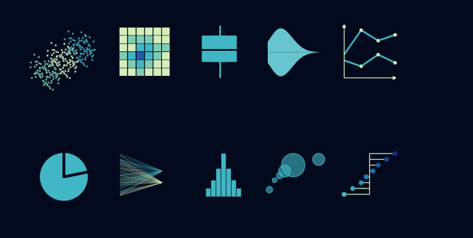

   

**Infos et mises à jour** 

 
**14 février 2022**:  
La partie sur les macros a été intégrée: https://github.com/mthevenin/stata_fr/blob/master/v2_2022_chap12.pdf  

 
 
**02 février 2022**: on reprend du service.      
La nouvelle version de la formation est prévue pour septembre 2022. La version pdf sera mise à jour progressivement: https://github.com/mthevenin/stata_fr/blob/master/v2_2021.pdf

 
 
**25 février 2021**: **Seconde version de la formation sur les graphiques**.    
J'ai commencé la nouvelle version, je l'espère plus aboutie, de la formation sur les graphique. Elle devrait être accompagnée de la programmation de deux commandes graphiques (peut-être trois) pour les courbes de crête (ridge) et les lollipop/haltère. Une version pdf qui sera mise à jour progressivement est disponible à cette adresse: https://github.com/mthevenin/stata_fr/blob/master/v2_2022_chap12.pdf
 

 
**19 février 2021**: **tous les chemins mènent à ggplot**.  
Une quarantaine de graphiques, plutôt simples, exécutés dans un .do et générés avec la librairie *plotnine* de Python, wrapper de **ggplot2**,  sont disponibles dans la page dédiée à **Python**. Elles reprennent une partie les visualisations développées pour la formation Stata.
 
 Ce support a été récemment recentré sur les questions relatives aux graphiques avec Stata,  suite à une demande de formation de la part de l'unité de recherche de **démographie économique** de l'Ined.  

{width=80%}

[Programme du graphique précédent](https://github.com/mthevenin/stata_fr/blob/master/accueil)

**Liens Ined**

* **Site de l'Ined**: https://www.ined.fr  
* **Site du service des méthodes statistiques**: https://sms.site.ined.fr  
* **Site des Rencontres de Statistique Appliquée**: https://statapp.site.ined.fr/   
* **Site du séminaire R à l'Usage des Sciences Sociales (RUSS)**: https://russ.site.ined.fr 

**Autres supports**  

* **Formation analyse des durées (2017-2020)**: https://mthevenin.github.io/analyse_duree/
* **Formation introduction à Stata (2018)**: https://mthevenin.github.io/formation_stata/

 
mailto:marc.thevenin@ined.fr - Service Méthodes Statistiques - Ined -
 
Support réalisé avec [Rstudio](href:https://www.rstudio.com) - librairies **Rmarkdown**, **Knitr**  
Version Stata: [v16-SE](https://www.stata.com/)  

