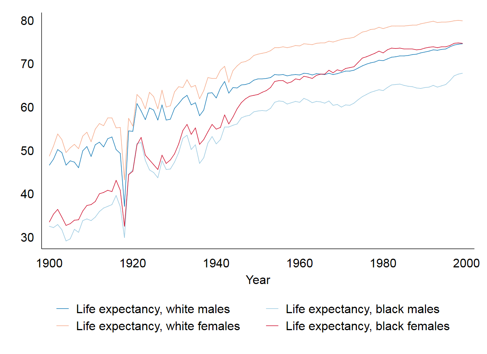
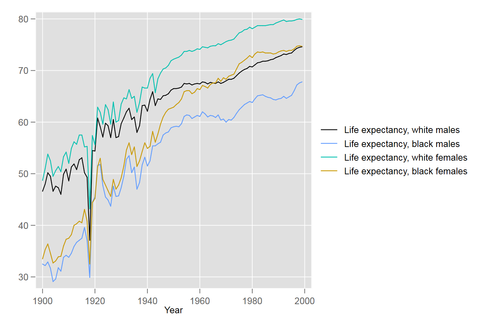
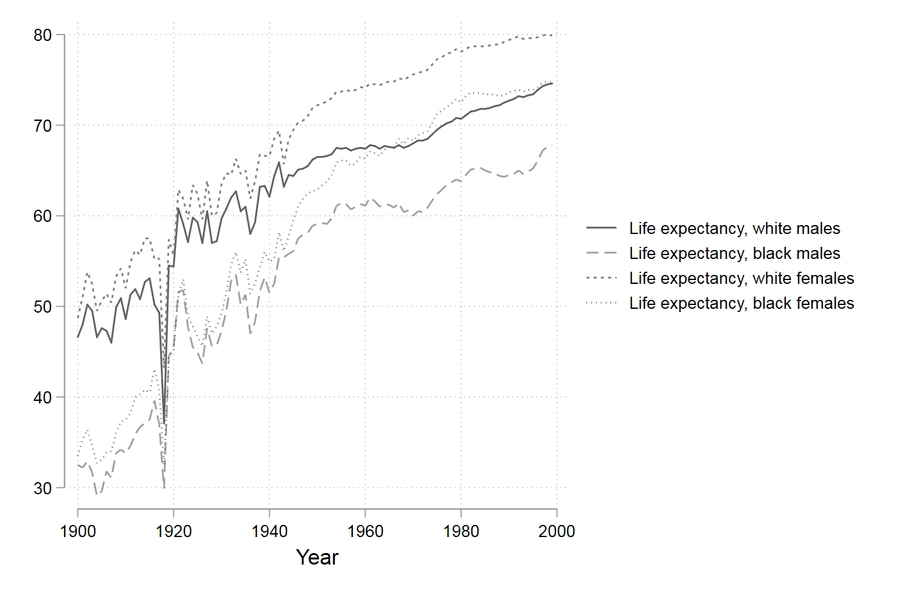
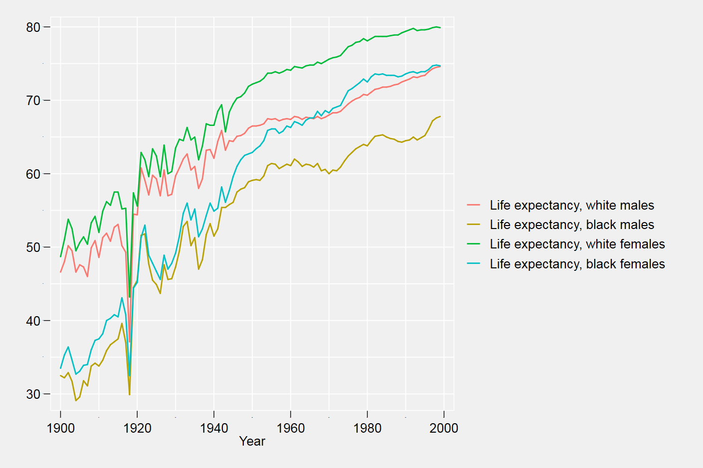
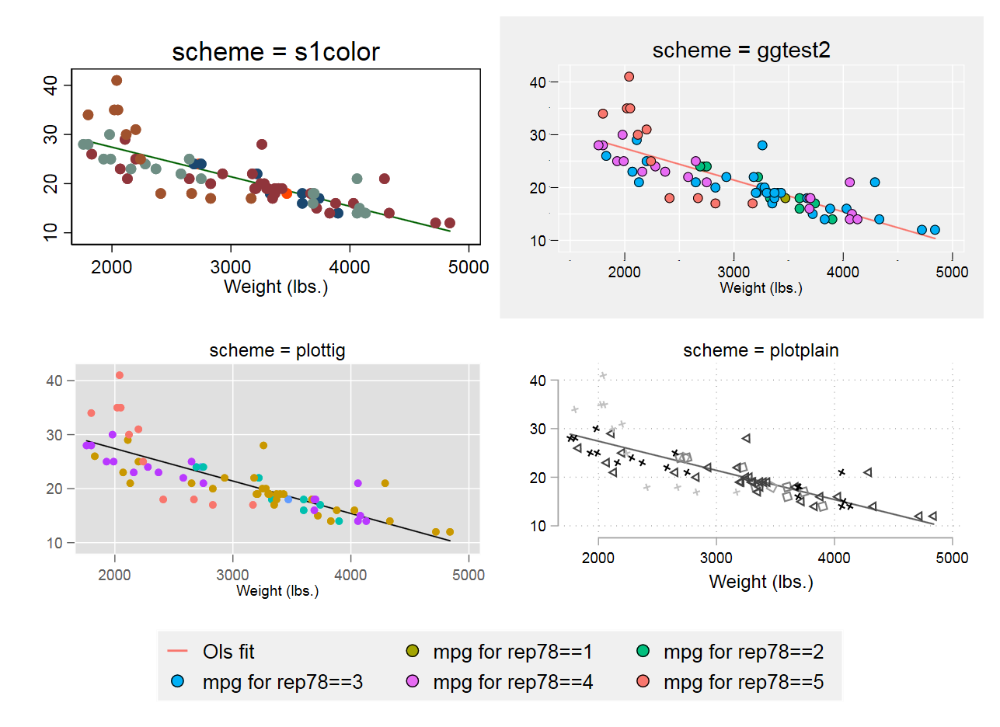
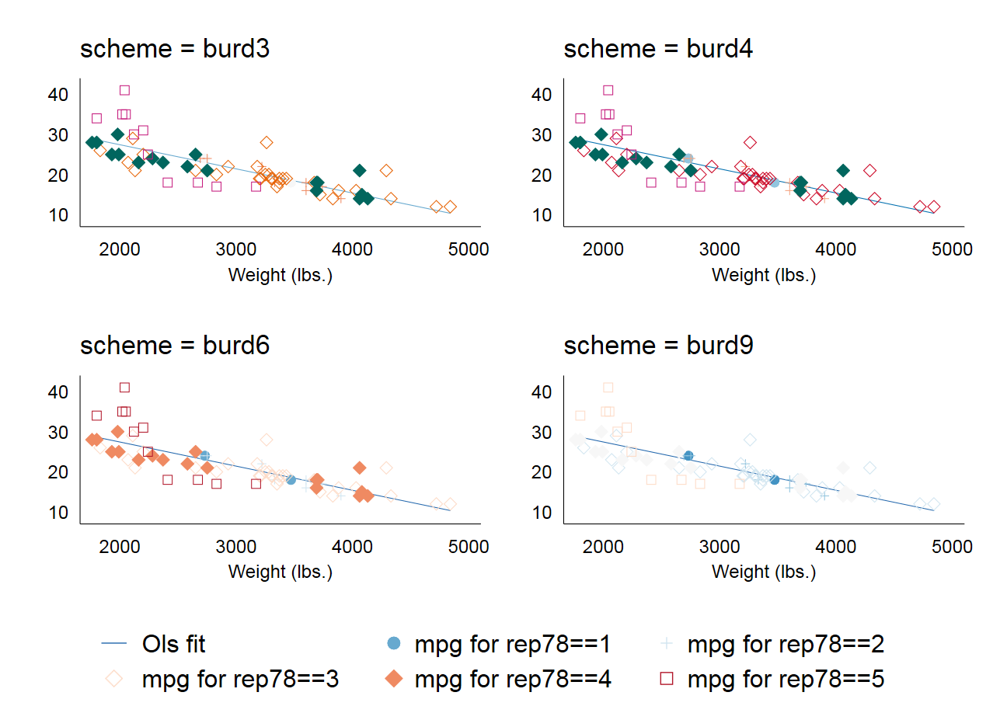
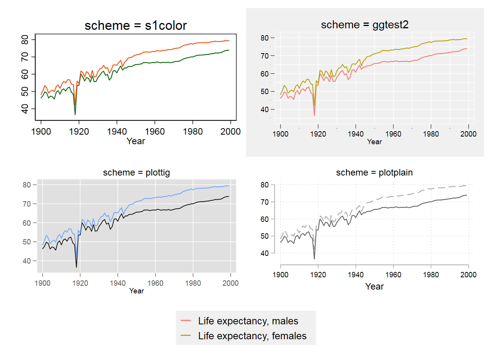
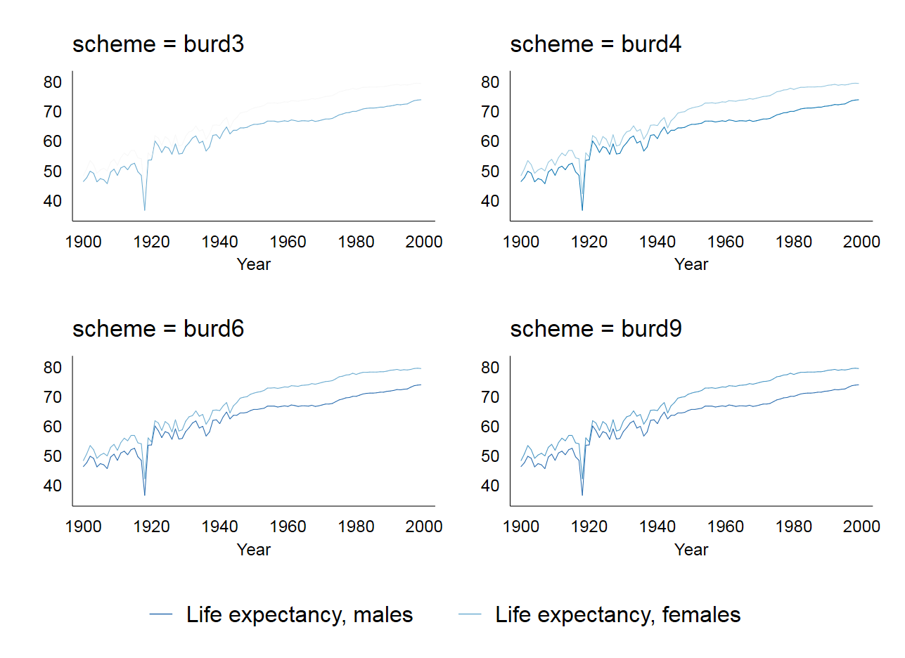

```{r, echo=FALSE, include=FALSE}
require(knitr)
statapath <- "C:\\Program Files (x86)\\Stata15\\StataSE-64"
opts_chunk$set(engine="stata", engine.path=statapath, comment="")
```


<br><br>
Les thèmes graphiques proposés par défaut par le logiciel ne correspondent plus aux standards.  
Plusieurs packages externes permettent de récupérer des thèmes directement ou d’en créer par exécution 
d’un .do : thèmes de type **burd**, **plottig**, **plotplain**, et type **ggplot** avec la commande brewscheme.

**Thèmes graphiques**  
Les thèmes sont chargeables avec la commande `set scheme` avec option `permanently` pour les appliquer à toutes les sessions ou via le menu (edit => preference => graph preference => scheme).  
Pour appliquer un thème pour un graphique particulier, on utilise en option du graphique `scheme(nom_theme)`.

**Avec la version Stata 15**: des messages d’avertissement liés à la non reconnaissance de certains styles peuvent 
se produire. Cela ne bloque pas l’exécution de la création du graphique qui prendra des valeurs par défaut.  


# Thèmes en installation directe 


##Thèmes de type Burd 


8 thèmes graphiques : burd, burd3 à burd10  

Auteur : **François Briatte**  

**Installation**  
`ssc install scheme_burd`


**Exemple**  
```{r}
    sysuse uslifeexp, clear
    tw line le_wmale year || line le_bmale year || line le_wfemale year || line le_bfemale year , ///
    scheme(burd4) name(b4) legend(pos(6))
    graph export "b4.png", name(b4) replace 
```
  

##Thèmes plotplain, plottig{.tabset .tabset-fade .tabset-pills} 


4 thèmes graphiques: plotting, plottigbling, plotplain, plotplainblind.  

Auteur: **Daniel Bischof**  

**Installation**  
`ssc install blindschemes`

**Références**    
<https://danbischof.com/2015/02/04/stata-figure-schemes/>  
<http://www.stata-journal.com/sjpdf.html?articlenum=gr0070>

### Exemple plottig 
```{}
    sysuse uslifeexp, clear
    tw line le_wmale year || line le_bmale year || line le_wfemale year || line le_bfemale year, ///
    scheme(plottig) name(pt) legend(pos(6))
    graph export "pt.png", name(pt) replace 
```

```{r,include=FALSE}
    sysuse uslifeexp, clear
    tw line le_wmale year || line le_bmale year || line le_wfemale year || line le_bfemale year, ///
    scheme(plottig) name(pt) legend(pos(3))
    graph export "pt.png", name(pt) replace 
```
 

### Exemple plotplain 
```{}
    sysuse uslifeexp, clear
    tw line le_wmale year || line le_bmale year || line le_wfemale year || line le_bfemale year , ///
    scheme(plotplain) name(pp) legend(pos(3))
    graph export "pp.png", name(pp) replace 
```


```{r, include=FALSE}
    sysuse uslifeexp, clear
    tw line le_wmale year || line le_bmale year || line le_wfemale year || line le_bfemale year , ///
    scheme(plotplain) name(pp) legend(pos(3))
    graph export "pp.png", name(pp) replace 
```

 

<br><br>

# Thèmes à paramétrer: commande brewscheme 

Serie d’outils pour générer des styles et couleurs.  

Auteur : **William Buchanan**  


**Installatio** (préférer l’installation via github qui donne la version la plus récente):     
`net inst brewscheme, from("https://wbuchanan.github.io/brewscheme/") replace`  

 ou  
 
`ssc install brewscheme`


**Références**:    
<https://wbuchanan.github.io/brewscheme/>    
<https://github.com/wbuchanan/brewscheme>    
<https://wbuchanan.github.io/brewscheme/brewscheme.pdf>    

**Exemple**  

Exécuter les deux  programmes suivants (à exécuter impérativement à partir d’un .do)  


Programme 1  (auteur: W.Buchanan )
```{}
* Code pour générer un style ggplot (R): ggtest (on peut le renommer dans le programme ci-dessous)  

// Change the end of line delimiter
#d ;

// Generate the theme file used to simulate ggplot2 aesthetics
brewtheme ggtheme, numticks("major 5" "horizontal_major 5" "vertical_major 5"     
"horizontal_minor 10" "vertical_minor 10") color("plotregion gs15"          
"matrix_plotregion gs15" "background gs15" "textbox gs15" "legend gs15"       
"box gs15" "mat_label_box gs15" "text_option_fill gs15" "clegend gs15"        
"histback gs15" "pboxlabelfill gs15" "plabelfill gs15" "pmarkbkfill gs15"      
"pmarkback gs15") linew("major_grid medthick" "minor_grid thin" "legend medium"    
"clegend medium") clockdir("legend_position 3") yesno("draw_major_grid yes"     
"draw_minor_grid yes" "legend_force_draw yes" "legend_force_nodraw no"        
"draw_minor_vgrid yes" "draw_minor_hgrid yes" "extend_grid_low yes"         
"extend_grid_high yes" "extend_axes_low no" "extend_axes_high no")          
gridsty("minor minor") axissty("horizontal_default horizontal_withgrid"       
"vertical_default vertical_withgrid") linepattern("major_grid solid"        
"minor_grid solid") linesty("major_grid major_grid" "minor_grid minor_grid")     
ticksty("minor minor_notick" "minor_notick minor_notick")               
ticksetsty("major_vert_withgrid minor_vert_nolabel"                 
"major_horiz_withgrid minor_horiz_nolabel"                      
"major_horiz_nolabel major_horiz_default"                       
"major_vert_nolabel major_vert_default") gsize("minortick_label minuscule"        
"minortick tiny") numsty("legend_cols 1" "legend_rows 0" "zyx2rows 0" 
"zyx2cols 1") verticaltext("legend top");

// Change the end of line delimiter back to a carriage return
#d cr
```


Programme2
```{}
* Création du thème ggtest2 
brewscheme, scheme(ggtest2) const(orange) cone(blue) consat(20) scatc(5)    ///  
scatst(ggplot2) piest(ggplot2) piec(6) barst(ggplot2) barc(2) linec(5)      ///   
linest(ggplot2) areast(ggplot2) areac(5) somest(ggplot2) somec(24) cic(3)   ///   
cist(ggplot2) themef(ggplot2)
```


```{}
    sysuse uslifeexp, clear
    tw line le_wmale year || line le_bmale year || line le_wfemale year || line le_bfemale year, ///
    scheme(ggtest2) name(bs) legend(pos(3))
    graph export "bs.png", name(bs) replace 
```

```{r,include=FALSE}
    sysuse uslifeexp, clear
    tw line le_wmale year || line le_bmale year || line le_wfemale year || line le_bfemale year, ///
    scheme(ggtest2) name(bs) legend(pos(3))
    graph export "bs.png", name(bs) replace 
```
 

<br><br>

# Comparaisons{.tabset .tabset-fade .tabset-pills}

##Comparaison 1

Avec un nuage de point.  

```{]}
sysuse auto, clear
local sc s1color ggtest2 plottig plotplain burd burd3 burd4 burd6  burd9

foreach sc2 of local sc {

 tw                                                                         ///
    (lfit mpg weight,                  legend(lab(1 "Ols fit")))            ///   
    (scatter mpg weight if rep78 == 1, legend(lab(2 "mpg for rep78==1")))   ///                                     
    (scatter mpg weight if rep78 == 2, legend(lab(3 "mpg for rep78==2")))   ///   
    (scatter mpg weight if rep78 == 3, legend(lab(4 "mpg for rep78==3")))   ///   
    (scatter mpg weight if rep78 == 4, legend(lab(5 "mpg for rep78==4")))   ///   
    (scatter mpg weight if rep78 == 5, legend(lab(6 "mpg for rep78==5"))),  /// 
     legend(rows(2)) scheme(`sc2') title("scheme = `sc2'") nodraw name(`sc2')     
}

grc1leg s1color ggtest2 plottig plotplain, cols(2)  legendfrom(ggtest2)
grc1leg burd3 burd4 burd6 burd9          , cols(2)  legendfrom(burd6)
```


```{r,include=FALSE}
sysuse auto, clear
local sc s1color ggtest2 plottig plotplain burd burd3 burd4 burd6 burd9

foreach sc2 of local sc {

 tw                                                                         ///
    (lfit mpg weight,                  legend(lab(1 "Ols fit")))            ///   
    (scatter mpg weight if rep78 == 1, legend(lab(2 "mpg for rep78==1")))   ///                                     
    (scatter mpg weight if rep78 == 2, legend(lab(3 "mpg for rep78==2")))   ///   
    (scatter mpg weight if rep78 == 3, legend(lab(4 "mpg for rep78==3")))   ///   
    (scatter mpg weight if rep78 == 4, legend(lab(5 "mpg for rep78==4")))   ///   
    (scatter mpg weight if rep78 == 5, legend(lab(6 "mpg for rep78==5"))),  /// 
     legend(rows(2)) scheme(`sc2') title("scheme = `sc2'") nodraw name(`sc2')     
}

grc1leg s1color ggtest2 plottig plotplain, cols(2)  legendfrom(ggtest2) name(comp1) 
    graph export "comp1.png", name(comp1) replace 
grc1leg burd3 burd4 burd6 burd9          , cols(2)  legendfrom(burd6)    name(comp1b)
    graph export "comp1b.png", name(comp1b) replace 
```

  
 


##Comparaison 2

Avec les courbes d'espérance de vie 

```{}
sysuse uslifeexp, clear
local sc s1color ggtest2 plottig plotplain burd3 burd4 burd6 burd9 

foreach sc2 of local sc {
    tw line le_male year || line le_female year, /// 
    scheme(`sc2') title("scheme = `sc2'") nodraw name(`sc2')     
}

grc1leg s1color ggtest2 plottig plotplain, cols(2)  legendfrom(ggtest2) name(comp2)
     graph export "comp2.png", name(comp2) replace 
grc1leg burd3 burd4 burd6 burd9     , cols(2)  legendfrom(burd6)   name(comp2b)
     graph export "comp2b.png", name(comp2b) replace 
```


```{r,include=FALSE}
sysuse uslifeexp, clear
local sc s1color ggtest2 plottig plotplain burd3 burd4 burd6 burd9 

foreach sc2 of local sc {
    tw line le_male year || line le_female year, /// 
    scheme(`sc2') title("scheme = `sc2'") nodraw name(`sc2')     
}

grc1leg s1color ggtest2 plottig plotplain, cols(2)  legendfrom(ggtest2) name(comp2)
     graph export "comp2.png", name(comp2) replace 
grc1leg burd3 burd4 burd6 burd9     , cols(2)  legendfrom(burd6)   name(comp2b)
     graph export "comp2b.png", name(comp2b) replace 
```

 
  

##Comparaison 3

Première comparaison  avec les effets de transparence de la version 15 de Stata.  


```{}
sysuse auto, clear
local sc s1color ggtest2 plottig plotplain

foreach sc2 of local sc {

 tw                                                                                           ///
 (lfit mpg weight,                  legend(lab(1 "Ols fit"))          color(cranberry%60)) ///   
 (scatter mpg weight if rep78 == 1, legend(lab(2 "mpg for rep78==1")) color(midblue%30))   ///                                     
 (scatter mpg weight if rep78 == 2, legend(lab(3 "mpg for rep78==2")) color(midgreen%30))  ///   
 (scatter mpg weight if rep78 == 3, legend(lab(4 "mpg for rep78==3")) color(sand%30))      ///   
 (scatter mpg weight if rep78 == 4, legend(lab(5 "mpg for rep78==4")) color(pink%30))      ///   
 (scatter mpg weight if rep78 == 5, legend(lab(6 "mpg for rep78==5")) color(orange_red%30)),/// 
 legend(rows(2)) scheme(`sc2') title("scheme = `sc2'") nodraw name(`sc2')     
}

grc1leg s1color ggtest2 plottig plotplain, cols(2)  legendfrom(ggtest2) name(comp3)
     graph export "comp3.png", name(comp3) replace 

```


```{r,include=FALSE}
sysuse auto, clear
local sc s1color ggtest2 plottig plotplain

foreach sc2 of local sc {

 tw                                                                                             ///
    (lfit mpg weight,                  legend(lab(1 "Ols fit"))          color(cranberry%60))   ///   
    (scatter mpg weight if rep78 == 1, legend(lab(2 "mpg for rep78==1")) color(midblue%30))     ///                                     
    (scatter mpg weight if rep78 == 2, legend(lab(3 "mpg for rep78==2")) color(midgreen%30))    ///   
    (scatter mpg weight if rep78 == 3, legend(lab(4 "mpg for rep78==3")) color(sand%30))        ///   
    (scatter mpg weight if rep78 == 4, legend(lab(5 "mpg for rep78==4")) color(pink%30))        ///   
    (scatter mpg weight if rep78 == 5, legend(lab(6 "mpg for rep78==5")) color(orange_red%30)), /// 
       legend(rows(2)) scheme(`sc2') title("scheme = `sc2'") nodraw name(`sc2')     
}

grc1leg s1color ggtest2 plottig plotplain, cols(2)  legendfrom(ggtest2) name(comp3)
     graph export "comp3.png", name(comp3) replace 

```

 


